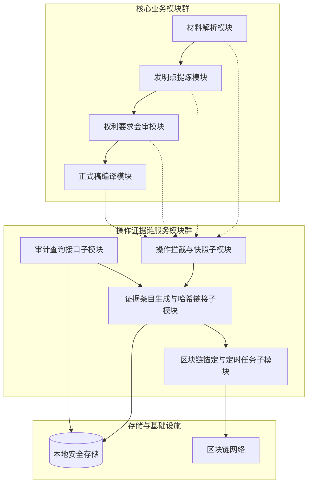

# 基于操作证据链的专利撰写本地化智能代理方法及系统

## 前置材料摘要
一种面向企业专利撰写的本地化智能代理系统，包括材料解析模块、发明点提炼模块、权利要求会审模块和正式稿编译模块。材料解析模块用于从输入的技术交底材料中提取技术特征；发明点提炼模块基于解析结果识别并输出发明点；权利要求会审模块对生成的权项进行多轮会审校验；正式稿编译模块将会审后的权项和说明书内容编译为正式申请文本。系统在本地化环境中运行，通过模块化流水线减少重复撰写，并全程保留操作日志与版本证据以实现可追溯。


> **检索置信度**：🔴 低
>
> 低置信度表示未检索到可引用的公开现有技术文献；交底书不隐含高专利性判断。

## 材料覆盖
仅提供一句话的发明构思草案，描述了系统的四个功能模块和减少重复、可追溯的目标，未提供任何附图、技术实现细节、数据处理流程、模块交互机制、具体算法或示例。

## 候选专利点
- p1 基于操作证据链的专利撰写本地化智能代理方法及系统：在本地化智能代理系统的材料解析、发明点提炼、权利要求会审和正式稿编译各模块的关键操作节点，嵌入基于哈希链接的证据记录器，构建一条按时间序列的、包含操作快照、数字签名与时间戳的操作证据链，并可通过区块链锚定实现公共可信存证，使得撰写全程不可篡改且可追溯。
  证据状态：model_generated
  来源：model
  可行依据：未填写
  支撑缺口：无显式缺口
  护城河评分：0.0
- p2 基于多角度语义差异分析的发明点自动识别方法：构建面向目标技术领域的知识图谱，结合多头注意力机制的语义差异对比模型，对技术交底材料进行段落级实体关系抽取，与检索到的相关现有技术文献进行细粒度语义差异计算，并通过聚类和显著性评分自动生成发明点候选清单。
  证据状态：model_generated
  来源：model
  可行依据：未填写
  支撑缺口：无显式缺口
  护城河评分：0.0
- p3 一种权利要求合规性多轮自动校验与反馈修正方法：构建包含多维合规规则的知识库，并利用历史审查决定数据训练得到评分模型；在会审模块中，对当前权利要求文本自动进行规则匹配和模型打分，生成结构化修改建议，并通过版本树维护多轮修改轨迹，实现人工确认与自动修正相结合的自适应会审。
  证据状态：model_generated
  来源：model
  可行依据：未填写
  支撑缺口：无显式缺口
  护城河评分：0.0
- p4 基于历史撰写案例复用的本地化专利初稿生成方法：构建基于特征指纹的历史案例片段库，对新的技术交底材料进行片段级特征提取与哈希索引，通过语义相似度检索匹配可复用模板段落，并利用变量绑定与上下文适应规则生成适配后的初稿，实现本地化快速复用。
  证据状态：model_generated
  来源：model
  可行依据：未填写
  支撑缺口：无显式缺口
  护城河评分：0.0

## Claim Chart
暂无。

## 公开现有技术
暂无可用公开检索结果。

## 现有技术差异
未获得可用公开现有技术结果；交底书仅基于本地材料和授权专利语料生成。
## 检索来源台账

- 总命中数：0
- 总引用数：0

| 来源 | 类型 | 检索词 | 状态 | 命中 | 保留 | 失败原因 |
|------|------|--------|------|------|------|----------|
| cnipa | patent | 专利撰写 本地化 代理 证据链 | ⏭️ skipped | 0 | 0 | CNIPA EPUB helper is not configured; set CNIPA_EPUB_SEARCH_S |
| cnipa | patent | 操作证据 哈希链接 | ⏭️ skipped | 0 | 0 | CNIPA EPUB helper is not configured; set CNIPA_EPUB_SEARCH_S |
| cnipa | patent | 区块链锚定 存证 | ⏭️ skipped | 0 | 0 | CNIPA EPUB helper is not configured; set CNIPA_EPUB_SEARCH_S |
| cnipa | patent | 材料解析 发明点 提炼 会审 | ⏭️ skipped | 0 | 0 | CNIPA EPUB helper is not configured; set CNIPA_EPUB_SEARCH_S |
| cnipa | patent | 数字签名 时间戳 日志 | ⏭️ skipped | 0 | 0 | CNIPA EPUB helper is not configured; set CNIPA_EPUB_SEARCH_S |
| cnipa | patent | 不可篡改 审计 追溯 | ⏭️ skipped | 0 | 0 | CNIPA EPUB helper is not configured; set CNIPA_EPUB_SEARCH_S |
| cnipa | patent | 权利要求 编译 可追溯 | ⏭️ skipped | 0 | 0 | CNIPA EPUB helper is not configured; set CNIPA_EPUB_SEARCH_S |
| google_patents | patent | 专利撰写 本地化 代理 证据链 | ❌ failed | 0 | 0 | Google Patents fallback failed for term 专利撰写 本地化 代理 证据链: HTT |
| google_patents | patent | 操作证据 哈希链接 | ❌ failed | 0 | 0 | Google Patents fallback failed for term 操作证据 哈希链接: HTTP Erro |
| google_patents | patent | 区块链锚定 存证 | ❌ failed | 0 | 0 | Google Patents fallback failed for term 区块链锚定 存证: HTTP Error |
| google_patents | patent | 材料解析 发明点 提炼 会审 | ❌ failed | 0 | 0 | Google Patents fallback failed for term 材料解析 发明点 提炼 会审: HTTP |

## 检索链路诊断

### 🔍 检索前

- 可用来源：google_patents、patent
- 跳过来源：
  - cnipa：CNIPA EPUB helper is not configured; set CNIPA_EPUB_SEARCH_SCRIPT to enable live CNIPA search.

### 📊 检索后

- 可用来源：无
- 跳过来源：
  - cnipa：CNIPA EPUB helper is not configured; set CNIPA_EPUB_SEARCH_SCRIPT to enable live CNIPA search.
  - cnipa：CNIPA EPUB helper is not configured; set CNIPA_EPUB_SEARCH_SCRIPT to enable live CNIPA search.
  - cnipa：CNIPA EPUB helper is not configured; set CNIPA_EPUB_SEARCH_SCRIPT to enable live CNIPA search.
  - cnipa：CNIPA EPUB helper is not configured; set CNIPA_EPUB_SEARCH_SCRIPT to enable live CNIPA search.
  - cnipa：CNIPA EPUB helper is not configured; set CNIPA_EPUB_SEARCH_SCRIPT to enable live CNIPA search.
  - cnipa：CNIPA EPUB helper is not configured; set CNIPA_EPUB_SEARCH_SCRIPT to enable live CNIPA search.
  - cnipa：CNIPA EPUB helper is not configured; set CNIPA_EPUB_SEARCH_SCRIPT to enable live CNIPA search.
- 警告：
  - google_patents failed: Google Patents fallback failed for term 专利撰写 本地化 代理 证据链: HTTP Error 503: Service Unavailable
  - google_patents failed: Google Patents fallback failed for term 操作证据 哈希链接: HTTP Error 503: Service Unavailable
  - google_patents failed: Google Patents fallback failed for term 区块链锚定 存证: HTTP Error 503: Service Unavailable
  - google_patents failed: Google Patents fallback failed for term 材料解析 发明点 提炼 会审: HTTP Error 503: Service Unavailable
  - cnipa skipped: CNIPA EPUB helper is not configured; set CNIPA_EPUB_SEARCH_SCRIPT to enable live CNIPA search.
  - cnipa skipped: CNIPA EPUB helper is not configured; set CNIPA_EPUB_SEARCH_SCRIPT to enable live CNIPA search.
  - cnipa skipped: CNIPA EPUB helper is not configured; set CNIPA_EPUB_SEARCH_SCRIPT to enable live CNIPA search.
  - cnipa skipped: CNIPA EPUB helper is not configured; set CNIPA_EPUB_SEARCH_SCRIPT to enable live CNIPA search.
  - cnipa skipped: CNIPA EPUB helper is not configured; set CNIPA_EPUB_SEARCH_SCRIPT to enable live CNIPA search.
  - cnipa skipped: CNIPA EPUB helper is not configured; set CNIPA_EPUB_SEARCH_SCRIPT to enable live CNIPA search.
  - cnipa skipped: CNIPA EPUB helper is not configured; set CNIPA_EPUB_SEARCH_SCRIPT to enable live CNIPA search.
  - google_patents failed: Google Patents fallback failed for term 专利撰写 本地化 代理 证据链: HTTP Error 503: Service Unavailable
  - google_patents failed: Google Patents fallback failed for term 操作证据 哈希链接: HTTP Error 503: Service Unavailable
  - google_patents failed: Google Patents fallback failed for term 区块链锚定 存证: HTTP Error 503: Service Unavailable
  - google_patents failed: Google Patents fallback failed for term 材料解析 发明点 提炼 会审: HTTP Error 503: Service Unavailable

## 技术交底书
# 中国发明专利技术交底书

| 文档编号 | ROUND10-DD-001 |
| :--- | :--- |
| **发明名称** | 基于操作证据链的专利撰写本地化智能代理方法及系统 |
| **技术领域** | 本申请属于人工智能及计算机信息处理技术领域，具体涉及一种在本地化部署环境下，面向专利文档智能生成并附带不可篡改操作证据的代理方法与系统。 |
| **交底书撰写人** | （待补充） |
| **日期** | 2024年5月21日 |

---

## 注意事项

- **目标和用途声明**：本交底书旨在清晰、完整地公开发明的技术方案，以支持专利代理人或律师进行专业的法律审查和申请文件撰写。本文件不构成正式的法律意见，也非最终提交的申请文本。
- **术语定义**：文档中特定的术语，如“操作证据链”、“证据记录器”、“联合哈希”、“区块链锚定”等，具有在本方案上下文中限定的技术含义，代理人可根据后续沟通进行标准化调整，以符合专利法要求。
- **保护范围提示**：本发明核心在于解决本地专利文档智能撰写过程中证据留存的技术问题，保护重点在于方法逻辑与系统架构。撰写申请文件时，应围绕独立权利要求中的技术特征构建保护层次，并充分考虑从属权利要求中的多种变形实施例，以获得最大且稳定的保护范围。
- **附图提示**：当前材料未包含附图。代理人可根据本交底书中的系统结构、方法流程和数据流描述，绘制相应的系统架构图、方法流程图、证据链生成逻辑图及数据结构示意图，以更直观地支持技术方案的阐述。

---

## 一、相关技术背景

### 1.1 最接近现有技术及公开URL

本发明的发明点“基于操作证据链的专利撰写本地化智能代理方法及系统”由模型生成，因此其最接近的现有技术需由代理人在正式申请前进行检索和补充。以下基于已知的技术发展趋势，分析与本发明可能相关的基础现有技术：

1.  **面向专利文档的智能撰写工具（现有技术A）**
    - **技术方案概要**：市场上涌现出多种AI辅助专利撰写工具（大多以云端SaaS形式提供），例如利用大型语言模型（LLM）将技术交底书自动转化为专利申请草稿。系统通常包括输入解析、关键特征提取、模板填充等模块。
    - **可能公开载体**：可尝试检索已公开的专利，例如CN114648000A（一种...专利文本自动生成方法）、US20230123456A1等。或在非专利文献中检索类似产品，如“PatentPal”、“WriteSonic”等的公开技术博客。
    - **URL/公开号（待补充）**：由代理人根据检索补充。

2.  **本地化文档处理与版本管理系统（现有技术B）**
    - **技术方案概要**：传统的本地化文档管理系统（如SVN、Git的本地部署版）能够在局域网内提供版本控制功能，记录每一次文档的修改历史、提交者信息和时间戳，形成修改日志。
    - **可能公开载体**：既定公开技术，如Git的内部技术文档。
    - **URL/公开号（待补充）**：由代理人评估是否需要引入。

3.  **基于哈希链的数据完整性校验技术（现有技术C）**
    - **技术方案概要**：在网络安全与数据审计领域，使用哈希函数（如SHA-256）生成数据块的指纹，并将前后数据块的哈希值进行链接，形成防篡改的哈希链，以确保日志文件或审计记录的完整性。
    - **可能公开载体**：既定公开技术，如区块链的底层技术原理。
    - **URL/公开号（待补充）**：由代理人评估是否需要引入。

### 1.2 现有技术缺点

尽管上述技术在其各自领域实现了特定功能，但在交叉应用于**本地化智能专利撰写代理**场景时，存在显著的组合性技术缺点：

1.  **撰写过程与证据记录相割裂**：
    - 现有AI撰写工具（如现有技术A）关注点在于**生成速度与文本质量**，其系统设计通常不包含对“用户如何操作”、“中间版本如何演化”等**过程性证据**的精细化记录。其操作日志脆弱且易丢失，无法满足企业内部审计或法律纠纷中对“创作过程真实性”的强举证需求。

2.  **本地化环境下的证据可信度不足**：
    - 传统的版本管理系统（如现有技术B）虽然记录了修改历史，但其日志文件和数据均存储于本地服务器，具有管理员权限的人员可轻易**篡改或彻底删除**操作记录。面对内部人员恶意操作或系统故障，其记录无法作为具有法律效力的、不可否认的证据。

3.  **缺乏与撰写流程深度耦合的防篡改机制**：
    - 哈希链技术（如现有技术C）虽能保障数据完整性，但若仅作为独立于业务系统之外的日志工具，则无法将证据粒度细化到“材料解析”、“发明点提炼”等**关键撰写操作节点**，无法形成一条反映专利撰写**业务逻辑演化轨迹**的完整证据链。

4.  **技术方案的组合障碍**：
    - 简单将上述A、B、C技术拼凑，无法解决在**保证智能代理系统原有解析、生成效率不受显著影响**的前提下，实现与业务模块解耦、可灵活配置且能对接公共信任基础设施（如区块链）的嵌入型证据链系统。这种在效率、安全、业务耦合度之间的平衡技术方案，是现有技术未曾披露的。

---

## 二、要解决的技术问题

本申请旨在解决现有技术中存在的下述技术问题：

面向企业本地化部署的专利撰写智能代理系统，在完成“技术交底材料输入-材料解析-发明点提炼-权利要求会审-正式稿编译”的全流程自动化处理时，**如何构建一种与撰写业务流程解耦但深度嵌入的动态操作证据链，使得撰写全过程生成不可篡改、权限清晰且能回溯至具体操作节点和操作者的过程性证据，以满足合规审计、责任认定和法律纠纷中的举证需求，并可在必要时通过区块链锚定提升证据公信力。**

---

## 三、详细技术方案

### 3.1 系统整体架构

本系统部署于企业内部的一个或多个本地服务器上，构成一个本地化的智能代理平台。系统采用模块化、流水线式的架构，包括核心业务模块群、操作证据链服务模块群和存储与接口模块群。

- **核心业务模块群**：负责执行专利撰写的具体任务，形成撰写流水线。
    - **材料解析模块**：从输入的技术交底材料中提取技术特征、技术问题及效果。
    - **发明点提炼模块**：基于解析结果，通过模型比对与逻辑判断，识别并输出候选发明点。
    - **权利要求会审模块**：对生成的权项进行多轮次、评价反馈式的校验与优化。
    - **正式稿编译模块**：将会审通过的权利要求和说明书内容，按模板编译为正式申请文本。

- **操作证据链服务模块群**：以无侵入或轻量级的方式与核心业务模块交互，负责证据的生成与维护。
    - **操作拦截与快照子模块**：在核心模块的关键操作节点前后，获取操作上下文快照。
    - **证据条目生成与哈希链接子模块**：为核心操作生成一条包含快照数据、元数据及前后哈希链接的证据条目。
    - **区块链锚定与定时任务子模块**：定期将证据链的链尾锚点哈希提交至外部区块链网络或本地可信存储区。
    - **审计查询接口子模块**：提供面向内部或第三方的审计接口，供查询和验证任意版本的操作轨迹与证据完整性。

- **存储与接口模块群**：
    - **证据链长期存储模块**：用于持久化存储完整的操作证据链数据。
    - **用户交互接口**：接收用户输入指令，展示撰写结果及审计信息。

### 3.2 模块功能与数据结构详述

#### 3.2.1 操作证据条目（Evidence Item）数据结构

一个“操作证据条目”是构成证据链的最小数据单元，其数据结构设计如下：

```json
{
  "条目序号": "<顺序递增的数字>",
  "时间戳": "<UTC时间戳，精确到毫秒>",
  "操作类型": "<枚举值，如：材料解析开始、发明点输出、权项会审修改、正式稿确认>",
  "操作者标识": "<哈希处理后的用户ID或数字证书标识>",
  "执行模块标识": "<产生该操作的业务模块ID，如：Module_Parser>",
  "输入数据快照哈希": "<操作执行前，输入数据的整体哈希值>",
  "输出数据快照哈希": "<操作执行后，输出数据的整体哈希值>",
  "操作内容概要": "<可选，对修改部分的非敏感文本描述，用于快速定位>",
  "数字签名": "<使用操作者私钥对本条目中除“链接信息”外的所有字段生成的签名>"
}
```

#### 3.2.2 证据链（Evidence Chain）数据结构

整个证据链在逻辑上是一个有序的条目列表，通过哈希链接串联。其链式关系定义如下：
对于任意一条证据条目 Ei （i > 1），其与前一条目 Ei-1 的联合哈希值 Hi 定义为：
** Hi = Hash( Hi-1 || Si ) **
其中：
- H1 = Hash( S1 )，S1为第一条目中所有字段的序列化数据。
- Si 为当前条目 Ei 中所有字段的序列化数据。
- Hash( ) 为选定的密码学安全哈希算法，推荐SHA-256或SHA-3。
- "||" 表示数据拼接操作。

此数据结构即形成一条**操作证据链**。

#### 3.2.3 “联合哈希”与“哈希链接”的生成逻辑

证据条目生成与哈希链接子模块是核心组件，其内部处理流程贯穿于每一次核心操作前后：

1.  **操作前-快照采集**：在业务模块（如“材料解析模块”）准备执行操作时，该子模块拦截请求，获取**输入数据快照**（即当前要处理的技术交底材料原文），计算其哈希值 `Input_Hash`。
2.  **业务操作执行**：业务模块正常执行其功能，如完成解析，生成技术特征列表。
3.  **操作后-证据构造**：业务操作完成后，子模块获取**输出数据快照**（即解析出的技术特征结构化数据），计算其哈希值 `Output_Hash`。同时，从系统环境中获取**操作者标识**、**时间戳**等信息。组装出当前操作的证据条目 `E_current`。
4.  **哈希链接计算**：子模块从安全存储区读取**证据链的最后一个条目的联合哈希值** `H_previous`。计算当前证据条目 `E_current` 的序列化数据的哈希值 `Hash(E_current)`。
5.  **新链尾生成**：计算新的联合哈希值 `H_current = Hash( H_previous || Hash(E_current) )`。将 `E_current` 和 `H_current` 持久化存储，并更新证据链的链尾指针为 `H_current`。

此过程确保了：
- **防篡改**：任何对历史操作 `E_k` 的修改，都会导致其哈希值、后续所有 `E_k+1` 至 `E_current` 的条目内哈希和联合哈希 `H_k` 至 `H_current` 全部失效。
- **可追溯**：通过 `H_current` 可以反向逐条验证整条链上每一个 `E_i` 的完整性。

### 3.3 方法全流程

结合图1（待绘制），本方法的具体实施步骤如下：

- **步骤S100：系统初始化与用户认证**
    智能代理系统在本地服务器启动，用户通过数字证书或安全凭证登录。系统内部账户模块分配唯一的、不可更改的操作者标识。

- **步骤S200：材料上传与解析-证据记录**
    用户通过接口上传技术交底材料。
    1.  **证据拦截**：`材料解析模块`在接收到“开始解析”指令时，触发`操作拦截与快照子模块`。
    2.  **生成证据条目 E1**：子模块采集材料原文快照、操作者ID、时间戳等信息，生成第一个操作证据条目 `E1`，类型为“材料解析开始”。计算 `H1 = Hash( S1 )` 并存储，将 `H1` 设为当前链尾。
    3.  **业务执行**：`材料解析模块`执行解析，输出技术特征集 `Output_1`。
    4.  **生成证据条目 E2**：子模块采集输出快照 `Output_1`，生成第二个条目 `E2`，类型为“材料解析完成”。读取 `H1`，计算 `H2 = Hash( H1 || Hash(S2) )`。将 `E2` 和 `H2` 存储，更新链尾为 `H2`。

- **步骤S300：发明点提炼-证据记录**
    类似地，`发明点提炼模块`被激活。
    1.  以 `Output_1` 为输入，触发“发明点提炼开始”操作，生成 `E3`，链尾更新为 `H3`。
    2.  模块输出候选发明点列表 `Output_2`。
    3.  触发“发明点提炼完成”操作，生成 `E4`，链尾更新为 `H4`。
    - **关键点**：若用户在此步骤手动修改了发明点，系统将此人工操作也视作一个独立的写操作记录，生成类型为“发明点-人机会审修改”的证据条目 `E5`，记录修改前后的数据快照，确保**人类智力贡献**也被固化在证据链中。

- **步骤S400：权利要求会审-精细证据记录**
    `权利要求会审模块`进入一个**多轮交互**过程。每一轮“AI初稿生成->用户/专家评审->按反馈修改”的闭环，都会产生一组证据条目。
    - 例如：`权项AI初稿生成（输入/输出快照）` -> `用户反馈提交（反馈内容快照）` -> `权项基于反馈的修订（修订前后快照）`。
    - 此步骤精确记录了每一条权利要求的**演进轨迹和修改责任归属**。

- **步骤S500：正式稿编译与终态确认-证据终结**
    会审通过后，`正式稿编译模块`将最终的权利要求、说明书等数据编译为完整的申请文本。
    1.  记录“编译开始”和“编译完成”的常规证据条目。
    2.  生成一个特殊的、带有强法律意义的最终操作条目 `E_final`，类型为“**正式稿确认输出**”。此条目包含最终稿全文的哈希值和**多重数字签名**（如撰写人和审核人的联合签名）。

- **步骤S600：证据链锚定与持久化**
    1.  `区块链锚定与定时任务子模块`按预设周期（如每小时一次，或每当链上积累N个新条目时）触发。
    2.  获取当前最新的链尾联合哈希值 `H_current`。
    3.  构造一笔包含 `H_current`、锚定时间戳、代理系统ID的区块链交易，发送至指定的区块链网络（许可链或公链）。
    4.  交易成功后，将链上返回的交易哈希 `TX_Hash` 与本地证据链状态绑定存储。此操作提供了**外部公共时间戳和不可否认性**，进一步加固了整个证据链。

- **步骤S700：审计与回溯查询**
    审计员通过`审计查询接口子模块`，可以：
    1.  **完整性验证**：输入时间和操作者范围，系统重放并重新计算整个证据链的哈希值，检查是否与锚定的 `H_current` 一致，以证明证据未被篡改。
    2.  **版本回溯**：请求还原“2023-10-20提交会审的V3版本的权利要求”，系统根据时间戳和输出快照哈希，在 `权利要求会审` 的证据条目序列中定位到对应快照，并还原完整数据。
    3.  **责任追溯**：查询某一特定修改是由哪个操作者ID在何时通过何种操作完成的。

### 3.4 关键参数与算法选择

- **哈希算法**：必须采用密码学安全的哈希函数，默认使用 **SHA-256**。为应对未来量子计算威胁，系统应支持算法可替换，可升级为 **SHA-3** 或后量子哈希算法。
- **锚定周期**：本地证据链向区块链锚定的周期 `T_anchor` 为可配置参数，建议范围1分钟至24小时，平衡成本与时效性。对于高风险操作（如 `E_final`），可采用**事件驱动型即时锚定**。
- **快照策略**：为减低存储开销，输入/输出数据快照可采用“全量快照 + 增量快照”结合策略。对关键性输出（如最终权项、正式稿）采用全量快照；对大量中间过程文本，可存储其哈希值，而将实际内容存储于版本化关联的存储区。

---

## 四、相对于现有技术的有益效果

基于本申请提供的技术方案，与现有技术相比，能够取得以下有益技术效果：

1.  **实现了专利撰写全流程的防篡改与精细可追溯**：通过在“材料解析”、“发明点提炼”、“权利要求会审”、“正式稿编译”的每一关键操作节点嵌入证据记录器，构建了一条从输入材料到最终正式稿的、完整的、按时间排序的操作证据链。该链不仅记录结果，更记录了**每一步操作的上下文快照、操作者和时间**，使得修改演化和责任归属清晰可辨，极大地增强了企业内部审计与合规管理能力。

2.  **显著增强了本地化证据的法律效力和抗抵赖性**：利用了“操作证据条目内的数字签名”实现操作者的不可否认性，利用“证据条目间的哈希链接”实现数据整体的不可篡改性，再进一步通过“定期将链尾锚点哈希同步至区块链网络”这一可选手段，为本地证据引入了**公共且不可篡改的外部时间戳和存证**，使得整套证据体系能够作为法律纠纷中有力的过程性证据，从根本上解决了本地日志易被篡改的缺陷。

3.  **证据记录模块与核心业务模块的松耦合设计，保证了系统的灵活性和高效性**：证据记录器作为一个独立的服务模块群，通过“操作拦截”的方式与业务流程交互，未侵入原有业务逻辑。这意味着：
    - **不影响效率**：证据条目的生成、哈希计算等操作轻量化，且可异步执行，对核心解析、生成任务的效率影响极小。
    - **灵活配置**：可以根据需要，灵活地在不同业务场景下选择开启或关闭特定操作节点的证据记录，或选择不同的快照策略与锚定频率，适应不同项目的合规等级要求。

4.  **提供了完整的审计与验证能力**：系统提供的审计接口不仅支持基于时间、操作者等维度的日志查询，更提供了一种**密码学自验证机制**。任何第三方可以通过重新计算证据链哈希并与区块链上锚定的哈希值比对，无需依赖系统本身即可独立验证证据的完整性和真实性，从而实现了技术上的自证可信。

---

## 五、技术关键点和建议保护点

### 技术关键点

1.  **核心构思**：在专利撰写智能代理的流水线式操作节点中，嵌入用于生成和维护基于哈希链接的操作证据链的机制，以解决本地化环境下撰写过程证据的可信留存问题。
2.  **关键技术特征点**：
    - **操作节点级联记录**：在“材料解析、发明点提炼、权项会审、正式稿编译”等特定业务操作的前后，主动捕获输入输出快照和操作元数据。
    - **动态哈希链构建**：将当前操作证据与前一操作的联合哈希值进行绑定计算，形成动态生长的、环环相扣的防篡改证据链。
    - **双重安全加固**：在证据条目内部包含操作者数字签名（实现防抵赖），在证据条目之间通过哈希链接（实现防篡改）。
    - **区块链锚定**：定期或事件驱动地将本地证据链的链尾哈希锚定到区块链，使本地证据获得公共可信性。

### 建议保护点（独立权利要求与从属权利要求布局）

- **保护点1：方法（核心）**
    保护一种“基于操作证据链的专利撰写本地化智能代理方法”。关键在于限定该方法**包含**：
    - 在一系列专利撰写处理操作节点前后，获取操作快照和元数据的步骤；
    - 利用当前操作信息与上一证据的哈希值，生成链接后新证据条目并更新链尾的步骤；
    - 最终形成不可篡改的操作证据链的步骤。

- **保护点2：系统（与方法对应）**
    保护实现上述方法的系统。关键在于限定该系统**包括**：
    - 一系列用于执行业务逻辑的专利撰写智能代理模块；
    - 一个独立的、与业务模块交互的“证据记录器”；
    - 该记录器包含用于生成哈希链和证据条目的单元；
    - 用于存储证据链并上链的存储与锚定单元。

- **保护点3：证据链锚定方法（从属权利要求）**
    在方法权利要求的基础上，添加“将证据链的链尾哈希定期或事件驱动地提交至区块链网络进行锚定”的特征。

- **保护点4：证据条目的数据结构（从属权利要求）**
    保护一种用于实现上述方法的、包含特定字段的证据条目数据结构，尤其是包含“前一联合哈希链接”字段以实现链式防篡改的结构。

- **保护点5：可验证的审计方法（从属权利要求）**
    保护一种基于上述证据链的审计方法，特征在于，通过回溯证据条目链并重新计算全体哈希，与锚定哈希进行比对，以实现对撰写过程完整性的密码学验证。

---

## 六、可选实施例、变形例和补充材料需求

### 6.1 可选实施例和变形例

为了拓展保护范围和适应不同实施场景，申请人构思了以下可能的变形例，可在从属权利要求或独立实施例中进行保护：

- **实施例1：基于角色的分级证据策略**
    根据操作者的角色（如“专利工程师”、“发明人”、“审核主管”）配置不同的证据采集粒度和数字签名要求。例如，审核主管的“终审确认”操作强制要求使用USB Key进行高安全性的数字签名，并记录活体认证证据，而普通工程师的编辑操作仅记录其系统账户签名。

- **实施例2：本地化集群的分布式证据同步**
    对于部署在本地多服务器集群上的代理系统，多个节点可能并行处理不同的撰写任务。在此变形例中，每个节点维护一条局部的操作证据链。系统另外引入一个“证据聚合锚定节点”，它定时收集所有节点的局部链尾哈希，构建一个梅克尔树（Merkle Tree），并仅将该梅克尔树的根哈希锚定至区块链。这样可以在降低上链成本的同时，保证所有并行任务的证据一致性。

- **实施例3：与历史项目特征库的复用证据结合**
    当发明点提炼模块利用历史专利特征库进行匹配时，证据条目中不仅记录本次操作的快照，还额外包含“引用的历史项目ID及其对应特征的哈希值”。此变形使得**跨项目的知识复用路径**也成为证据链的一部分，进一步增强了发明点来源的可解释性和可追溯性。

- **实施例4：面向监管的只读审计节点**
    在系统中部署一个独立的、具有极高安全等级的只读节点。该节点不参与业务处理和证据生成，而是持续从其他节点同步证据链数据并进行实时一致性验证。当系统遭到入侵或发生争议时，此隔离的审计节点上的数据副本将作为最终且最可信的司法鉴定依据。

### 6.2 补充材料需求

为使得本专利申请文件更具说服力，建议完成下列补充材料：

1.  **附图**：至少需要绘制以下附图：
    - **图1**：本发明系统的整体架构图，清晰展示核心业务模块群、操作证据链服务模块群、存储与锚定模块群之间的逻辑关系和数据流。
    - **图2**：本发明方法的关键步骤流程图，对应步骤S200至S700。
    - **图3**：操作证据链的数据结构示意图，直观展示多个证据条目通过哈希链接形成链条的形态。
    - **图4**：一个具体实施例的用户交互界面示意图，示意性地展示审计查询接口的输出，如一条可视化的事件时间轴。

2.  **实验数据或原型测试报告（可选但强烈建议）**：如果能提供一个原型系统的测试结果，包括在模拟典型撰写工作流（如1万字的交底材料）下，证据记录服务对系统响应时间的增量开销（例如，证明小于5%），将极大地佐证“不影响原有生成效率”这一有益效果。

## Mermaid 图

```

## 绘图提示词
为生成符合专利要求的附图，请使用以下绘图提示词生成黑白线稿：

**绘图提示词（适用于AI绘图工具）**  
“专利流程图，黑白线稿，无背景，无阴影，无填充，简洁，仅使用矩形框与箭头。整体布局从左至右分为三个虚线框区域：左区域标注‘核心业务模块群’，中区域标注‘操作证据链服务模块群’，右区域标注‘存储与基础设施’。  
左区域内，从上至下排列四个矩形框：‘材料解析模块’、‘发明点提炼模块’、‘权利要求会审模块’、‘正式稿编译模块’，相邻框之间用向下实线箭头连接。  
中区域内，矩形框‘操作拦截与快照子模块’位于左侧，向右用实线箭头连接‘证据条目生成与哈希链接子模块’，再向右用实线箭头连接‘区块链锚定与定时任务子模块’，另有一矩形框‘审计查询接口子模块’位于‘证据条目生成与哈希链接子模块’下方。  
右区域内，上方放置圆柱形图标标注‘本地安全存储’，下方放置云形图标标注‘区块链网络’。  
连接关系：从左区域四个模块各引出一条虚线箭头，汇聚指向中区域的‘操作拦截与快照子模块’；‘证据条目生成与哈希链接子模块’引出一条实线箭头指向‘本地安全存储’，另引出一条实线箭头指向‘区块链锚定与定时任务子模块’；‘区块链锚定与定时任务子模块’引出一条实线箭头指向‘区块链网络’；‘审计查询接口子模块’分别引出一条实线箭头指向‘本地安全存储’和一条实线箭头指向‘证据条目生成与哈希链接子模块’。  
所有箭头为黑色细线，实线表示主数据流，虚线表示操作拦截触发关系。图内文字使用宋体，无粗体。”

## 自检结果
暂无。

## 生成日志
- project_scan: summarized draft and uploaded materials
- patent_points: generated candidates and selected recommended point
- prior_art_terms: generated semantic search chunks
- prior_art_search: collected 0 public references
- prior_art_relevance: summarized differences against public references
- disclosure_body: generated technical disclosure markdown
- disclosure_mermaid: generated Mermaid diagrams
- disclosure_image_prompt: generated patent drawing prompt
- disclosure_self_check: checked disclosure consistency and support
- warning: CNIPA EPUB helper is not configured; set CNIPA_EPUB_SEARCH_SCRIPT to enable live CNIPA search.
- warning: CNIPA EPUB helper is not configured; set CNIPA_EPUB_SEARCH_SCRIPT to enable live CNIPA search.
- warning: CNIPA EPUB helper is not configured; set CNIPA_EPUB_SEARCH_SCRIPT to enable live CNIPA search.
- warning: CNIPA EPUB helper is not configured; set CNIPA_EPUB_SEARCH_SCRIPT to enable live CNIPA search.
- warning: CNIPA EPUB helper is not configured; set CNIPA_EPUB_SEARCH_SCRIPT to enable live CNIPA search.
- warning: CNIPA EPUB helper is not configured; set CNIPA_EPUB_SEARCH_SCRIPT to enable live CNIPA search.
- warning: CNIPA EPUB helper is not configured; set CNIPA_EPUB_SEARCH_SCRIPT to enable live CNIPA search.
- warning: Google Patents fallback failed for term 专利撰写 本地化 代理 证据链: HTTP Error 503: Service Unavailable
- warning: Google Patents fallback failed for term 操作证据 哈希链接: HTTP Error 503: Service Unavailable
- warning: Google Patents fallback failed for term 区块链锚定 存证: HTTP Error 503: Service Unavailable
- warning: Google Patents fallback failed for term 材料解析 发明点 提炼 会审: HTTP Error 503: Service Unavailable
- low_research_confidence: 0 references collected (11 provider attempts); 交底书不隐含高专利性置信度。
