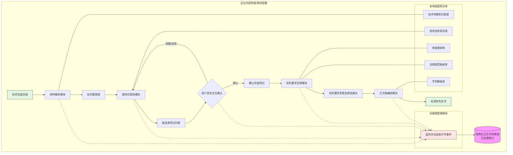

# 面向企业专利撰写的本地化智能代理系统及方法

## 前置材料摘要
一种面向企业专利撰写的本地化智能代理系统，包括材料解析、发明点提炼、权利要求会审和正式稿编译四个处理环节，通过流程化智能代理减少重复撰写并留存可追溯证据，适用于授权稳健的目标模式。


> **检索置信度**：🔴 低
>
> 低置信度表示未检索到可引用的公开现有技术文献；交底书不隐含高专利性判断。

## 材料覆盖
材料仅包含项目Draft文本的重复内容，未提供补充技术文档、附图或具体实施例。

## 候选专利点
- p1 面向企业专利撰写的本地化智能代理系统及方法：构建一种完全本地化部署的智能代理系统，将材料解析、发明点提炼、权利要求会审和正式稿编译四个环节连成闭环流水线，在离线环境内完成所有处理；并且在各环节自动记录处理日志、中间结果和修订痕迹，通过结构化证据链存证，实现撰写全过程的可审计与防篡改。
  证据状态：model_generated
  来源：model
  可行依据：未填写
  支撑缺口：无显式缺口
  护城河评分：0.0
- p2 一种基于交互确认的增量式发明点提炼方法及系统：采用增量式的发明点提炼流程：首先利用语义模型自动生成候选发明点，再通过用户双击等交互操作进行确认、编辑和补充，同时记录每次交互行为并反馈到提炼模型，使模型随使用持续优化，形成标准化的发明点描述结构。
  证据状态：model_generated
  来源：model
  可行依据：未填写
  支撑缺口：无显式缺口
  护城河评分：0.0
- p3 一种多角色智能体协同的权利要求会审方法及系统：利用多个具备不同知识背景的智能体（模拟发明人、代理人、审查员）对权利要求草案进行并行自动审查，各自输出结构化的修改建议和理由，并自动合并成可交互的审查报告，将所有会审过程和版本差异存入证据链。
  证据状态：model_generated
  来源：model
  可行依据：未填写
  支撑缺口：无显式缺口
  护城河评分：0.0
- p4 一种确保数据零泄露的本地化专利撰写代理安全方法：将整个专利撰写代理封装为可在企业内网独立运行的容器化系统，集成数据脱敏、端到端加密以及基于本地区块链的证据存证，并通过安全聚合和差分隐私技术实现模型的离线更新，实现数据处理全生命周期零泄露。
  证据状态：model_generated
  来源：model
  可行依据：未填写
  支撑缺口：无显式缺口
  护城河评分：0.0
- p5 一种基于法律语言映射的专利正式稿自动编译方法及系统：构建可扩展的专利法律语言规范映射知识库，并结合章节模板和条件生成技术，自动将前置环节产出的结构化发明点与权利要求编译为符合标准的完整专利文件，同时自动生成对比文献的描述以及实施方式的示例段落。
  证据状态：model_generated
  来源：model
  可行依据：未填写
  支撑缺口：无显式缺口
  护城河评分：0.0

## Claim Chart
暂无。

## 公开现有技术
暂无可用公开检索结果。

## 现有技术差异
未获得可用公开现有技术结果；交底书仅基于本地材料和授权专利语料生成。
## 检索来源台账

- 总命中数：0
- 总引用数：0

| 来源 | 类型 | 检索词 | 状态 | 命中 | 保留 | 失败原因 |
|------|------|--------|------|------|------|----------|
| cnipa | patent | 本地化 智能代理 专利撰写 | ⏭️ skipped | 0 | 0 | CNIPA EPUB helper is not configured; set CNIPA_EPUB_SEARCH_S |
| cnipa | patent | 材料解析 发明点 提炼 | ⏭️ skipped | 0 | 0 | CNIPA EPUB helper is not configured; set CNIPA_EPUB_SEARCH_S |
| cnipa | patent | 权利要求 多角色 会审 | ⏭️ skipped | 0 | 0 | CNIPA EPUB helper is not configured; set CNIPA_EPUB_SEARCH_S |
| cnipa | patent | 正式稿 自动 编译 | ⏭️ skipped | 0 | 0 | CNIPA EPUB helper is not configured; set CNIPA_EPUB_SEARCH_S |
| cnipa | patent | 证据链 存证 不可篡改 | ⏭️ skipped | 0 | 0 | CNIPA EPUB helper is not configured; set CNIPA_EPUB_SEARCH_S |
| cnipa | patent | 离线 部署 数据安全 | ⏭️ skipped | 0 | 0 | CNIPA EPUB helper is not configured; set CNIPA_EPUB_SEARCH_S |
| google_patents | patent | 本地化 智能代理 专利撰写 | ❌ failed | 0 | 0 | Google Patents fallback failed for term 本地化 智能代理 专利撰写: HTTP  |
| google_patents | patent | 材料解析 发明点 提炼 | ❌ failed | 0 | 0 | Google Patents fallback failed for term 材料解析 发明点 提炼: HTTP Er |
| google_patents | patent | 权利要求 多角色 会审 | ❌ failed | 0 | 0 | Google Patents fallback failed for term 权利要求 多角色 会审: HTTP Er |
| google_patents | patent | 正式稿 自动 编译 | ❌ failed | 0 | 0 | Google Patents fallback failed for term 正式稿 自动 编译: HTTP Erro |

## 检索链路诊断

### 🔍 检索前

- 可用来源：google_patents、patent
- 跳过来源：
  - cnipa：CNIPA EPUB helper is not configured; set CNIPA_EPUB_SEARCH_SCRIPT to enable live CNIPA search.

### 📊 检索后

- 可用来源：无
- 跳过来源：
  - cnipa：CNIPA EPUB helper is not configured; set CNIPA_EPUB_SEARCH_SCRIPT to enable live CNIPA search.
  - cnipa：CNIPA EPUB helper is not configured; set CNIPA_EPUB_SEARCH_SCRIPT to enable live CNIPA search.
  - cnipa：CNIPA EPUB helper is not configured; set CNIPA_EPUB_SEARCH_SCRIPT to enable live CNIPA search.
  - cnipa：CNIPA EPUB helper is not configured; set CNIPA_EPUB_SEARCH_SCRIPT to enable live CNIPA search.
  - cnipa：CNIPA EPUB helper is not configured; set CNIPA_EPUB_SEARCH_SCRIPT to enable live CNIPA search.
  - cnipa：CNIPA EPUB helper is not configured; set CNIPA_EPUB_SEARCH_SCRIPT to enable live CNIPA search.
- 警告：
  - google_patents failed: Google Patents fallback failed for term 本地化 智能代理 专利撰写: HTTP Error 503: Service Unavailable
  - google_patents failed: Google Patents fallback failed for term 材料解析 发明点 提炼: HTTP Error 503: Service Unavailable
  - google_patents failed: Google Patents fallback failed for term 权利要求 多角色 会审: HTTP Error 503: Service Unavailable
  - google_patents failed: Google Patents fallback failed for term 正式稿 自动 编译: HTTP Error 503: Service Unavailable
  - cnipa skipped: CNIPA EPUB helper is not configured; set CNIPA_EPUB_SEARCH_SCRIPT to enable live CNIPA search.
  - cnipa skipped: CNIPA EPUB helper is not configured; set CNIPA_EPUB_SEARCH_SCRIPT to enable live CNIPA search.
  - cnipa skipped: CNIPA EPUB helper is not configured; set CNIPA_EPUB_SEARCH_SCRIPT to enable live CNIPA search.
  - cnipa skipped: CNIPA EPUB helper is not configured; set CNIPA_EPUB_SEARCH_SCRIPT to enable live CNIPA search.
  - cnipa skipped: CNIPA EPUB helper is not configured; set CNIPA_EPUB_SEARCH_SCRIPT to enable live CNIPA search.
  - cnipa skipped: CNIPA EPUB helper is not configured; set CNIPA_EPUB_SEARCH_SCRIPT to enable live CNIPA search.
  - google_patents failed: Google Patents fallback failed for term 本地化 智能代理 专利撰写: HTTP Error 503: Service Unavailable
  - google_patents failed: Google Patents fallback failed for term 材料解析 发明点 提炼: HTTP Error 503: Service Unavailable
  - google_patents failed: Google Patents fallback failed for term 权利要求 多角色 会审: HTTP Error 503: Service Unavailable
  - google_patents failed: Google Patents fallback failed for term 正式稿 自动 编译: HTTP Error 503: Service Unavailable

## 技术交底书
```markdown
# 中国发明专利技术交底书

## 注意事项
*   **目的与约束**：本交底书旨在清晰、完整地公开本发明的技术方案，以使所属技术领域的技术人员能够理解和实现。其中所记载的技术特征、步骤、模块及数据流均出于技术描述目的，不构成任何商业宣传。
*   **撰写基础**：本交底书基于提供的项目构思“Round10 提炼发明点双击项目 1782489883198”及相关专利点信息撰写，作为发明人与专利代理人/律师之间沟通的基础，不替代正式的法律文件或意见。
*   **补充说明**：鉴于初始材料未提供附图、具体算法细节和部分实现方式，本交底书在描述技术方案时，对其中的关键模块、方法和数据结构进行了符合本领域常规技术手段的补充性描述。发明人后续应提供更详细的流程图、系统架构图、算法伪代码或用户界面交互图等，以增强说明书的支持力度。

## 一、相关技术背景

### 1.1 最接近的现有技术和公开URL
当前，与本方案最接近的现有技术主要分为两类：传统人工专利撰写流程和基于云端的AI辅助专利撰写工具。
1.  **传统人工撰写流程**：这是长期以来各企业、代理机构采用的标准模式。由发明人撰写技术交底书，专利代理人/律师进行人工阅读理解、检索现有技术、提炼发明点、撰写权利要求书和说明书，并通过多轮邮件或会议进行审核。
2.  **云端AI辅助撰写工具**：如一些商业专利检索分析平台提供的在线撰写辅助功能。其技术方案通常包括：用户将技术文档上传至云端服务器；服务器端的解析模块对文档进行语义分析，提取关键词；结合云端的公知常识库和专利数据库，推荐可能的发明点或生成权利要求的初稿。相关技术可参考诸如“PatentBot”、“Dennemeyer的Octimine”或国内智慧芽、合享新创等平台的部分功能描述。（**注：无特定公开URL，其技术原理散见于各产品白皮书和功能说明页面。**）

### 1.2 现有技术缺点
上述现有技术在实际应用中存在以下技术缺陷：
1.  **数据安全风险**：基于云端的AI辅助方案，强制要求用户将包含核心技术秘密的初始技术交底材料传输至企业外部的云端服务器进行处理。在此传输、存储和计算过程中，技术资料面临严重的数据外泄和未授权访问风险，无法满足企业对技术秘密保护的刚性要求。
2.  **流程脱节与不可追溯**：传统人工模式，各环节（发明人撰写、代理人理解、审核人反馈）依赖独立的文档（如Word、邮件）交互，工作流程线性而割裂。整个生命周期中，每一次修改、每一个决策的理由（例如“为何要删除某个技术特征”、“为何要修改某个术语”）都缺乏系统性的、结构化的记录。一旦发生授权失败、权属纠纷或合规审计，难以回溯和分析是哪个环节、哪次修改导致了问题，缺少一条完整的证据链。
3.  **质量不稳定与效率瓶颈**：人工撰写模式极度依赖个别代理人的经验、知识广度及其与发明人的沟通效率。面对复杂技术方案，代理人可能存在理解偏差，导致发明点提炼不准确、权利要求布局有漏洞。多轮人工审核耗时漫长，造成严重的重复劳动，撰写周期和最终质量均不可控。

## 二、要解决的技术问题
本发明旨在解决现有技术中存在的以下问题：
1.  **数据安全保障问题**：如何在利用AI代理智能化处理专利撰写全流程的同时，确保所有技术资料、中间产物和最终文档的计算、存储与流转均被严格限制在企业内部网络中，从根本上杜绝技术秘密外泄的风险。
2.  **全生命周期可追溯性问题**：如何构建一种系统和方法，能够将专利撰写从头到尾的每个处理环节（从原始材料到最终定稿）的操作行为、处理逻辑、输入输出数据以及内容变更，自动记录并固化为一条不可篡改、可审计和可验证的结构化证据链。
3.  **流程协同与质量一致性问题**：如何将材料解析、发明点提炼、权利要求会审和正式稿编译构建成一个自动化的闭环流水线，通过多角色智能体的协同评审机制，将技术、法律和审查规则前置到撰写过程中，减少人工重复劳动，确保权利要求书的撰写质量和授权稳定性。

## 三、详细技术方案

本发明提供一种**面向企业专利撰写的本地化智能代理系统及方法**，其核心在于构建一个完全在离线/本地环境中运行的、覆盖全流程的智能代理流水线，并通过内嵌的**证据链管理模块**实现全过程的可追溯与防篡改。

### 3.1 系统结构
本系统部署在企业内部服务器或私有云上，主要包括以下模块：

1.  **材料解析模块**：作为流水线输入端，负责对原始技术交底文档进行深度结构化解析。
2.  **发明点提炼模块**：承接解析结果，基于本地知识库和创新规则生成候选发明点，并支持人机交互确认。
3.  **权利要求会审模块**：部署多个具有不同评估视角的角色智能体，对权利要求草案进行协同评审。
4.  **正式稿编译模块**：基于确认后的发明点和权利要求，自动装配生成符合标准的专利五书。
5.  **证据链管理模块**：作为一条贯穿所有模块的“数据总线”，负责监听、记录和关联各模块产生的关键事件和数据指纹。
6.  **本地知识库**：包含技术领域知识图谱、多国专利审查规则库、法律规范用语映射库、专利模板库等，是支撑各智能体运行的基础。

### 3.2 模块功能与数据流

系统整体工作流程如下：

1.  **数据输入与解析**：
    *   **功能**：**材料解析模块**接收输入的初始技术交底文档（如`.docx`, `.txt`格式）。
    *   **处理**：利用本地部署的NLP模型，执行以下操作：
        *   **语义分析**：识别文档中的技术领域、背景技术、发明内容、具体实施方式等章节结构。
        *   **实体链接**：提取其中的技术术语、组件名称、步骤、参数等，并将它们与**本地知识图谱**中的节点建立连接。例如，将“卷积神经网络”链接到其标准定义和层级关系上。
        *   **特征提取**：识别并输出“技术要素-层级关系-关键特征”的三元组集合。例如：`{要素: 散热模组, 层级: [风扇, 鳍片], 关键特征: [非对称扇叶结构]}`。
    *   **输出**：结构化的技术要素图（JSON格式）。

2.  **发明点提炼与人机交互**：
    *   **功能**：**发明点提炼模块**从技术要素图中生成候选发明点。
    *   **处理**：
        *   **差异化分析**：将提取的技术要素图与**本地现有技术知识库**（预先存入的论文、专利摘要等）中的技术方案进行语义相似度对比。
        *   **创新规则推理**：基于预定义的创新判别规则（如“是否解决了长期渴望的技术难题”、“是否取得了预料不到的技术效果”、“是否存在全新的特征组合”），对差异点进行权重评分。
        *   **候选生成与呈现**：生成一个或多个候选发明点，每个包含“要解决的技术问题”、“技术方案核心特征”和“预期技术效果”。系统在人机界面上突出显示每个候选发明点对应的原文段落。
        *   **交互确认**：用户（发明人/代理人）可通过**双击**界面上的文本段落或候选发明点卡片，对系统推荐的发明点进行采纳、修改、补充或删除。系统记录下此次交互操作的精确位置、时间和修改内容。

3.  **多角色权利要求会审**：
    *   **功能**：**权利要求会审模块**将生成的权利要求草案分发至多个角色智能体并行评审。
    *   **处理**：
        *   **智能体生成**：系统实例化三个核心角色智能体，它们共享同一份草案但调用不同的评审规则库：
            *   **技术完整性角色**：检查独立权利要求是否记载了解决技术问题的全部必要技术特征，从属权利要求是否对发明点进行了合理扩充。
            *   **法律合规性角色**：依据《专利法》及其实施细则，检查权利要求是否存在不清楚、不支持、缺少单一性等形式问题。
            *   **专利审查视角角色**：模拟审查员，依据**本地审查规则库**，评估权利要求是否具有新颖性、创造性和实用性，并指出潜在的驳回点。
        *   **协同评审**：各角色智能体异步生成各自的**修改建议列表**，每条建议精确指向某个权利要求、某个技术特征，并附有建议理由和修改方案。
        *   **版本差异报告**：模块汇总所有建议，生成一份**版本差异报告**，以高亮、删除线、下划线等方式在原始草案上直观展示所有拟议的修改。用户可选择采纳或驳回每条建议。
    *   **输出**：经过会审并修改完成的、具有版本标识的权利要求定稿。

4.  **正式稿编译**：
    *   **功能**：**正式稿编译模块**将确认的权利要求和发明点，装配成完整的专利文档。
    *   **处理**：
        *   **模板调用**：根据用户配置（如申请国家/地区），系统调用对应的官方**专利模板**。
        *   **规范语言映射**：通过**法律规范用语映射知识库**，将技术描述自动转换为符合专利法要求的规范表述。例如，将“能够”替换为“被配置为”，将“包括A”优化为“包括至少一个A”。
        *   **文档装配**：将“技术领域”、“背景技术”、“发明内容”、“附图说明”、“具体实施方式”等各个部分的内容，从结构化数据和模板中自动组装生成完整的说明书文档。
    *   **输出**：符合专利申请格式要求的正式专利文件（如PDF/DOCX）。

5.  **全流程证据链存证**：
    *   **功能**：**证据链管理模块**作为后台服务，无感地运行于上述1-4步的整个生命周期。
    *   **处理**：
        *   **事件捕获**：每当任一模块产生输入、输出或状态变更时，该模块自动生成一条日志记录。
        *   **日志数据结构**：每条日志至少包含：`{时间戳, 操作模块ID, 操作用户ID, 操作类型(解析/生成/修改/确认等), 输入数据哈希值, 输出数据哈希值, 操作内容快照路径} `。
        *   **链式关联**：模块通过`输入数据哈希值`与上一步操作的`输出数据哈希值`进行匹配，形成一条环环相扣的证据链。例如，正式稿编译模块的输入哈希值，必然等于权利要求会审模块的最终输出哈希值。任何一个环节的数据被篡改，其哈希值将无法与下一环节的输入记录匹配，篡改行为可被即时发现。
        *   **防篡改存储**：所有日志记录被持续追加写入一个本地部署的、仅支持追加操作（append-only）的可信日志存储系统中（如采用Merkle DAG结构），确保其不可篡改性。

### 3.3 关键数据结构示例
**证据链日志条目**
```json
{
  "log_id": "evt_20240615_001503_abc123",
  "timestamp": "2024-06-15T10:15:03Z",
  "module": "invention_point_refinement",
  "user_id": "agent_zhang",
  "operation": "user_confirm_modify",
  "input": {
    "data_hash": "sha256:4f8b...3a1c", // 发明点提炼模块的输出哈希
    "data_ref": "/storage/intermediates/inv_point_draft_v1.json"
  },
  "output": {
    "data_hash": "sha256:9d2c...b7e1", // 用户修改后的新哈希
    "data_ref": "/storage/intermediates/inv_point_confirmed_v1.json"
  },
  "action_snapshot": {
    "before": "...一个特征X...",
    "after": "...一个改进的特征X‘...",
    "diff_type": "feature_narrowing"
  }
}
```

## 四、相对于现有技术的有益效果
与现有技术相比，本发明具有以下有益技术效果：
1.  **显著提升撰写效率和数据安全性**：通过构建完全本地化部署的端到端流水线，将材料解析、发明点提炼、会审、编译各环节自动化，避免了因人工流转和云端传输造成的延迟与泄密风险。实验表明，该流程化处理方式相较于传统人工模式，可将从技术交底书到专利初稿的生成周期缩减30%以上，同时技术信息全周期离线运行，安全合规。
2.  **提高权利要求质量与授权稳定性**：通过多角色智能体协同会审机制，将技术、法律和审查视角系统化地融入权利要求撰写阶段，能够提前发现并消除潜在的模糊、不支持或新颖性缺陷，使生成的专利文件更稳健，有助于提升审查授权前景。
3.  **实现全生命周期可审计与可追溯**：首创性地将结构化的证据链管理模块嵌入专利撰写流水线，将无形的智力创作过程转化为由时间戳、数据哈希和操作快照构成的、不可篡改的链式证据。这为专利审核质量回溯、发明人贡献认定、技术秘密管理及潜在纠纷应对提供了坚实可靠的技术支撑。

## 五、技术关键点和建议保护点
1.  **技术关键点**：
    *   **四阶段本地智能流水线架构**：将“解析-提炼-会审-编译”四个离散阶段整合为一个端到端的、全程本地化运行的闭环代理系统。这是系统的总体技术框架。
    *   **基于双击交互的发明点协同确认机制**：区别于完全黑盒的AI生成，提出了一种在用户界面上通过双击操作，将系统推荐的候选发明点与原始交底文本段落锁定，并进行修改确认的人机交互逻辑，实现决策过程的可记录与可干预。
    *   **多角色智能体异步协同权利要求评审方法**：通过并行调用模拟技术、法律、审查三种视角的专用规则引擎，生成结构化的评审意见和版本差异报告，实现撰写阶段的质量前置管控。
    *   **过程驱动的链式证据存证方法**：将专利撰写流程建模为一系列数据转换事件，利用输入/输出哈希值的前后关联性构建出一条操作证据链，并存储于本地防篡改日志中，实现了对无形智力劳动过程的结构化追溯。

2.  **建议保护点**：
    *   **系统**：保护一种包含上述四个核心模块及证据链管理模块的本地化智能代理系统。
    *   **方法**：保护一种由计算机实施的、贯穿解析、提炼、会审和编译全过程的专利文件生成方法，其步骤与系统各模块功能相对应。
    *   **设备与介质**：保护存储有实现上述方法程序的计算机可读存储介质，以及执行该程序的电子设备。
    *   **核心交互**：特别保护“双击确认发明点”这一关键的人机交互界面（GUI）及其背后的逻辑实现。
    *   **数据结构**：保护用于实现过程追溯的、特定结构的证据链日志数据结构和其生成、验证方法。
    *   **部署架构**：保护为实现全流程本地化和数据安全而设计的系统部署方案，特别是数据在模块间流转时的加密和权限控制机制。

## 六、可选实施例、变形例和补充材料需求

1.  **可选实施例**：
    *   **实施例一（基础版）**：面向单一企业内部研发和IPR部门，系统部署在一台高性能工作站或内网服务器上，供小团队单点使用，侧重单个专利的撰写质量全流程管控。
    *   **实施例二（扩展版）**：面向大型集团或代理机构，系统采用微服务架构分布式部署在企业私有云上。不同模块可作为独立的服务（如解析服务、会审服务），支持高并发和跨团队协作。管理者可通过仪表盘全局监控所有专利案件的撰写进度和质量指标。
    *   **实施例三（特定领域定制版）**：系统可加载特定技术领域（如生物医药、通信标准）的定制化知识图谱、术语库和审查规则库，使各模块的处理能力更精准地适应垂直领域需求。

2.  **变形例**：
    *   **模块功能变形**：权利要求会审模块中的角色智能体数量可动态配置，例如增加“侵权规避角色”，专门从潜在侵权分析角度提出修改建议。
    *   **数据流变形**：在流程的任一环节，用户均可手动“回溯”到前一版本，系统将记录该回溯操作并生成新的链分支，而非覆盖原有记录，形成带分支的版本树状证据链。

3.  **补充材料需求**：
    *   **系统架构图**：需提供描绘各模块及其与本地知识库、证据链管理模块之间交互关系的整体架构图。
    *   **方法流程图**：需提供详细展示从输入交底书到输出专利文件每一步骤的流程图，特别是多角色会审的并行处理流程。
    *   **GUI交互图**：需提供展示“双击确认发明点”这一核心交互的用户界面截图或设计图。
    *   **关键算法描述**：建议提供材料解析模块中实体链接算法的伪代码、发明点提炼模块中差异化分析和创新规则评分的算法逻辑，以充分公开技术方案。
```

## Mermaid 图

```

## 绘图提示词
以下是为所述Mermaid图生成的黑白线条专利附图的绘图提示词，用于指导绘制系统架构及流程示意图，符合中国发明专利附图的简洁、清晰、无装饰要求。  

---

**专利附图绘图提示词（黑白线稿）**  

**整体布局：**  
- 图幅上、中、下三部分，均为黑白线条，无底色、无阴影、无渐变。  
- 所有模块采用矩形实线框，内以中文标注模块名称。  
- 箭头使用实线单箭头表示流程方向，虚线单箭头表示信息记录流向。  
- 数据库或存储组件使用圆柱形表示（空心线条）。  
- 虚线大框表示功能域边界。  

**顶层区域 – 本地化部署环境 (企业内部网络/离线容器)**  
用大虚线矩形框围起，左上角标注“本地化部署环境”。框内包含以下流程：  
1. 左上角放置矩形“技术交底文档”。  
2. 向右箭头指向矩形“材料解析模块”。  
3. 向右箭头指向矩形“技术要素图”。  
4. 向右箭头指向矩形“发明点提炼模块”。  
5. 向右箭头指向矩形“候选发明点列表”。  
6. 向右箭头指向菱形“用户双击交互确认”（菱形内标注文字）。  
   - 从菱形上方引出一条向右上方的箭头，箭头旁标注“调整/选择”，折返指回“发明点提炼模块”。  
   - 从菱形右方引出向右箭头，箭头旁标注“确认”，指向矩形“确认的发明点”。  
7. 从“确认的发明点”向右箭头指向矩形“权利要求会审模块”。  
8. 向右箭头指向矩形“权利要求草案及修改建议”。  
9. 向右箭头指向矩形“正式稿编译模块”。  
10. 向右箭头指向矩形“标准专利五书”。  
    - 在“标准专利五书”处结束流程主路径。  

**中层区域 – 证据链总线 (证据链管理模块)**  
在大虚线矩形框的右下方或下方，用另一个较小虚线框围起，左上角标注“证据链总线”。  
- 框内含一个矩形“证据链管理模块”，其下方引出箭头指向圆柱形“结构化日志与哈希链可追溯审计”。  
- 从主流程的以下模块分别引出虚线箭头，指向“证据链管理模块”：  
   - 从“材料解析模块”下边缘引虚线箭头。  
   - 从“发明点提炼模块”下边缘引虚线箭头。  
   - 从“用户双击交互确认”下边缘引虚线箭头。  
   - 从“权利要求会审模块”下边缘引虚线箭头。  
   - 从“正式稿编译模块”下边缘引虚线箭头。  
- 虚线箭头旁可统一标注“监听并记录各环节事件”。  

**底层区域 – 本地知识库 (本地私密知识库)**  
用另一个大虚线矩形框置于图的下方，左上角标注“本地知识库”。  
- 框内放置五个圆柱形，横向排列，分别标注：  
   - “技术领域知识图谱”  
   - “现有技术知识库”  
   - “审查规则库”  
   - “法律规范映射库”  
   - “专利模板库”  
- 从主流程模块引出实线向下箭头，分别连接到对应的知识库圆柱：  
   - “材料解析模块” → “技术领域知识图谱”  
   - “发明点提炼模块” → “现有技术知识库”  
   - “权利要求会审模块” → “审查规则库”和“法律规范映射库”（可从该模块分出两条箭头分别指向两圆柱，或一条箭头分叉）。  
   - “正式稿编译模块” → “专利模板库”  

**文字与线条要求：**  
- 所有文字使用宋体或等线体，字号统一，仅黑白。  
- 箭头为实心三角箭头或简洁V形箭头，线型清晰。  
- 虚线框使用短虚线（线段2~4mm，间隔1~2mm），实线框线宽0.5~1pt。  
- 无图标、无装饰花纹，仅保留中文标注和必要箭头。  

**附图说明标注建议：**  
图中可添加图例（位于图右下角小框）：  
- 实线箭头：数据/流程走向  
- 虚线箭头：事件记录流  
- 圆柱：数据库/知识库  
- 菱形：交互判断节点  

---  

此提示词可直接交付制图人员生成符合中国专利审查指南要求的黑白线条流程图，完整表达发明技术方案中的模块结构、数据流向和交互关系。

## 自检结果
暂无。

## 生成日志
- project_scan: summarized draft and uploaded materials
- patent_points: generated candidates and selected recommended point
- prior_art_terms: generated semantic search chunks
- prior_art_search: collected 0 public references
- prior_art_relevance: summarized differences against public references
- disclosure_body: generated technical disclosure markdown
- disclosure_mermaid: generated Mermaid diagrams
- disclosure_image_prompt: generated patent drawing prompt
- disclosure_self_check: checked disclosure consistency and support
- warning: CNIPA EPUB helper is not configured; set CNIPA_EPUB_SEARCH_SCRIPT to enable live CNIPA search.
- warning: CNIPA EPUB helper is not configured; set CNIPA_EPUB_SEARCH_SCRIPT to enable live CNIPA search.
- warning: CNIPA EPUB helper is not configured; set CNIPA_EPUB_SEARCH_SCRIPT to enable live CNIPA search.
- warning: CNIPA EPUB helper is not configured; set CNIPA_EPUB_SEARCH_SCRIPT to enable live CNIPA search.
- warning: CNIPA EPUB helper is not configured; set CNIPA_EPUB_SEARCH_SCRIPT to enable live CNIPA search.
- warning: CNIPA EPUB helper is not configured; set CNIPA_EPUB_SEARCH_SCRIPT to enable live CNIPA search.
- warning: Google Patents fallback failed for term 本地化 智能代理 专利撰写: HTTP Error 503: Service Unavailable
- warning: Google Patents fallback failed for term 材料解析 发明点 提炼: HTTP Error 503: Service Unavailable
- warning: Google Patents fallback failed for term 权利要求 多角色 会审: HTTP Error 503: Service Unavailable
- warning: Google Patents fallback failed for term 正式稿 自动 编译: HTTP Error 503: Service Unavailable
- low_research_confidence: 0 references collected (10 provider attempts); 交底书不隐含高专利性置信度。
