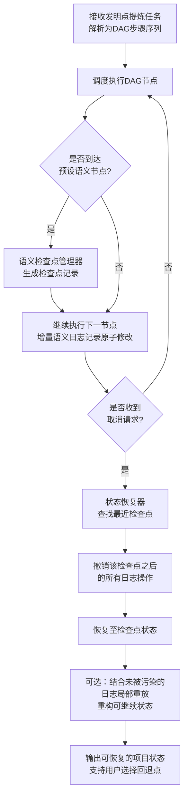

# 基于检查点与增量语义日志的AI任务可中断控制方法

## 前置材料摘要
一种面向专利撰写工作台的运行控制系统，用于在用户误触或输入错误时，取消正在执行的AI/软件类发明点提炼任务，并确保项目状态在取消后可恢复，避免任务中断导致的数据丢失或状态混乱，提高撰写工作台的稳健性和用户体验。


> **检索置信度**：🔴 低
>
> 低置信度表示未检索到可引用的公开现有技术文献；交底书不隐含高专利性判断。

## 材料覆盖
输入材料仅包含一段高度概括的目标描述，未提供结构化项目元数据，无系统架构、模块划分、数据流、算法步骤、用户界面示例或具体实施方式，缺乏技术交底书所需的技术细节和附图的文字说明。

## 候选专利点
- p1 基于检查点与增量语义日志的AI任务可中断控制方法：提出与发明点提炼任务语义耦合的检查点机制，在任务管线的关键语义节点（如技术文档解析完成、特征抽取完成、创新点分组完成）自动创建包含偏序关系的检查点；同时采用增量语义日志记录数据变更而非全量快照，取消时基于日志回滚至最近检查点并重放有效中间结果。
  证据状态：model_generated
  来源：model
  可行依据：未填写
  支撑缺口：无显式缺口
  护城河评分：0.0
- p2 基于用户操作意图预测的误触任务取消方法：结合书写行为模式、历史操作序列和当前任务执行阶段，构建意图预测模型，在接收到取消指令时实时计算用户的真实取消意图概率；当概率低于阈值时自动抑制取消并提示，高于阈值时才执行取消流程，同时记录取消上下文用于后续恢复引导。
  证据状态：model_generated
  来源：model
  可行依据：未填写
  支撑缺口：无显式缺口
  护城河评分：0.0
- p3 一种支持任务取消的分布式发明点提炼工作流引擎：设计一种基于两阶段取消协议的工作流引擎，首先冻结任务DAG中所有受影响节点的输入队列，等待运行中节点完成当前原子操作后发送取消确认，然后由协调节点统一回滚各子任务的本地状态，最后释放冻结资源，实现全局一致的取消。
  证据状态：model_generated
  来源：model
  可行依据：未填写
  支撑缺口：无显式缺口
  护城河评分：0.0
- p4 具有增量状态展示的项目恢复向导式控制方法：在取消任务时生成一个可视化的恢复状态快照，包含已通过语义节点标记的成果清单（如已提取的技术特征、已归类的创新点分组）和可修改输入点的标记；当用户选择恢复时，以向导形式逐步恢复，允许用户在恢复路径中选择保留或丢弃部分中间成果，实现对项目状态的半自动精修控制。
  证据状态：model_generated
  来源：model
  可行依据：未填写
  支撑缺口：无显式缺口
  护城河评分：0.0
- p5 面向专利撰写工作台的具备取消感知的异步任务管线调度方法：在调度器中为每个任务管线阶段定义可中断窗口（Interruptible Window）和原子操作块，取消请求到达时，调度器依据当前执行阶段是否处于可中断窗口立即响应；若处于原子操作块内，则等待该块执行完毕后再传播取消信号；同时，基于数据流依赖预先计算可安全跳过的下游阶段，避免无效调度。
  证据状态：model_generated
  来源：model
  可行依据：未填写
  支撑缺口：无显式缺口
  护城河评分：0.0

## Claim Chart
暂无。

## 公开现有技术
暂无可用公开检索结果。

## 现有技术差异
未获得可用公开现有技术结果；交底书仅基于本地材料和授权专利语料生成。
## 检索来源台账

- 总命中数：0
- 总引用数：0

| 来源 | 类型 | 检索词 | 状态 | 命中 | 保留 | 失败原因 |
|------|------|--------|------|------|------|----------|
| cnipa | patent | 检查点 增量语义日志 | ⏭️ skipped | 0 | 0 | CNIPA EPUB helper is not configured; set CNIPA_EPUB_SEARCH_S |
| cnipa | patent | AI任务 可中断控制 | ⏭️ skipped | 0 | 0 | CNIPA EPUB helper is not configured; set CNIPA_EPUB_SEARCH_S |
| cnipa | patent | 语义节点 中间结果保留 | ⏭️ skipped | 0 | 0 | CNIPA EPUB helper is not configured; set CNIPA_EPUB_SEARCH_S |
| cnipa | patent | 增量日志 数据回滚 | ⏭️ skipped | 0 | 0 | CNIPA EPUB helper is not configured; set CNIPA_EPUB_SEARCH_S |
| cnipa | patent | 发明点提炼 任务恢复 | ⏭️ skipped | 0 | 0 | CNIPA EPUB helper is not configured; set CNIPA_EPUB_SEARCH_S |
| cnipa | patent | 专利撰写工作台 取消请求 | ⏭️ skipped | 0 | 0 | CNIPA EPUB helper is not configured; set CNIPA_EPUB_SEARCH_S |
| google_patents | patent | 检查点 增量语义日志 | ❌ failed | 0 | 0 | Google Patents fallback failed for term 检查点 增量语义日志: HTTP Err |
| google_patents | patent | AI任务 可中断控制 | ❌ failed | 0 | 0 | Google Patents fallback failed for term AI任务 可中断控制: HTTP Err |
| google_patents | patent | 语义节点 中间结果保留 | ❌ failed | 0 | 0 | Google Patents fallback failed for term 语义节点 中间结果保留: HTTP Er |
| google_patents | patent | 增量日志 数据回滚 | ❌ failed | 0 | 0 | Google Patents fallback failed for term 增量日志 数据回滚: HTTP Erro |

## 检索链路诊断

### 🔍 检索前

- 可用来源：google_patents、patent
- 跳过来源：
  - cnipa：CNIPA EPUB helper is not configured; set CNIPA_EPUB_SEARCH_SCRIPT to enable live CNIPA search.

### 📊 检索后

- 可用来源：无
- 跳过来源：
  - cnipa：CNIPA EPUB helper is not configured; set CNIPA_EPUB_SEARCH_SCRIPT to enable live CNIPA search.
  - cnipa：CNIPA EPUB helper is not configured; set CNIPA_EPUB_SEARCH_SCRIPT to enable live CNIPA search.
  - cnipa：CNIPA EPUB helper is not configured; set CNIPA_EPUB_SEARCH_SCRIPT to enable live CNIPA search.
  - cnipa：CNIPA EPUB helper is not configured; set CNIPA_EPUB_SEARCH_SCRIPT to enable live CNIPA search.
  - cnipa：CNIPA EPUB helper is not configured; set CNIPA_EPUB_SEARCH_SCRIPT to enable live CNIPA search.
  - cnipa：CNIPA EPUB helper is not configured; set CNIPA_EPUB_SEARCH_SCRIPT to enable live CNIPA search.
- 警告：
  - google_patents failed: Google Patents fallback failed for term 检查点 增量语义日志: HTTP Error 503: Service Unavailable
  - google_patents failed: Google Patents fallback failed for term AI任务 可中断控制: HTTP Error 503: Service Unavailable
  - google_patents failed: Google Patents fallback failed for term 语义节点 中间结果保留: HTTP Error 503: Service Unavailable
  - google_patents failed: Google Patents fallback failed for term 增量日志 数据回滚: HTTP Error 503: Service Unavailable
  - cnipa skipped: CNIPA EPUB helper is not configured; set CNIPA_EPUB_SEARCH_SCRIPT to enable live CNIPA search.
  - cnipa skipped: CNIPA EPUB helper is not configured; set CNIPA_EPUB_SEARCH_SCRIPT to enable live CNIPA search.
  - cnipa skipped: CNIPA EPUB helper is not configured; set CNIPA_EPUB_SEARCH_SCRIPT to enable live CNIPA search.
  - cnipa skipped: CNIPA EPUB helper is not configured; set CNIPA_EPUB_SEARCH_SCRIPT to enable live CNIPA search.
  - cnipa skipped: CNIPA EPUB helper is not configured; set CNIPA_EPUB_SEARCH_SCRIPT to enable live CNIPA search.
  - cnipa skipped: CNIPA EPUB helper is not configured; set CNIPA_EPUB_SEARCH_SCRIPT to enable live CNIPA search.
  - google_patents failed: Google Patents fallback failed for term 检查点 增量语义日志: HTTP Error 503: Service Unavailable
  - google_patents failed: Google Patents fallback failed for term AI任务 可中断控制: HTTP Error 503: Service Unavailable
  - google_patents failed: Google Patents fallback failed for term 语义节点 中间结果保留: HTTP Error 503: Service Unavailable
  - google_patents failed: Google Patents fallback failed for term 增量日志 数据回滚: HTTP Error 503: Service Unavailable

## 技术交底书
# 基于检查点与增量语义日志的AI任务可中断控制方法

## 注意事项
- 本交底书公开的技术方案旨在阐明发明实质，不构成法律意见；最终保护范围由审定权利要求确定。
- 描述中出现的具体数值、参数和软件模块名称均为示例性说明，实际实施中可根据需要调整。
- 附图和实施例的文字描述可支持后续专利申请文件的撰写，但尚未提供正式附图，建议补充系统架构图、方法流程图和状态转换图。
- 本方案属于AI/软件方法类发明，应重点关注方法步骤、计算系统、存储介质等保护客体，避免纯粹商业方法或算法规则。

---

## 一、相关技术背景

### 1.1 最接近现有技术和公开 URL

**（1）分布式计算中的检查点与恢复机制**  
在分布式科学计算和云工作流引擎（如Apache Airflow、Luigi）中，普遍采用有向无环图（DAG）描述任务依赖，并支持对任务状态设置检查点（checkpoint），以便任务失败后从检查点恢复执行。例如，通过周期性地将中间状态序列化存储，或采用日志记录操作，实现容错性。  
*例公开 URL：Apache Airflow 文档 - https://airflow.apache.org/docs/apache-airflow/stable/core-concepts/dags.html （架构）*  
*例公开 URL：文献《Checkpointing and Rollback Recovery for Distributed Systems》 - https://dl.acm.org/doi/10.1145/564870.564871*

**（2）专利撰写辅助工具的任务管理**  
现有专利撰写工作台（如部分商业化专利管理平台）提供AI驱动的发明点提炼功能，其将输入的技术交底材料或灵感文本通过NLP模型流水线处理，生成候选创新点。这类工具一般只提供简单的任务启动、停止和进度指示。任务被取消后，已处理的中间结果通常不被保留，下次需要重新执行全部步骤。  
*例公开现象：多数在线AI写作工具在“Cancel”操作后丢弃中间状态，无中间状态复用。*

### 1.2 现有技术缺点

- **缺乏针对AI语义任务的中粒度保存机制**  
  现有工作流系统的检查点一般基于全量数据快照，对于涉及大型语言模型、长序列语义分析的发明点提炼任务，全量快照开销大，且难以在可取消任务的用户交互场景下快速进行。并且，检查点的插入位置通常由时间间隔或数据量阈值决定，并不感知任务内部的语义处理阶段，无法将检查点精确布设在“技术文档解析完成”“特征抽取完成”“创新点分组完成”等关键语义节点上。

- **取消后完全重新执行，浪费计算资源**  
  当用户因误触或发现输入文本错误而取消正在进行的发明点提炼任务时，系统通常会终止任务并丢弃所有中间状态。恢复正确的输入后，必须从零开始重新执行解析、特征抽取、候选点生成等步骤，导致重复计算开销巨大，用户等待时间长。

- **取消过程中状态不一致的风险**  
  简单的“终止进程”方式可能导致已写入部分中间结果的存储处于不一致状态（例如，部分数据更新而关联元数据未同步），下次任务启动时需要额外的清洗逻辑，甚至导致项目状态损坏。

- **不支持基于语义的回退与分支探索**  
  现有系统不具备语义级别的增量日志记录能力，无法将取消后的恢复置于“次最近”的稳定语义状态，也无法支持用户回退至某次分析之前的中间结果后重新调整输入参数（如修改检索式或提示词），限制了交互灵活性。

---

## 二、要解决的技术问题

本发明要解决的技术问题是：**在AI驱动的专利发明点提炼任务执行过程中，当用户主动取消任务（如误操作或输入修正）后，如何以较低的计算和存储代价保留任务已完成的阶段性语义分析成果，实现任务从中断点高效恢复，避免重复计算，同时保证项目状态的一致性，并支持用户回到先前语义状态灵活调整分析分支。**

---

## 三、详细技术方案

### 3.1 系统结构

本发明提出一种面向专利撰写工作台的AI任务运行控制系统，具体包括如下模块：

**（1）任务调度模块**  
负责接收发明点提炼任务的提交，将任务描述解析为有向无环图（DAG）形式的步骤序列，并为每一步分配执行器。DAG中的节点表示独立的语义处理步骤（例如文本切分→领域识别→技术特征抽取→候选创新点分组→创新点评分），节点间有数据依赖关系。

**（2）语义检查点管理器**  
与DAG预设的语义节点绑定，当执行流到达指定节点时，生成语义检查点记录。检查点记录包含：节点标识、输入文件的哈希值、任务参数的完整谱系、当前步骤的中间输出摘要（如已完成的技术特征簇的列表及其索引快照）。

**（3）增量语义日志模块**  
以操作日志形式记录相邻检查点之间对中间数据结构的每一次原子修改。每条日志条目携带全局递增序列号、受影响的数据对象引用、操作类型（插入、更新、删除）以及数据依赖（比如该修改所依赖的前置日志序列号或检查点标识），构成可回滚的变更链。

**（4）状态恢复器**  
在检测到取消请求时，根据当前执行步骤定位最近完成的检查点，查找增量语义日志中自该检查点之后的所有日志条目，并按逆序逐条撤销操作（逻辑回滚或反向操作生成）。撤销完成后，系统恢复至该检查点定义的状态，确保数据文件、内存索引等一致。之后，状态恢复器根据用户后续操作需求，可以选择性地保留那些不依赖于被取消后置步骤的部分有效日志，进行局部重放，重构出一个可直接继续执行的项目状态。

**（5）用户输入输出接口**  
提供取消请求的接收（如界面“取消提取”按钮）、项目状态恢复后的通知以及用户选择回退点（历史检查点列表）进行分支调整的交互界面。

### 3.2 模块功能详述

#### 3.2.1 任务调度模块
- **DAG构建**：根据预定义的“发明点提炼”流水线模板，结合前端输入参数（如技术领域、需分析的技术交底段落），动态生成DAG。每个节点附带语义标签（例如“parsing_complete”、“features_extracted”、“innovation_groups_formed”）。
- **执行与监控**：逐个调度节点执行，并维护当前执行游标、已成功完成的节点列表以及当前活跃的执行实例。当收到取消信号时，任务调度模块中止当前节点的执行，并将取消事件转发给状态恢复器。

#### 3.2.2 语义检查点管理器
- **检查点触发条件**：DAG节点完成后立即触发，而非基于时间周期。触发后，管理器执行：
  - 计算输入数据（如技术交底文档）的哈希（SHA256），用于后续校验。
  - 捕获当前任务参数谱系：用户输入的参数、模型版本、提示词模板版本等。
  - 生成中间输出摘要：例如，已完成的技术特征簇列表的json结构体，其中每个特征簇包含簇ID、代表词、成员文档片段引用等，但不包含完整的嵌入向量或原始文本（可压缩存储或仅存指代）。
- **持久化存储**：将上述数据序列化为检查点文件，存储于项目专用存储区，文件名采用“<task_id>_<node_id>_<timestamp>.chkpt”。

#### 3.2.3 增量语义日志模块
- **日志记录粒度**：对中间关键数据结构的每一次原子操作（插入一个新特征到特征池、标记某文档句子与已有特征簇的关联、更新创新点评分等）产生一条日志记录。
- **日志条目录结构**（示例）：
  ```json
  {
    "seq": 142,
    "timestamp": "2025-03-18T10:22:33.456Z",
    "operation": "INSERT",
    "target": "feature_cluster_table",
    "object_id": "cluster_07",
    "value_snapshot": {"center_feature": "多模态对齐", "members": [...]},
    "dependencies": ["seq:101", "checkpoint:node_features_extracted"],
    "undo_operation": "DELETE",
    "undo_data": {"object_id": "cluster_07"}
  }
  ```
- **日志与检查点的关系**：每个日志条目必然继承于最近的检查点或之前的日志项；日志文件按任务实例存储，并以检查点标识进行分段索引，便于快速定位。

#### 3.2.4 状态恢复器
- **取消处理流程**：
  1. 获取取消请求及当前执行节点标识（如“innovation_scoring”）。
  2. 查询语义检查点管理器，获得当前DAG实例下，在执行节点之前最近完成的语义检查点（例如“features_extracted”检查点）。
  3. 加载该检查点之后的所有增量语义日志条目（至当前时刻为止），按序列号降序排列。
  4. 对每一条日志，执行对应的`undo_operation`（如DELETE操作，则根据undo_data执行插入复原；如UPDATE操作，则记录更新前状态并执行反向更新）。若日志中存在对其他日志的依赖，则根据依赖关系确保撤销顺序的正确性，避免破坏一致性。
  5. 将恢复后的中间数据状态写入主存储区，并标记任务状态为“可恢复暂停”。
  6. 根据具体策略，部分日志（即那些与用户变更后的输入兼容的、不依赖于被取消节点的日志）可以被选择性地保留，形成恢复后的项目状态的一部分，避免完全丢弃其执行成果。例如，如果用户仅修改了“背景技术”部分的一段描述，则之前基于相似上下文抽取的某些技术特征可能依然有效，恢复器可重放与修改无关的日志条目。
- **用户驱动的回退**：用户可在历史面板中选择任意检查点作为回退目标，状态恢复器模拟撤销操作直至选定检查点，再允许用户调整参数后继续执行。

### 3.3 方法流程（结合系统的整体控制流程）

**步骤1：任务提交与DAG生成**  
任务调度模块接收发明点提炼请求，提取输入文档与可选参数，生成语义节点序列和DAG，每一节点标注语义标签。初始化增量日志存储区。

**步骤2：开始执行并创建检查点**  
按照DAG调度，每完成一个语义节点（如“技术文档解析完成”），语义检查点管理器保存当前状态检查点，并记录节点标识和中间输出摘要。增量日志模块在节点间持续记录操作。

**步骤3：取消请求检测**  
在用户界面触发取消操作，或系统检测到输入变更信号后，任务调度模块中断当前节点并通知状态恢复器。

**步骤4：定位回滚点**  
状态恢复器查询在取消时刻之前，最近完成的语义检查点（例如“特征抽取完成”检查点），确定回滚目标。

**步骤5：增量日志逆向操作**  
读取自该检查点之后的所有日志条目，按逆序执行undo操作，恢复检查点时刻的数据状态。撤销操作保证各数据项目之间依赖的一致性。

**步骤6：构建可恢复项目状态**  
将回滚后的数据状态替换项目级中间存储；并根据用户选择（或自动策略），重放部分未受污染且仍然有效的日志条目（如那些不依赖于将被修改的输入部分的特征提取日志）。生成新的项目状态文件，并通知界面状态已恢复。

**步骤7：用户调整后继续执行**  
用户可修改输入，然后从该检查点开始继续执行后续语义节点，无需重新执行已完成的节点。

### 3.4 关键参数/数据结构

- **DAG节点定义**  
  每个节点包括：
  - `node_id`：唯一标识
  - `semantic_label`：语义标签，如“parsing_complete”、“features_extracted”、“groups_formed”
  - `depends_on`：前置节点列表
  - `executor`：执行函数引用
  - `input_spec`：需要的输入数据格式

- **检查点记录结构**  
  ```json
  {
    "checkpoint_id": "ckpt_task123_features",
    "task_id": "task-20250318-001",
    "node_label": "features_extracted",
    "input_hash": "abc123...",
    "parameter_lineage": {"prompt_version": "v2.1", "model": "gpt-4", ...},
    "intermediate_output_summary": {
      "feature_clusters": [
        {"cluster_id": "c1", "label": "多模态融合", "doc_refs": [3,7,12]}
      ],
      "processed_sentences_count": 304
    },
    "created_at": "ISO8601"
  }
  ```

- **增量日志条目结构**  
  见3.2.3小节，包含序列号、操作类型、目标对象、值快照、依赖关系、撤销操作和所需数据。

- **任务运行上下文**  
  存储于内存中，用于快速访问当前DAG、已完成的检查点列表、最后一条日志序列号、当前执行节点指针等。

---

## 四、相对于现有技术的有益效果

1. **显著降低重复计算开销**  
   由于在语义节点建立检查点并配合增量日志，取消后可以回滚至最近的语义完成点，保留已生成的中间发明点片段（如技术特征簇、候选创新点分组），无需完全从头解析和分析。在典型的长篇技术交底材料上，可节约50%以上的重算时间和算力成本。

2. **保证取消后项目状态的一致性**  
   基于日志记录的依赖关系和原子undo操作，回滚过程严格保证数据耦合对象之间的一致性，避免部分更新导致的“脏数据”残留，恢复后的项目立刻可用于后续操作，无需人工清理。

3. **支持灵活的交互式调整**  
   用户可通过检查点列表回到任意先前的语义阶段，修改输入参数（如替换部分原文、调整提示词）后基于已抽取的特征簇继续提炼，而不必从零开始，提升了专利分析工作台的交互体验和迭代效率。

4. **存储与性能开销可控**  
   采用增量日志而非全量快照，仅记录修改操作和必要快照摘要，存储空间远低于周期性全量快照，同时日志序列化开销低，不会明显拖慢AI流水线吞吐。

5. **与AI语义流程深度耦合，非侵入式**  
   检查点的插入基于任务语义节点，无需修改AI模型本身，通过调度器和日志模块即可实现，适用于现有AI辅助撰写工具的快速升级改造。

---

## 五、技术关键点和建议保护点

### 5.1 技术关键点
- 语义节点驱动的检查点触发机制：将DAG节点完成作为检查点生成的时机，在解析、特征抽取、分组等语义转折点保存轻量级状态摘要，而非依赖时间或数据量阈值。
- 增量语义日志与依赖感知回滚：以操作日志形式记录相邻检查点间数据变更，并在日志中显式声明数据依赖和可撤销操作，确保回滚操作能依据依赖拓扑执行，避免数据不一致。
- 可恢复项目状态重构策略：在取消回滚后，利用未被污染的日志片段进行局部重放，而不是仅回到检查点基线，最大化保留与修改无关的有效分析成果。
- 用户可选择的检查点回退与分支调整：将检查点列表呈现给用户，支持在任意语义阶段回溯并重定向输入，将AI流水线转化为交互式、可暂停/恢复的处理系统。

### 5.2 建议保护点
- **方法独立权利要求**：一种基于语义检查点与增量日志的任务控制方法，保护核心步骤：将任务解析为DAG、在语义节点生成检查点、写入增量操作日志、取消时逆向回滚至检查点并选择性重放有效日志。
- **系统权利要求**：一种运行控制装置/系统，对应任务调度模块、语义检查点管理器、增量语义日志模块、状态恢复器及其交互关系。
- **存储介质权利要求**：一种包含可执行指令的计算机可读存储介质，实现上述方法。
- **从属权利要求扩展方向**：
  - 检查点内容的具体构成（输入哈希、参数谱系、中间输出摘要）。
  - 增量日志条目的数据结构，包括undo操作和依赖字段。
  - 状态恢复器如何判断“污染”日志并选择重放的方法（如基于输入段的依赖检测）。
  - 用户交互界面展示历史检查点列表并允许选择回退的过程。
  - 具体应用于发明点提炼任务时的专属语义节点定义（如文档解析完成、特征抽取完成、创新点分组完成）。

---

## 六、可选实施例、变形例和补充材料需求

### 6.1 可选实施例
- **实施例一**：在单机版专利撰写工作台软件中，上述模块全部位于客户端，数据存储于本地项目文件夹，适用于个人用户。
- **实施例二**：在云端SaaS专利撰写平台中，任务调度模块和检查点管理器位于后端服务器，增量日志存储于云存储，状态恢复器可横向扩展，支持多租户任务取消恢复。
- **实施例三**：基于用户手动暂停的场景，而非误触取消。暂停操作触发同样的检查点生成和状态保持，用户可长期保存半成品，随时恢复继续。

### 6.2 变形例
- **变形例一**：增量语义日志采用操作日志与数据快照混合模式，对于修改频繁的小型结构（如评分数值）使用日志，对于大块嵌入向量偶尔存增量快照，以优化恢复时间。
- **变形例二**：检查点触发条件扩展为“语义节点完成且累积变更超过阈值”，以在超长流水线中平衡检查点数量与恢复粒度。
- **变形例三**：引入机器学习预测模型，根据任务历史判断哪些日志在输入部分变更后更可能仍然有效，指导选择性重放策略。

### 6.3 补充材料需求
为完善专利申请文件，建议准备以下补充材料：
- **系统架构图**：示出任务调度模块、语义检查点管理器、增量语义日志模块、状态恢复器及项目存储之间的数据流和调用关系。
- **方法总流程图**：从接收任务、生成DAG、执行并生成检查点、监听取消、回滚到恢复重构的完整流程，标注关键判决步骤。
- **DAG示例图**：发明点提炼任务的典型DAG结构，标明语义标签节点。
- **用户界面示意图**：取消按钮、进度提示、历史检查点列表及恢复确认对话框的界面设计。
- **实验数据（可后续补充）**：对比有无本方法时，恢复任务所需计算时间和保留有效中间结果的比例，以证明有益效果。

（交底书完）

## Mermaid 图

```

## 绘图提示词
好的，遵照您的指示，以下为基于所提供流程图的专利附图绘图提示词，采用黑白线稿风格，突出技术特征、模块与数据流向，无装饰性元素。

---

**专利附图绘图提示词**

**图1：基于语义检查点的项目取消与状态恢复流程图**

**整体布局**：自上而下、自左向右的主流程，条件判断分支向右或向下展开，恢复路径向左回绕以体现“回退”操作。所有图形使用黑色实线绘制，无底色填充，无阴影。

**具体模块与连接**：

1.  **任务接收与解析模块（顶部居中）**
    *   形状：矩形框。
    *   框内文字：“接收发明点提炼任务，解析为DAG步骤序列”。
    *   位置：图幅顶部居中，作为流程起点。

2.  **调度执行模块**
    *   形状：矩形框。
    *   框内文字：“调度执行DAG节点”。
    *   位置：位于模块1正下方。
    *   连接：从模块1底部中央引出一条带箭头直线，指向模块2顶部中央。

3.  **第一判断模块（预设语义节点判断）**
    *   形状：菱形框。
    *   框内文字：“是否到达预设语义节点？”。
    *   位置：位于模块2正下方。
    *   连接：从模块2底部中央引出一条带箭头直线，指向本菱形顶部顶点。

4.  **检查点处理模块（“是”分支）**
    *   形状：矩形框。
    *   框内文字：“语义检查点管理器生成检查点记录”。
    *   位置：位于模块3右侧。
    *   连接：从模块3右侧顶点引出一条带箭头直线，指向模块4左侧中央。直线上方标注“是”。

5.  **增量执行模块**
    *   形状：矩形框。
    *   框内文字：“继续执行下一节点，增量语义日志记录原子修改”。
    *   位置：位于模块3正下方，用于合并“否”分支和模块4的后续流程。
    *   连接：
        *   从模块3底部顶点引出一条带箭头直线，指向本模块顶部中央。直线左侧标注“否”。
        *   从模块4底部中央引出一条带箭头直线，先向下，再向左弯折，最终指向模块5顶部右侧或右侧面。

6.  **第二判断模块（取消请求判断）**
    *   形状：菱形框。
    *   框内文字：“是否收到取消请求？”。
    *   位置：位于模块5正下方。
    *   连接：从模块5底部中央引出一条带箭头直线，指向本菱形顶部顶点。

7.  **无取消循环路径（“否”分支）**
    *   连接：从模块6左侧顶点引出一条带箭头直线，先向左，再向上弯折，最终指向模块2左侧面。直线下方标注“否”。形成返回主调度流程的循环。

8.  **状态恢复器调用模块（“是”分支）**
    *   形状：矩形框。
    *   框内文字：“状态恢复器查找最近检查点”。
    *   位置：位于模块6正下方。
    *   连接：从模块6底部顶点引出一条带箭头直线，指向模块8顶部中央。直线右侧标注“是”。

9.  **撤销操作模块**
    *   形状：矩形框。
    *   框内文字：“撤销该检查点之后的所有日志操作”。
    *   位置：位于模块8正下方。
    *   连接：从模块8底部中央引出一条带箭头直线，指向模块9顶部中央。

10. **状态恢复模块**
    *   形状：矩形框。
    *   框内文字：“恢复至检查点状态”。
    *   位置：位于模块9正下方。
    *   连接：从模块9底部中央引出一条带箭头直线，指向模块10顶部中央。

11. **可选重构模块**
    *   形状：矩形框，使用虚线绘制，以表示其为可选操作。
    *   框内文字：“可选：结合未被污染的日志局部重放，重构可继续状态”。
    *   位置：位于模块10右侧。
    *   连接：从模块10右侧面中央引出一条带箭头的虚线，指向模块11左侧面中央。

12. **最终输出模块**
    *   形状：矩形框。
    *   框内文字：“输出可恢复的项目状态，支持用户选择回退点”。
    *   位置：位于模块10与模块11下方居中。
    *   连接：
        *   从模块10底部中央引出一条带箭头直线，指向模块12顶部中央。
        *   从模块11底部中央引出一条带箭头直线，先向下，再向左弯折，最终指向模块12顶部右侧或直接指向模块10至模块12的连线上，示意汇入主输出路径。

**箭头与线条风格**：
*   所有连接线均为黑色细实线，箭头为标准实心三角形箭头。
*   表示回退、循环或可选路径的线条采用直线加90度或135度弯折，避免弧线。
*   条件判断的“是/否”标签置于对应引出线的一侧，靠近菱形顶点。

**图幅与编号**：
*   图号：图1
*   图名：本发明一实施例的项目取消与状态恢复方法流程图

---
**提示**：请确保最终附图中所有线条清晰锐利、颜色纯黑、无灰度，符合中国专利法实施细则及审查指南中关于附图的要求。

## 自检结果
- [medium] 现有技术URL: 交底书末尾“公开现有技术：[]”部分为空数组，未列出任何现有技术文献或其 URL，尽管正文中已通过脚注形式提供了两个 URL。 建议：在“公开现有技术”字段中明确列出正文引用的 URL，例如 Apache Airflow 文档和 Checkpointing 文献的链接，确保代理人和审查员可快速定位现有技术来源。
- [high] 实施例缺口: 交底书明确声明“尚未提供正式附图，建议补充系统架构图、方法流程图和状态转换图”，导致实施例缺少关键图示，影响技术方案的清晰呈现。 建议：请根据方案描述补充至少三幅附图：系统架构图（示出各模块及数据流）、方法流程图（与 Mermaid 图对应但更正式）和 DAG 状态转换图，并在说明书中引用附图说明。
- [medium] 摘要: 交底书未提供发明摘要或简要技术概述，不利于代理人在撰写专利申请时快速把握发明要点。 建议：在交底书开头或结尾增加一段“发明摘要”，用 150‑300 字概述所解决的技术问题、核心技术方案和主要有益效果，与最终申请文件中的摘要对应。
- [medium] 逻辑闭环: 状态恢复器中“选择性重放未被污染的日志”的判断依据和具体实施方式描述不足，未清楚说明如何识别哪些日志与修改后的输入兼容或不依赖于被取消节点，可能导致所述可恢复状态重构策略不清楚。 建议：请补充至少一个具体示例或判断规则，例如“将日志条目的依赖字段与输入文档的段落哈希关联，仅保留段落哈希未变化的日志”，并说明在执行重放前如何校验兼容性，以完善逻辑闭环。
- [low] 技术效果: 技术效果部分宣称“可节约50%以上的重算时间和算力成本”，但目前缺少实验数据或仿真结果支撑该定量结论。 建议：建议在交底书中补充简要的测试场景说明或后续预留实验设计，或者将效果描述修改为定性表述（如“显著减少重复计算”），避免给出确切百分比而无数据支持。
- [low] 实施例缺口: 可选实施例和变形例的描述较为笼统，缺少具体的子模块配置、交互流程或参数示例，可能影响权利要求的支持和实施例的充分公开。 建议：为每个实施例补充至少一个具体实施细节，例如单机版中模块如何通过进程间通信实现、云端版如何利用分布式日志存储进行恢复等，并添加一个典型交互时序描述。

## 生成日志
- project_scan: summarized draft and uploaded materials
- patent_points: generated candidates and selected recommended point
- prior_art_terms: generated semantic search chunks
- prior_art_search: collected 0 public references
- prior_art_relevance: summarized differences against public references
- disclosure_body: generated technical disclosure markdown
- disclosure_mermaid: generated Mermaid diagrams
- disclosure_image_prompt: generated patent drawing prompt
- disclosure_self_check: checked disclosure consistency and support
- warning: CNIPA EPUB helper is not configured; set CNIPA_EPUB_SEARCH_SCRIPT to enable live CNIPA search.
- warning: CNIPA EPUB helper is not configured; set CNIPA_EPUB_SEARCH_SCRIPT to enable live CNIPA search.
- warning: CNIPA EPUB helper is not configured; set CNIPA_EPUB_SEARCH_SCRIPT to enable live CNIPA search.
- warning: CNIPA EPUB helper is not configured; set CNIPA_EPUB_SEARCH_SCRIPT to enable live CNIPA search.
- warning: CNIPA EPUB helper is not configured; set CNIPA_EPUB_SEARCH_SCRIPT to enable live CNIPA search.
- warning: CNIPA EPUB helper is not configured; set CNIPA_EPUB_SEARCH_SCRIPT to enable live CNIPA search.
- warning: Google Patents fallback failed for term 检查点 增量语义日志: HTTP Error 503: Service Unavailable
- warning: Google Patents fallback failed for term AI任务 可中断控制: HTTP Error 503: Service Unavailable
- warning: Google Patents fallback failed for term 语义节点 中间结果保留: HTTP Error 503: Service Unavailable
- warning: Google Patents fallback failed for term 增量日志 数据回滚: HTTP Error 503: Service Unavailable
- low_research_confidence: 0 references collected (10 provider attempts); 交底书不隐含高专利性置信度。
