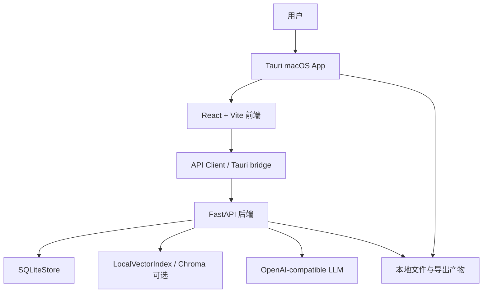

<!-- generated-by: codex-doc-update -->

# PatentAgent 项目设计总览

本文档描述当前源码中的产品设计原则、系统架构、菜单结构、期望用户动作，以及主要步骤产物。内容依据当前 React/Tauri/FastAPI 生产源码和已有 README 整理，规格文档和设计稿仅作为背景参考，不作为实现证据。

## 源码身份

| 项目 | 当前值 |
| --- | --- |
| Worktree | `/Users/leo/Projects/patents_agent` |
| Branch | `codex/automation-test-plan` |
| Docs update implementation base | `d7640545` |
| Worktree 状态 | 写入本文档前已有预存未提交变更；写入后另增 `docs/project-design-overview.md` 更新 |

## 项目定位

PatentAgent 是面向中国发明专利和实用新型的本地桌面专利工程系统。它把一句技术想法、结构方案或已有初稿，组织为可执行的专利撰写流程：录入材料、确认发明点、会审策略、凝练公式、生成初稿、质量门禁、正式稿编译、成稿会审和导出。

系统的核心目标不是生成一份看起来完整的文本，而是帮助用户在专利授权视角下持续收敛：哪些内容能进正式稿，哪些只能保留在内部策略稿，哪些缺少证据，哪些会阻断导出。

## 设计原则

### 1. 授权导向优先

产品围绕授权稳定性、保护范围、说明书支撑、现有技术差异和正式稿清洁度设计。初稿不是终点，质量检查、正式稿编译和成稿会审共同决定能否导出正式提交稿。

实现落点：

- `frontend/src/guidedFlow.ts` 定义完整 guided flow 和质量门禁。
- `backend/app/filing_readiness.py`、`backend/app/claim_defense.py`、`backend/app/draft_completion.py` 负责成熟度、防线和完善分析。
- `backend/app/official_compile.py` 和 `backend/app/post_draft_review.py` 控制正式稿与成稿会审。

### 2. 默认向导简单，专家工具下沉

普通用户首屏只面对三条起步路径：从技术想法撰写发明专利、从结构方案撰写实用新型、导入已有稿件进行润色提升。语料库、护城河、会审、质检、导出等复杂工具被收进二级专家工具。

实现落点：

- `frontend/src/guidedFlow.ts` 中的 `v1StartChoices` 定义三条默认入口。
- `frontend/src/guidedFlow.ts` 中的 `mainSections` 只暴露 `开始 / 项目 / 设置`。
- `frontend/src/views/expertViews.tsx` 按工具组渲染专家工具中心。

### 3. 证据状态显式化

系统允许用户登记可行但未验证的技术路线，用于布局和分案策略，但不会把未验证方案伪装成已验证事实。候选发明点、证据绑定和完善矩阵都带有证据状态。新增的 Markdown DeepResearch intake 会把研究材料解析进内部 evidence 和 prior-art 结构，供发明点判断、差异比对和后续质检复用。

实现落点：

- `backend/app/schemas.py` 定义 `EvidenceVerificationStatus`。
- `frontend/src/api.ts` 定义前端 Evidence 相关类型。
- `frontend/src/flow/inventionSelectors.ts` 将候选发明点证据状态显示给用户。

### 4. 正式稿和内部稿强隔离

正式提交稿只允许包含清理后的摘要、权利要求书、说明书和附图说明。内部策略、护城河、会审日志、支撑缺口、补强建议和风险说明必须留在内部稿或侧车报告中。交底导出也遵循同样边界，对律师和代理师可见的是 clean disclosure，而研究命中、检索归并和内部备注进入 sidecar。

实现落点：

- `frontend/src/views/exportView.tsx` 将正式提交稿、内部策略稿和风险说明分开。
- `backend/app/official_compile.py` 生成 `OfficialDraftPackage`。
- `frontend/src/flow/panels/ExportConfirmationPanel.tsx` 在正式稿编译和成稿会审未通过前锁定正式导出。

### 5. 本地桌面优先

生产形态是 Tauri macOS 桌面应用。Tauri 负责启动本地 FastAPI sidecar、探测 `/api/health`、提供原生打开和保存能力，并把渲染端 `/api/*` 请求转发到本地后端。

实现落点：

- `src-tauri/src/main.rs` 启动和监管后端、提供 Tauri commands。
- `frontend/src/lib/apiClient.ts` 在 Tauri 环境中解析本地后端 base URL。
- `src-tauri/tauri.conf.json` 定义 React build、PyInstaller backend、DMG bundle。

### 6. 长任务可观察、可取消、可重试

发明点提炼、会审、公式凝练、成稿会审等任务可能较慢，系统把运行阶段、心跳、失败原因和修复建议持久化展示，允许取消和重试。

实现落点：

- `backend/app/runtime.py` 定义 `RuntimeContext`、取消、超时和阶段状态。
- `frontend/src/flow/runtimeWidgets.tsx` 渲染运行中控制台、失败和重试动作。
- `frontend/src/flow/panels/*Panel.tsx` 在对应步骤接入取消和重试处理。

### 7. 源码和真实运行产物为准

项目明确要求 UI 判断以 `frontend/src/`、`src-tauri/` 和真实运行应用为准。`docs/superpowers/`、截图和 OpenDesign 导出是需求或参考，不是生产实现证据。

实现落点：

- 根目录 `AGENTS.md` 定义 UI、DMG 和回归验证的防错规则。
- README 明确当前生产 React、Tauri 和后端关系。

## 总体架构

### 目录职责

| 目录或文件 | 职责 |
| --- | --- |
| `frontend/src/` | React 生产前端、向导、专家工具、工作区、API client 和样式 |
| `backend/app/` | FastAPI 应用、生成逻辑、质量门禁、存储、LLM 适配和导出 |
| `backend/app/api/` | 已拆分的系统、桌面配置、项目和语料库 API router |
| `src-tauri/` | Tauri v2 桌面壳、后端 sidecar 管理、原生文件对话框、DMG 配置 |
| `tests/` | 后端单元测试、接口测试和质量门禁测试 |
| `docs/release/` | 桌面打包、release gate、DMG 回归和交付规则 |
| `docs/superpowers/` | 功能规格和执行计划，作为需求来源而非生产实现 |
| `data/` | 本地运行数据和 SQLite/索引数据，默认不作为源码提交内容 |

### 前端层

前端是 React 19 + TypeScript + Vite。主要结构如下：

- `frontend/src/App.tsx` 维护应用状态、请求处理和跨工作区 handler。
- `frontend/src/app/AppRoot.tsx` 只负责 shell 渲染、路由选择和 workspace 装配。
- `frontend/src/app/routes.tsx` 将主导航和专家工具映射为 route kind。
- `frontend/src/guidedFlow.ts` 定义主导航、专家工具、向导步骤、步骤状态和门禁逻辑。
- `frontend/src/features/projects/ProjectWorkspace.tsx` 渲染三选一入口、项目列表或 guided flow。
- `frontend/src/features/corpus/CorpusWorkspace.tsx` 渲染语料建设和知识库检索。
- `frontend/src/features/quality/QualityWorkspace.tsx` 渲染成熟度、授权前景、防线、完善和审查修改。
- `frontend/src/features/postDraft/PostDraftWorkspace.tsx` 渲染护城河、前置材料、会审、分步撰写和导出。
- `frontend/src/flow/panels/` 存放向导各步骤面板。

### 后端层

后端是 FastAPI + Pydantic + SQLite。启动时创建 `SQLiteStore`、本地向量索引、桌面配置和 LLM client，然后注册 API router 和仍位于 `backend/app/main.py` 的流程接口。

核心模块：

- `backend/app/main.py` 装配应用，并承载多数长流程 endpoint。
- `backend/app/storage.py` 管理 SQLite 表和对象序列化。
- `backend/app/repositories/` 与 `backend/app/services/` 承载项目、语料库和桌面配置服务。
- `backend/app/disclosure/` 处理材料解析、交底包和候选发明点。
- `backend/app/research/deep_researcher.py`、`backend/app/research/deep_research_intake.py` 将 Markdown 研究材料归并为内部证据、prior-art hits 和检索短语。
- `backend/app/deliberation/` 处理多智能体会审。
- `backend/app/core_formula.py` 处理公式需求评估和公式包。
- `backend/app/generator.py` 生成初稿。
- `backend/app/filing_readiness.py`、`backend/app/claim_defense.py`、`backend/app/draft_completion.py` 组成质量检查。
- `backend/app/official_compile.py` 生成正式稿。
- `backend/app/post_draft_review.py` 与 `backend/app/post_draft_repair.py` 处理成稿会审和修复。
- `backend/app/exporter.py` 输出 DOCX、Markdown、Mermaid 和绘图提示词。

### 桌面层

Tauri 负责把 Web 工作台包装为 macOS 桌面应用：

- 开发模式使用 `npm --prefix frontend run dev` 和 `http://127.0.0.1:5173`。
- 构建模式先构建前端，再用 PyInstaller 打包 backend sidecar。
- 应用启动时创建 app data 目录，启动后端，等待 `/api/health` 成功。
- Renderer 中的 API 请求通过 `get_backend_base_url` 指向本地后端。
- 原生能力包括打开外部初稿、保存正式稿、打开导出文件夹、桌面配置读写和健康检查。

### 存储层

主要持久化对象位于 SQLite：

- 语料库：`documents`、`chunks`、`corpus_jobs`、`corpus_versions`、`patent_assets`。
- 项目：`projects`、`project_materials`、`project_patent_points`。
- 外部稿：`external_draft_sources`、`external_draft_intake_runs`。
- 流程运行：`disclosure_runs`、`deliberation_runs`、`formula_runs`、`official_compile_runs`、`post_draft_review_runs`。
- 质检：`filing_readiness_reports`、`claim_defense_worksheets`、`grantability_reports`、`draft_completion_runs`。
- 性能和复用：`llm_stage_cache`。

## 菜单结构

### 一级主导航

| 菜单 | 入口 ID | 作用 |
| --- | --- | --- |
| 开始 | `generate` | 显示三选一入口，进入 guided flow |
| 项目 | `projects` | 查看历史项目、筛选、选择和删除项目 |
| 设置 | `settings` | 配置本机 LLM provider、base URL、model、API key 和主题 |

### 顶栏动作

| 动作 | 出现条件 | 作用 |
| --- | --- | --- |
| 当前项目选择器 | 常驻 | 切换已有项目，刷新相关运行记录 |
| 专家工具 | 非专家工具页面 | 进入二级工具中心 |
| 返回向导 | 专家工具页面 | 回到默认 guided flow |
| 返回三选一 | 已选择起步路径或处于专家工具 | 清空当前入口选择，回到默认起步方式 |
| 刷新/状态 | 常驻 | 刷新后端数据，显示空闲或处理中状态 |

### 关键节点快捷导航

当已有选中项目时，侧边栏增加三个关键节点：

| 节点 | 行为 |
| --- | --- |
| `01 想法与材料` | 回到 `开始` 的项目向导 |
| `02 发明点确认` | 打开专家工具中的 `护城河地图` |
| `03 多智能体会审` | 打开专家工具中的 `多智能体会审` |

### 专家工具分组

| 分组 | 工具 | 用途 |
| --- | --- | --- |
| 知识库 | 项目现有技术库、知识库检索、高级导入 | Agent 从项目题目和一句话介绍生成检索计划，检索官方/公开源，形成项目级现有技术语料库；高级用户仍可导入本地官方导出物 |
| 发明点 | 护城河地图 | 管理候选发明点、证据状态和分案方向 |
| 交底与策略 | 前置材料、多智能体会审、分步撰写 | 生成交底书、会审策略和手动申请文本 |
| 质检 | 提交成熟度、授权前景、权利要求防线、初稿完善、审查修改 | 执行正式稿前的质量和风险分析 |
| 导出 | 导出文件 | 导出正式稿、内部稿、图示和风险说明 |

## 默认用户路径

### 起步路径

| 起点 | 期望用户动作 | 后续流程差异 |
| --- | --- | --- |
| 从技术想法撰写发明专利 | 输入项目名称、一句话想法、可选元数据，选择撰写目标 | 完整走发明点、会审、公式、初稿、质检、正式稿和导出 |
| 从结构方案撰写实用新型 | 输入结构方案和必要元数据 | 固定为实用新型轻量版，优先关注结构组成、连接关系、安装位置和附图 |
| 导入已有稿件进行润色提升 | 选择或创建项目，上传 DOCX/TXT/Markdown 或粘贴文本，解析章节并确认工作稿 | 先建立内部工作稿，再进入质量检查和正式稿清理 |

### Guided Flow 步骤

| 步骤 | 用户动作 | 系统产物 | 解锁条件或门禁 |
| --- | --- | --- | --- |
| 1. 想法与材料 | 创建项目；填写申请人、发明人、技术领域等可选元数据；上传补充材料；或保存外部初稿并解析章节 | `ProjectRecord`、`ProjectMaterial`、`ExternalDraftSource`、`ExternalDraftIntakeRun`、确认后的内部工作稿 | 项目必须有 `draft_text` 才能进入后续步骤 |
| 2. 发明点 | 选择标准模式或免费 Deep Research；上传研究报告；点击提炼发明点；选择主线并保存后备路线 | `DisclosureRun`、交底包、候选 `PatentPointCandidate`、选中的主路线和后备路线 | 必须确认发明点，除非已有可导出的初稿 |
| 3. 多智能体会审 | 选择 Codex 主席和专家 provider，启动会审；必要时取消或重试 | `DeliberationRun`、`strategy_brief`、阶段结果、事件日志和失败详情 | 发明项目需要完成会审；实用新型轻量版可跳过发明专属重步骤 |
| 4. 核心公式 | 查看公式需求；选择公式 provider；在需要公式时启动凝练 | `FormulaNeedAssessment`、`FormulaRun`、公式包、公式说明 Markdown | 若检测到公式信号，必须完成公式凝练后才能生成初稿 |
| 5. 生成初稿 | 点击生成初稿；查看权利要求预览 | `DraftPackage`，包含标题、摘要、权利要求、说明书、附图说明、Mermaid、绘图提示词、引用和生成日志 | 需要项目、会审结果和已满足的公式条件 |
| 6. 质量检查 | 运行质量检查；查看风险命中；一键提升分数；接受候选补强 | `FilingReadinessReport`、`ClaimDefenseWorksheet`、`DraftCompletionRun`、scorecard、support matrix、候选 patches | 初稿必须存在；结果要与当前源稿哈希匹配 |
| 7. 正式稿编译 | 点击生成正式稿；如被阻断，清理源稿并回到质量检查 | `OfficialCompileRun`、`OfficialDraftPackage`、源稿哈希、正式稿哈希、清污项、阻断项、编译报告 | 初稿存在且质量检查完成 |
| 8. 成稿会审 | 选择会审 provider；可先做 Kimi 语言润色；启动成稿会审；处理阻断项、应用安全补丁或打开修复编辑器 | `PostDraftReviewRun`、导出裁决、阻断项、内部痕迹命中、官方安全补丁、修复 session | 必须已有匹配当前源稿的正式稿 |
| 9. 导出 | 确认正式稿门禁；下载或原生保存正式提交稿；导出内部策略稿和报告 | 正式提交稿 DOCX/MD、内部策略稿 DOCX/MD、Mermaid、绘图提示词、成熟度报告、完善报告、侧车风险说明 | 正式稿编译完成，成稿会审通过，且源稿/正式稿哈希匹配 |

## 各步骤产物明细

### 项目与输入

- `ProjectRecord`：项目名称、原始想法、专利类型、申请人/发明人/技术领域等结构化元数据、当前 `DraftPackage`。
- `ProjectMaterial`：用户上传的 PDF、DOCX、PPT、Markdown、TXT 等材料及处理状态。
- `ExternalDraftSource`：外部初稿原文、文件名、来源类型和内容哈希。
- `ExternalDraftIntakeRun`：章节解析结果、工作稿哈希、确认状态和解析问题。

### 发明点和策略

- `DisclosureRun`：交底生成运行记录，包含候选发明点、支撑材料摘要、DeepResearch 归并出的内部证据和 prior-art 结构，以及运行状态。
- `PatentPointCandidate`：候选主线、技术问题、创新点、技术方案、有益效果、保护重点、支撑缺口和证据状态。
- `DeliberationRun`：多智能体会审运行记录，包含 provider、阶段结果、策略摘要、日志、失败和重试信息。
- `PatentStrategyBrief`：权利要求策略、说明书策略、风险控制和会审共识。

### 公式和初稿

- `FormulaNeedAssessment`：系统判定项目是否需要公式凝练，以及触发信号。
- `FormulaRun`：公式块、变量定义、公式说明和 provider 记录。
- `DraftPackage`：内部初稿容器，包含正式文本和内部生成上下文。内部稿可以保留引用、生成日志、会审摘要、交底摘要和公式摘要。
- `RevisionLedgerRecord`：记录初稿和后续修复中的草稿变更、来源步骤、变更摘要和可追溯元数据，供会审、修复和导出链路复核。

### 质量门禁

- `FilingReadinessReport`：正式稿成熟度、风险命中、严重性、目标章节、建议和自动清理能力。
- `ClaimDefenseWorksheet`：权利要求技术特征、分类、说明书支撑、附图/实施例/证据引用和防线建议。
- `GrantabilityReport`：授权前景、最接近现有技术、claim chart、新颖性/创造性攻击和建议。
- `DraftCompletionRun`：评分卡、完善问题、任务、支撑矩阵和候选补丁；其中 draft audit rules 的命中结果会并入现有质量检查，继续驱动补强和阻断判断。
- `ProposedPatch`：可接受、拒绝或批量接受的补强建议，标记是否可进入正式稿。

### 正式稿与成稿会审

- `OfficialDraftPackage`：清污后的正式稿，只包含标题、摘要、权利要求、说明书、附图说明、附图计划、警告和哈希。
- `OfficialCompileRun`：正式稿编译记录，包含清理项、阻断项、侧车说明、日志和正式稿包。律师/代理师面向的 disclosure export 与内部检索侧车分离存放，不把内部研究痕迹混入正式材料。
- `PostDraftReviewRun`：成稿会审记录，包含 provider、角色结果、主席裁决、阻断项、内部痕迹命中、安全补丁和 `export_allowed`。
- `PostDraftRepairSession`：标注式修复编辑器使用的问题列表、草稿章节和右侧检查器数据。

### 导出文件

- 正式提交稿：`official-export.docx`、`official-export.md`。
- 内部策略稿：`export.docx`、`export.md`。
- 图示和提示词：`diagram.mmd`、`image-prompt.md`。
- 报告：交底书、公式说明、提交成熟度、初稿完善、正式稿编译报告、成稿会审报告。
- 桌面原生导出：Tauri 原生保存 DOCX、Markdown 和风险说明侧车文件。

## 后端 API 边界

### 基础和配置

- `GET /api/health`：返回后端健康、数据目录、模型和 embedding 模型。
- `GET /api/agents/doctor`：检查会审 provider 可用性。
- `GET /api/desktop-config`、`PATCH /api/desktop-config`、`POST /api/desktop-config/health`：管理本机 LLM 配置，不回显原始 API key。

### 项目和材料

- `GET /api/projects`、`POST /api/projects`、`GET/PUT/DELETE /api/projects/{project_id}`：项目 CRUD。
- `POST /api/projects/{project_id}/materials`、`GET /api/projects/{project_id}/materials`：材料上传和列表。
- `GET/POST/PATCH/DELETE /api/projects/{project_id}/patent-points`：发明点管理。

### 项目现有技术库和语料库

- `GET /api/projects/{project_id}/knowledge`：查看项目知识状态、最新检索意图、检索计划、候选文献和语料库版本。
- `POST /api/projects/{project_id}/knowledge/search-intent`：从项目题目和一句话介绍生成检索意图与 Agent 检索计划。
- `POST /api/projects/{project_id}/knowledge/search-plans/{plan_id}/run`：执行官方/公开源检索，写入候选文献池。
- `GET/PATCH /api/projects/{project_id}/knowledge/candidates`：查看并确认候选文献。
- `POST /api/projects/{project_id}/knowledge/corpus-versions`：从已确认候选文献创建项目语料库版本。
- `POST /api/corpus/jobs`、`POST /api/corpus/jobs/{job_id}/files`、`POST /api/corpus/jobs/{job_id}/run`：高级本地文件补充语料。

### 主流程

`backend/app/main.py` 中的流程 endpoint 覆盖外部初稿、交底、会审、公式、初稿生成、质检、正式稿编译、成稿会审、修复和导出。前端 `frontend/src/api.ts` 对这些 endpoint 提供类型化函数和下载 URL 生成函数。

## 期望的用户操作模型

### 普通用户

1. 在 `开始` 页选择三条默认路径之一。
2. 创建或选择项目，录入想法或导入已有初稿。
3. 上传补充材料，确认发明点或结构方案。
4. 按当前步骤主按钮推进，不直接跳过门禁。
5. 在质量检查中处理高风险项和补强建议。
6. 生成正式稿，运行成稿会审。
7. 只有导出门禁全绿时下载正式提交稿。
8. 将正式稿交由专利代理师、律师或专业人员复核。

### 高级用户

1. 使用 `专家工具` 进入特定工作台。
2. 建设或检索语料库，辅助差异和证据判断。
3. 在护城河地图中维护主线、后备路线和分案方向。
4. 查看会审、成熟度、防线、完善和授权前景的完整报告。
5. 在正式稿被阻断时使用人工编辑器、标注式修复编辑器或安全补丁修复。
6. 导出内部策略稿和风险说明，保留复核依据。

### 开发和发布人员

1. UI 变更必须检查生产 React 文件和真实运行应用。
2. 桌面交付必须从当前 Tauri 产物验证，不依赖 stale `/Volumes/PatentAgent`。
3. DMG 交付必须使用 release gate 文档和打包脚本，并记录源分支、SHA、dirty 状态、DMG SHA256 和 smoke 结果。

## 导出门禁

正式提交稿导出必须同时满足：

1. 当前项目已有可导出的 `DraftPackage`。
2. 提交成熟度、权利要求防线和初稿完善已针对当前源稿完成。
3. `OfficialCompileRun` 已完成，且 `source_draft_hash` 等于当前源稿哈希。
4. `PostDraftReviewRun` 已完成并允许导出。
5. 成稿会审绑定的 `official_compile_run_id`、`official_package_hash` 和 `draft_package_hash` 与当前正式稿匹配。

如果任一条件失败，正式提交稿 DOCX/MD 入口锁定；内部稿和风险说明仍可用于内部复核，但不能直接提交。

## 设计边界

- 系统不提供法律意见，不替代专利代理师或律师。
- 未验证、需实验和模型生成内容可以用于内部策略，但不能被写成已验证工程事实。
- 内部策略稿不是正式提交稿。
- 自动补丁默认是候选建议，用户接受后仍需重新通过后续门禁。
- 规格文档、截图和原型不能证明生产 UI 已更新。

## 主要源码依据

| 主题 | 主要文件 |
| --- | --- |
| 产品定位和默认流程 | `README.md` |
| 会话和交付守则 | `AGENTS.md` |
| 主导航、专家工具、步骤和门禁 | `frontend/src/guidedFlow.ts` |
| 路由映射 | `frontend/src/app/routes.tsx` |
| Shell 装配 | `frontend/src/app/AppRoot.tsx`、`frontend/src/ui/ShellSidebar.tsx` |
| 三选一和项目工作区 | `frontend/src/views/projectViews.tsx`、`frontend/src/features/projects/ProjectWorkspace.tsx` |
| 向导步骤面板 | `frontend/src/flow/panels/` |
| 专家工具工作区 | `frontend/src/features/corpus/CorpusWorkspace.tsx`、`frontend/src/features/quality/QualityWorkspace.tsx`、`frontend/src/features/postDraft/PostDraftWorkspace.tsx` |
| API client | `frontend/src/api.ts`、`frontend/src/lib/apiClient.ts` |
| FastAPI app | `backend/app/main.py`、`backend/app/api/` |
| 数据模型 | `backend/app/schemas.py` |
| SQLite 存储 | `backend/app/storage.py` |
| 桌面壳和 sidecar | `src-tauri/src/main.rs`、`src-tauri/tauri.conf.json` |
