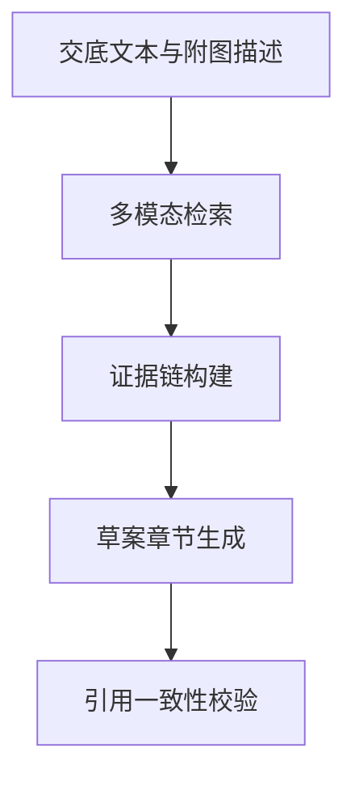

# 多模态检索证据链驱动的草案生成

## 前置材料摘要
本项目涉及一种基于多模态检索的专利草案生成方法，面向交底材料、既有专利文本和用户意图的联合检索与草案组织。

> **检索置信度**：🔴 低
>
> 低置信度表示未检索到可引用的公开现有技术文献；交底书不隐含高专利性判断。

## 材料覆盖
测试材料覆盖背景技术、痛点、技术方案、创新点和实施例。

## 候选专利点
- user-p1 多模态检索证据链驱动的草案生成：将文本交底、附图描述和相似专利片段统一为证据链。
  证据状态：feasible_unverified
  来源：user
  可行依据：算法流程可通过现有向量检索和文本生成模块实现。
  支撑缺口：正式申请前需要补充公开检索和实验样例。
  护城河评分：0.208
- p1 基于多模态检索证据链的专利草案生成方法：将多模态检索结果转换为可追溯证据链，并在权利要求、说明书和附图说明之间建立引用关系。
  证据状态：model_generated
  来源：model
  可行依据：未填写
  支撑缺口：无显式缺口
  护城河评分：0.0
- p2 专利草案章节引用一致性校验方法：利用章节结构图检测引用缺口并输出修订建议。
  证据状态：model_generated
  来源：model
  可行依据：未填写
  支撑缺口：无显式缺口
  护城河评分：0.0

## Claim Chart
暂无。

## 公开现有技术
暂无可用公开检索结果。

## 现有技术差异
未获得可用公开现有技术结果；交底书仅基于本地材料和授权专利语料生成。
## 检索来源台账

暂无检索记录。

## 检索链路诊断

### 🔍 检索前

- 可用来源：google_patents、patent
- 跳过来源：
  - cnipa：CNIPA EPUB helper is not configured; set CNIPA_EPUB_SEARCH_SCRIPT to enable live CNIPA search.

### 📊 检索后

- 可用来源：无

## 技术交底书
# 技术交底书

## 背景技术
现有专利撰写工具通常依赖单一文本输入，难以将发明交底、附图语义、相似专利片段和用户选择的保护重点统一组织。

## 技术问题
需要解决草案生成过程中证据来源分散、权利要求支撑关系弱、说明书章节与附图说明不一致的问题。

## 技术方案
一种基于多模态检索的专利草案生成方法，包括：
S1，接收发明交底文本、附图描述、关键词和用户指定的保护重点；
S2，对文本交底进行语义切分，提取技术问题、区别特征、实施例和技术效果；
S3，对附图描述生成图像语义标签，并与文本片段共同构建检索查询；
S4，在本地专利语料中检索相似片段，形成包含来源、章节、相似度和摘要的证据链；
S5，基于证据链生成摘要、权利要求书、说明书和附图说明；
S6，对术语、附图标记和权利要求引用关系进行一致性校验。

## 创新点
将多模态检索证据链绑定到草案章节，并在生成后执行章节引用一致性校验。

## 实施例
在一个实施例中，系统将交底文本中的“多模态检索”和附图中的“检索模块、生成模块、校验模块”映射为统一术语表，并将相似专利片段作为说明书背景技术和区别特征的参考。

## 有益效果
该方法能够提高草案结构完整性，降低生成内容与证据来源脱节的风险，并提升代理师复核效率。

## Mermaid 图

## 绘图提示词
黑白专利流程图，包含交底输入、多模态检索、证据链构建、草案生成、引用校验五个模块，模块之间用箭头连接。

## 自检结果
- [medium] 证据支撑: 测试数据未包含真实公开专利检索结果。 建议：正式申请前补充公开专利检索和区别特征论证。

## 生成日志
- project_scan: summarized draft and uploaded materials
- patent_points: generated candidates and selected recommended point
- prior_art_terms: generated semantic search chunks
- prior_art_search: collected 0 public references
- prior_art_relevance: summarized differences against public references
- disclosure_body: generated technical disclosure markdown
- disclosure_mermaid: generated Mermaid diagrams
- disclosure_image_prompt: generated patent drawing prompt
- disclosure_self_check: checked disclosure consistency and support
- low_research_confidence: 0 references collected (0 provider attempts); 交底书不隐含高专利性置信度。
