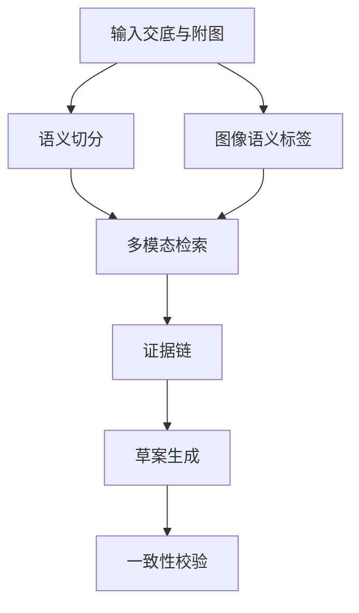

> **内部工作稿** — 仅供内部复核，不得作为正式提交稿使用。

# 一种基于多模态检索的专利草案生成方法

## 摘要
本发明公开了一种基于多模态检索的专利草案生成方法，接收发明交底文本、附图描述和保护重点，对文本进行语义切分并生成图像语义标签，组合形成多模态检索查询，在专利语料中生成证据链，并据此生成摘要、权利要求书、说明书和附图说明，同时进行引用一致性校验，以提高草案完整性和可复核性。

## 权利要求书
1. 一种基于多模态检索的专利草案生成方法，其特征在于，包括：
接收发明交底文本、附图描述以及用户输入的保护重点；
对所述发明交底文本进行语义切分，得到技术问题片段、技术方案片段、实施例片段和技术效果片段；
根据所述附图描述生成图像语义标签，并将所述图像语义标签与所述语义切分结果组合为多模态检索查询；
在专利语料库中检索与所述多模态检索查询匹配的专利片段，生成包含来源信息和章节信息的证据链；
基于所述证据链生成摘要、权利要求书、说明书和附图说明；
对所述权利要求书、说明书和附图说明中的术语、附图标记及引用关系进行一致性校验。

2. 根据权利要求1所述的方法，其特征在于，所述证据链包括检索片段的文献标识、章节类型、相似度分值和与区别特征对应的说明。

3. 根据权利要求1所述的方法，其特征在于，所述一致性校验包括检测权利要求中的技术特征是否在说明书具体实施方式中具有对应支撑。

## 说明书
说明书

技术领域
本发明涉及智能专利撰写与信息检索技术领域，尤其涉及一种基于多模态检索的专利草案生成方法。

背景技术
现有专利草案生成通常依赖用户输入的文字交底。对于同时包含流程图、系统结构图或模块说明的发明，单一文本生成方式难以充分利用附图语义，生成的权利要求、说明书和附图说明之间也容易出现引用不一致。

发明内容
本发明提供一种基于多模态检索的专利草案生成方法，通过对交底文本和附图描述进行联合检索，形成可追溯证据链，并基于该证据链生成专利草案各章节。

具体实施方式
在一个实施例中，系统接收发明交底文本、附图描述和用户输入的保护重点。系统首先对交底文本执行语义切分，得到技术问题、技术方案、实施例和技术效果片段。随后，系统从附图描述中识别模块名称和数据流关系，生成图像语义标签。系统将文本片段和图像语义标签组合为多模态检索查询，并在本地专利语料库中检索相似专利片段。

系统将检索结果组织为证据链，证据链至少包括文献标识、章节类型、相似度分值和与区别特征对应的说明。草案生成模块根据证据链分别生成摘要、权利要求书、说明书和附图说明。校验模块进一步解析术语、附图标记和引用关系，检测权利要求中的技术特征是否在说明书中具有支撑。

有益效果
通过上述方式，本发明能够提高生成草案的章节一致性和可复核性，降低内部过程性信息进入正式提交稿的风险。

## 附图说明
图1为基于多模态检索的专利草案生成方法流程图。
图2为专利草案生成系统的模块结构示意图。
图3为证据链与草案章节的引用关系示意图。

## Mermaid流程图

## 绘图提示词
黑白专利附图，展示输入层、检索层、证据链层、草案生成层和一致性校验层，使用流程箭头和模块框。

## 推荐专利点
多模态检索证据链驱动的草案生成

## 前置交底摘要
本项目涉及一种基于多模态检索的专利草案生成方法，面向交底材料、既有专利文本和用户意图的联合检索与草案组织。

## 审查意见
暂无。

## 多Agent会审策略
{
  "summary": "三方会审认为应以多模态检索证据链驱动草案生成为独立方法权利要求核心。",
  "claim_strategy": [
    "独立权利要求限定输入、语义切分、多模态检索、证据链生成、草案生成和一致性校验步骤。",
    "从属权利要求分别限定证据链字段、引用一致性校验和附图语义标签生成。"
  ],
  "description_strategy": [
    "说明书按技术问题、整体流程、证据链结构和校验实施例展开。",
    "避免声称模型效果已实验验证，测试效果表述为可提高复核效率。"
  ],
  "risk_controls": [
    "不要将内部会审、模型提示词或支撑不足标签写入正式稿。",
    "技术效果需保持可实现、可推导，不写商业宣传语。"
  ],
  "agent_consensus": "Codex、DeepSeek、Claude 三方均建议把证据链和引用一致性作为保护重点。",
  "disclosure_summary": "交底覆盖多模态检索、证据链和草案章节生成。",
  "patent_point_summary": "推荐候选点为基于多模态检索证据链的专利草案生成方法。",
  "prior_art_differences": "测试环境未接入真实公开检索，需正式申请前补充检索。"
}

## 引用语料片段
暂无。

## 生成日志
- claims: generated from invention brief and retrieved claim/description context
- description: generated to support claims
- abstract: generated under CNIPA-style 300-character constraint
- drawings: generated as figure descriptions
- diagram: generated as Mermaid flowchart
- image_prompt: generated for patent-style black-and-white drawing
- deliberation: injected strategy brief from run 16e76f850471413785481c37a1cbf5ef
- disclosure: injected pre-filing materials from run b011325efe634fef828665d09cc8511f
- formula: no core formula package required
- hygiene: cleaned 0 contamination items before save
