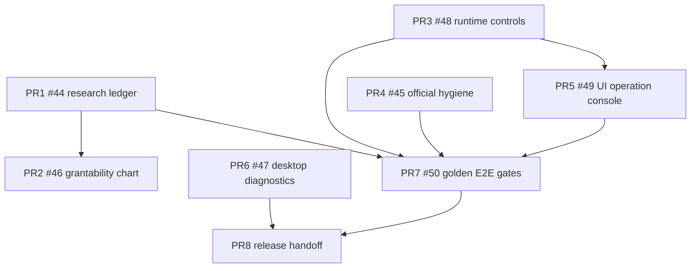

# PatentAgent v1.1.0 release handoff

This document is the human release-manager handoff for `release/v1.1.0`. It records the release train, dependency map, quality gates, packaging checklist, and the actions that must remain human-only.

PR8 is documentation and checklist work only. It must not merge `release/v1.1.0` to `main`, create tags, publish GitHub releases, edit secrets, or enable automatic release publication.

## Current release train

Base branch: `release/v1.1.0`

Pre-PR8 observed branch head: `35cd11d2a3e787bb878419312ff42f68e6afbaec`

| PR | Issue | Hermes task | Scope | Merge state |
|---:|---:|---|---|---|
| [#44](https://github.com/LeoAKALiu/patents_agent/pull/44) | [#36](https://github.com/LeoAKALiu/patents_agent/issues/36) | `t_67475984` | research ledger and source evidence foundation | merged |
| [#46](https://github.com/LeoAKALiu/patents_agent/pull/46) | [#42](https://github.com/LeoAKALiu/patents_agent/issues/42) | `t_2676c2a6` | grantability claim chart and patentability attack analysis | merged |
| [#48](https://github.com/LeoAKALiu/patents_agent/pull/48) | [#41](https://github.com/LeoAKALiu/patents_agent/issues/41) | `t_c56529d6` | runtime heartbeat, cancel, retry, timeout handling | merged |
| [#45](https://github.com/LeoAKALiu/patents_agent/pull/45) | [#40](https://github.com/LeoAKALiu/patents_agent/issues/40) | `t_9bd4c74a` | official hygiene schema repair and fail-closed gates | merged |
| [#49](https://github.com/LeoAKALiu/patents_agent/pull/49) | [#39](https://github.com/LeoAKALiu/patents_agent/issues/39) | `t_bf6bd756` | UI operation console and runtime visibility | merged |
| [#47](https://github.com/LeoAKALiu/patents_agent/pull/47) | [#38](https://github.com/LeoAKALiu/patents_agent/issues/38) | `t_9bea91f4` | desktop startup diagnostics and production renderer smoke | merged |
| [#50](https://github.com/LeoAKALiu/patents_agent/pull/50) | [#43](https://github.com/LeoAKALiu/patents_agent/issues/43) | `t_b3c01694` | golden E2E quality suite and release gates | merged |
| PR8 | [#37](https://github.com/LeoAKALiu/patents_agent/issues/37) | `t_8ccd0572` | release docs, packaging checklist, and no-auto-release handoff | this PR |

## Dependency graph



## Required release gates

Run these from a clean checkout of `release/v1.1.0` after PR8 is merged:

```bash
python3 -m pytest tests/ -q
npm --prefix frontend ci
npm --prefix frontend run test
npm --prefix frontend run build
cargo check --manifest-path src-tauri/Cargo.toml
cargo test --manifest-path src-tauri/Cargo.toml
PATENTAGENT_SKIP_INSTALL=1 scripts/v1_smoke.sh
```

Expected evidence:

- backend pytest passes with the current v1.1 test count
- frontend Vitest reports all tests passing
- frontend production build creates `frontend/dist/index.html`
- Tauri cargo check and unit tests pass
- v1.1 quality report is written under `.artifacts/v1.1.0-quality/`
- GitHub checks for the release branch are green after the final PR merge

Live-provider tests remain opt-in only and must not be required for default CI.

## Packaging checklist

The supported desktop runtime is Tauri. The local release artifact is a verified Tauri DMG; Developer ID signing, notarization, and publishing remain human release-manager actions.

1. Build frontend production assets.

   ```bash
   npm --prefix frontend ci
   npm --prefix frontend run build
   ```

2. Build the Tauri desktop artifact and run local DMG smoke on macOS.

   ```bash
   npm exec --yes --package @tauri-apps/cli@^2 -- tauri build
   hdiutil verify src-tauri/target/release/bundle/dmg/PatentAgent_1.1.0_aarch64.dmg
   python3 scripts/tauri_dmg_smoke.py src-tauri/target/release/bundle/dmg/PatentAgent_1.1.0_aarch64.dmg --keep-artifacts
   ```

3. Save release proof artifacts.

   Required proof files:

   - `.artifacts/v1.1.0-quality/v1_1_quality_report.json`
   - `.artifacts/v1.1.0-quality/v1_1_quality_report.md`
   - terminal log showing Tauri DMG build and `hdiutil verify`
   - terminal log or JSON summary from `scripts/tauri_dmg_smoke.py`
   - terminal log showing `python3 -m pytest tests/ -q`
   - `frontend/dist/`
   - `src-tauri/target/release/bundle/dmg/PatentAgent_1.1.0_aarch64.dmg`

4. Package only after smoke proof is captured.

   Minimum bundle contents:

   - built frontend renderer from `frontend/dist/`
   - Tauri app bundle from `src-tauri/`
   - bundled backend resources from `backend/`
   - release notes and this handoff document

5. Generate checksums after packaging.

   ```bash
   shasum -a 256 <artifact-path>
   ```

   Store the result in `SHA256SUMS.txt` beside the artifact. Do not invent checksums before the final artifact is produced.

## Human-only actions

The following actions are HUMAN-ONLY and must not be executed by default CI, Hermes workers, or autonomous release scripts.

| Action | Human-only condition |
|---|---|
| Merge `release/v1.1.0` to `main` | only after human release-manager approval |
| Create `v1.1.0` git tag | only after final artifact checksums are verified |
| Publish GitHub release | only after tag, artifact, checksum, and smoke proof are reviewed |
| Upload DMG/ZIP artifacts | only after human release-manager approval |
| Enable auto-merge or auto-release | out of scope for v1.1.0 |

Reference commands for the human release manager only:

```bash
# HUMAN-ONLY: do not run in automation.
git checkout main
git merge --no-ff release/v1.1.0
git tag -a v1.1.0 -m "PatentAgent v1.1.0"
gh release create v1.1.0 --draft --title "PatentAgent v1.1.0" --notes-file CHANGELOG.md
```

## Label and automation boundary

The release train keeps `no-auto-release` on release-planning issues and PRs. `no-auto-merge` means no unattended merge bot or worker may merge. The release owner may still perform guarded manual PR merges after checks are green and `--match-head-commit` confirms the reviewed head.

No workflow in this release branch publishes releases, creates tags, uploads artifacts, or enables auto-merge.

## Known limitations

- Signed and notarized macOS DMG packaging remains manual and outside this PR.
- Backend runtime is still the local Python environment supervised by Tauri.
- Live patent/provider research is diagnostic and opt-in; deterministic golden gates are the release blocker.
- Model API keys remain user-provided through environment variables or desktop settings.
