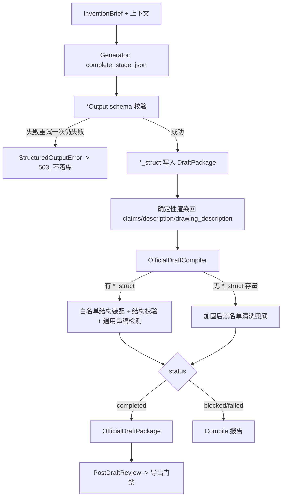

# 防污染纵深防御与结构化生成设计

## 目的

系统已具备正式稿编译器与导出门禁（`backend/app/official_compile.py`，`OfficialDraftCompiler` + `OfficialDraftPackage`），导出走 `_require_official_export_gate` 门禁（`backend/app/main.py`）。结构、hash 绑定、成稿会审改审正式包，方向正确。

但当前整改采用「在导出边界用关键词黑名单过滤污染」的路线，存在三类可复现缺陷，且评分可被系统自身注入的文本刷高。本设计将防污染从「下游过滤」前移为「上游结构化生成（脏内容结构上进不来）+ 下游白名单装配（只放行已知结构）」，并下线 score-improvement 自动注入旁路、修复评分指标失真。

本设计是 `2026-06-08-official-draft-compiler-design.md` 的后续迭代，沿用其编译/门禁/三桶（contamination_removed / blocked_items / sidecar_notes）结构，不推翻已落地成果。

## 已确认范围

本版做（5 件）：

1. 结构化生成：LLM 按 schema 分字段输出，正文由代码确定性渲染。
2. 白名单编译器：编译器优先从结构装配正式包；关键词黑名单降级为存量兜底；去除硬编码他案标题，改通用串稿检测。
3. 下线 score-improvement：删除该端点及自动改写规范草稿的全部链路。
4. 特征抽取吃结构化 claims：替换正则切行，特征强制绑定权项号。
5. 评分内容化防作弊：支撑判定排除样板签名、去重、设阈值；新增「注入不抬分」不变量。

本版不做：

- 不收敛 CORS、不加鉴权（下一版安全基线）。
- 不拆分 `main.py` / `storage.py`（下一版可维护性）。
- 不做前端大改，仅做移除已下线功能入口的最小适配。
- 不引入向量检索或生成质量评测集（独立议题）。

### 决策记录（来自 brainstorming）

- 防污染架构：**结构化生成 + 白名单编译**；关键词黑名单仅作存量草稿兜底。
- 评分防作弊：**纯确定性**（样板签名排除 + 证据去重 + 长度/特异性阈值），本版不引入 LLM-judge。
- score-improvement：**整端点下线**，不保留为「评分 + 建议」形态。
- `DraftPackage` 兼容：**结构子对象 + 渲染回现有文本字段**，避免大改下游消费方。

## 核心问题与证据

### 1. 根因仍活：系统在主动制造污染

- `score-improvement`（`main.py` `improve_project_score`）在每轮调用 `_apply_completion_patch` → `_append_once(package.description, "补充实施方式", text)`，并 `store.update_project_package` 把样板写回规范草稿。
- `_patch_text`（`backend/app/draft_completion.py`）为 `add_claim_support` / `add_term_definition` 生成固定样板（`input_data、processing_rule、intermediate_state、output_result、confidence_record`、`步骤S1/S2/S3`），零信息量。
- 编译器删除/阻断词表中**没有「补充实施方式」**，此类样板要么作为「看似合规、零信息量的实施例」流入正式稿，要么因恰含敏感子串而把整次编译 `blocked`，使用户卡死。

### 2. 关键词清洗会漏（两处已证）

- AI 开场白仅靠 `re.search(r"^好的，下面.*撰写", line)`（`official_compile.py`）。说明书段开场白为「好的，**基于**您提供的…撰写**范式**…」，不以「好的，下面」开头 → 不删除；残留检测词只含「好的，下面」 → 也不阻断。**结果：说明书 AI 开场白进入正式包。**
- 「撰写说明与支撑不足提示」只删标题行，其正文段落（如「本权利要求书严格遵循…」「技术问题与技术效果：已规避城市体检…」）不含触发词 → 连同 markdown 列表进入正式权利要求。

### 3. 硬编码他案标题

- `CROSS_PROJECT_TITLE = "基于边缘端动态推理的无人机飞行中任务调整方法"`（`official_compile.py`）是单条魔法串，`if CROSS_PROJECT_TITLE in source_text` 仅命中这一条。**任何不同的串稿标题原样放行**，且把泄露标题永久写进源码，本身是保密隐患。

### 4. 评分指标失真（可被自我注入刷分）

- `draft_completion.py` 的 `_has_data_support` / `_has_pseudo_support` / `_formula_relevant` 仅检测关键词（`input_data`、`字段`、`伪代码`、`步骤S` 等），而 `_patch_text` 注入文本恰好命中这些词，使 `completion_status` 由 `missing` 翻为 `supported`、`support_strength` 上升。评分在测「关键词是否出现」而非「特征是否真被支撑」。

## 推荐架构

### 数据模型变更（`backend/app/schemas.py`）

新增生成阶段 schema（仅生成器内部使用，模型只填字段）：

- `ClaimsOutput`：`{ claims: [ ClaimItem ] }`，`ClaimItem = { number:int, kind:"independent"|"dependent", depends_on:int|null, category:"method"|"system"|"device"|"medium"|"other", preamble:str, features:[str] }`。
- `DescriptionOutput`：`{ technical_field:str, background:str, summary:str, embodiments:str }`（说明书正文四段；**附图说明不在此处**，统一由 `DrawingsOutput` 单一来源渲染——避免「正文附图说明」与「独立 `drawing_description` 字段」两处不一致，此即上封专利图2/图3 自相矛盾的根因）。
- `DrawingsOutput`：`{ figures: [ { figure_no:str, title:str } ] }`。
- `AbstractOutput`：`{ abstract:str }`。

`DraftPackage` 新增**结构化子对象字段**（可选，向后兼容）：

- `claims_struct: ClaimsOutput | None`
- `description_struct: DescriptionOutput | None`
- `drawings_struct: DrawingsOutput | None`

现有文本字段（`claims` / `description` / `drawing_description` / `abstract`）保留，作为由结构**确定性渲染**得到的视图，供既有消费方（filing_readiness / exporter / claim_defense 等）继续使用。

### LLM 客户端（`backend/app/llm.py`）

- `LLMClient` 协议新增 `complete_stage_json(stage, system_prompt, user_prompt, schema_hint) -> dict`。
- `DeepSeekLLMClient` 实现：`response_format={"type":"json_object"}`，system 明确「只输出符合给定 schema 的 JSON，不输出任何解释、开场白或 markdown」；解析 JSON 失败或缺字段时**重试一次**（在 prompt 中回灌错误）；二次失败抛新增类型化异常 `StructuredOutputError`（定义于 `llm.py`），`main.py` 生成端捕获后返回 503，**绝不把原始文本落库**。
- `FakeLLMClient` 扩展：按 stage 返回结构化 JSON 字符串，支持现有与新增用例。

### 生成器（`backend/app/generator.py`）

- `generate()` 各阶段改用 `complete_stage_json`，得到结构对象 → Pydantic 校验 → 写入 `*_struct` 字段。
- 新增确定性渲染器 `render_claims(ClaimsOutput) -> str` / `render_description(DescriptionOutput) -> str` / `render_drawings(DrawingsOutput) -> str`：
  - 权项渲染：按 number 升序，`preamble`，其后各 `feature` 之间以中文分号「；」分隔、末条以句号「。」收尾；自动消除开场白与 meta（结构里根本没有这些字段）。
  - 说明书渲染：固定四段正文（技术领域/背景技术/发明内容/具体实施方式）+ 在「附图说明」位置插入由 `DrawingsOutput` 渲染的同一份附图文本。
  - 附图渲染：由 `DrawingsOutput.figures` **单一来源**渲染「图X为……。」，同时写入独立 `drawing_description` 字段与 `figure_plan`，保证两处一致（消除上封专利图2/图3 矛盾）。
- 渲染结果写回 `claims` / `description` / `drawing_description`；`abstract` 取 `AbstractOutput.abstract` 并做 ≤300 字校验（超出截断并记 `generation_logs`）。

### 编译器（`backend/app/official_compile.py`）

- `compile()` 优先走**结构装配路径**：当 `package.*_struct` 存在时，`OfficialDraftPackage` 的各字段由结构渲染得到，**只复制白名单字段**（title、abstract、claims、description、drawing_description、figure_plan）；meta / log / preamble 不在结构中，无从泄漏。
- **结构校验**（不满足即 `blocked`，归类 `structural_invalid`）：必备章节齐全且非空；权项至少 1 条独立权项且编号连续；摘要 ≤300 字；附图引用与正文一致。
- **通用串稿检测**替换硬编码常量：删除 `CROSS_PROJECT_TITLE`；新增规则——任一正文章节中出现「匹配专利标题模式且不等于本项目标题」的整行即判 `cross_project_contamination` 并 `blocked`。标题模式：`^一种.{4,40}(方法|系统|装置|设备|介质)$`（组合式标题以「…存储介质」结尾即命中「介质」；与项目自身 title 归一化后比较，避免误伤本项目标题）。
- **黑名单清洗降级为兜底**：仅当 `package.*_struct` 缺失（存量草稿）时，走现有加固后的逐行清洗；同时把已证两处漏点补入兜底规则（开场白匹配放宽为 `^好的[，,]` 起始即移除；support_gaps 整段——从命中「支撑不足提示 / 撰写说明 / support_gap」的行起到下一章节标题前的连续段落整体移除）。
- 三桶（contamination_removed / blocked_items / sidecar_notes）、hash 绑定、`status` 语义保持不变。

### draft_completion 与评分（`backend/app/draft_completion.py`）

- 移除 `_patch_text` 的伪造样板分支；`ProposedPatch` 的「自动入稿」语义与 `after_text` 可入稿能力删除，完善结果改为输出 `issues` + `tasks`（人工可执行指引文本，如「请补充 X 特征的实施例 / 公式 / 数据结构」），不再生成可被自动写入正文的补丁内容。
- 评分（`_support_matrix` / `_has_data_support` / `_has_pseudo_support` / `_scorecard`）改为**内容化判定**：
  1. 命中**已知样板签名**（至少包含 `input_data、processing_rule、intermediate_state` 元组，或 `步骤S1，获取与该特征对应的输入数据` 等固定句式）的证据**不计入支撑**；
  2. 同一段证据文本支撑多个特征时，仅首个有效、其余记为「重复证据，不计支撑」；
  3. 证据需达到长度 / 特异性阈值（默认 ≥ 20 字且包含该特征的关键名词，阈值实现为可配置常量）方可计入。
- 新增**不变量**：将系统生成的任意补丁 / 样板文本追加进 `description` 后重算 scorecard，`overall` 不得上升（以测试固化）。

### 特征抽取（`backend/app/claim_defense.py`）

- 新增 `feature_records_from_struct(claims_struct)`：直接消费结构化权项的 `features` 子句，每条 feature 绑定 `claim_refs=[number]`，跳过 `preamble` 与非技术行。
- `_claim_fragments` 正则切行路径降级为「无结构时兜底」，并加入硬过滤：丢弃匹配标题 / 章节标题 / 「好的」开场白 / 「support_gap / 撰写说明」等 meta 的行。
- `_try_llm_features` 改为「结构为主、LLM 增强」：有结构时 LLM 仅补充分类 / 风险标签，不再 `extend` 注入可能含垃圾的并列记录。

## 数据流

实际实现中 Mermaid 仅存在于设计文档与内部报告，不进入 `OfficialDraftPackage`。

## API 变更

删除：

- `POST /api/projects/{project_id}/score-improvement`（及 `improve_project_score`、`_apply_completion_patch`、`_append_once`、`ScoreImprovementRequest`、`ScoreImprovementResult`）。
- `POST /api/projects/{project_id}/completion-runs/{run_id}/patches/{patch_id}/accept`
- `POST /api/projects/{project_id}/completion-runs/{run_id}/patches/{patch_id}/reject`
  - 二者仅服务于已删除的「补丁应用」工作流；完善结果改以 `issues` + `tasks` 作为人工指引，无需 accept/reject 状态机。

不变：

- `official-compile-runs` 系列、`post-draft-reviews`、`official-export.docx/md` 门禁与 hash 绑定逻辑。
- `generate` / `review` / `filing-readiness` / `claim-defense-worksheets` / `completion-runs`（创建与读取保留，仅输出语义由「可入稿补丁」变为「人工指引」）。

## 前端最小适配

- 移除「一键提分 / score-improvement」「应用补丁 / 接受补丁」相关入口与调用（`frontend/src/api.ts`、`App.tsx`、`GuidedPatentFlow.tsx`、相关测试）。
- 完善报告区把 `tasks` 渲染为「人工补强建议」清单，不再呈现「已自动应用」。
- 不改动 guided flow 既有「生成→质量检查→正式稿编译→成稿会审→导出」主路径。

## 错误处理

- 结构化生成二次失败：返回 503，提示重试 / 检查模型是否支持 JSON 输出；不写入任何字段。
- 编译结构校验失败 / 通用串稿命中：`status="blocked"`，沿用现有 200 + 阻断项展示。
- 存量草稿（无 `*_struct`）：走兜底清洗路径，编译可正常 `completed` 或 `blocked`，不抛错。

## 测试计划

### 后端（新增）

- 结构化生成：坏 JSON 触发一次重试；二次失败抛 `StructuredOutputError`，调用方返回 503，草稿不被写入。
- 渲染器：权项 features 间渲染出分号、末条句号；说明书五段齐全；附图渲染与 `figure_plan` 一致。
- 编译器白名单：有 `*_struct` 时正式包仅含白名单字段；structured 来源不含 `generation_logs` / `image_prompt` / 开场白。
- 通用串稿：正文含「一种……方法」且 ≠ 项目标题 → `blocked`（不依赖任何硬编码串）；项目自身标题不误伤。
- **回归两处已证漏点**：说明书含「好的，基于您提供的…撰写范式…」→ 不进入正式包；claims 含「撰写说明与支撑不足提示」整段 → 整段不进入正式包。
- 评分防作弊：注入 `_patch_text` 样板文本后 `scorecard.overall` 不上升；样板签名证据不计支撑；重复证据不计支撑。
- 特征抽取：结构化 claims 仅产出真实权项特征，开场白 / 标题 / meta 不成为 feature。

### 后端（改写存量）

- 删除 / 改写依赖 score-improvement、`_apply_completion_patch`、patch accept/reject 的用例（含 `tests/test_draft_completion_api.py`）。
- 调整断言为「白名单结构装配」的 `tests/test_official_compile.py` 相关用例；移除对硬编码他案标题的专用断言，改为通用串稿断言。

### 前端

- 移除 score-improvement / apply-patch 相关用例；完善建议以「指引」呈现。

### 回归

- `python3 -m pytest -q`
- `npm test`
- `npm run build`
- `git diff --check`

## 迁移策略

- `*_struct` 字段为新增可选项；存量 `DraftPackage` 无结构字段时编译器走加固后的黑名单兜底，行为不破坏。
- 用户对存量项目重新「生成初稿」即切换到结构化路径并获得结构字段。
- 已下线端点：前端入口移除后，旧调用返回 404 属预期；无数据迁移需求。

## 验收标准

- 结构化生成产出的 `claims` / `description` / `drawing_description` 文本中不含 AI 开场白、章节 meta、support_gaps 提示。
- 编译器在存在结构字段时由白名单结构装配正式包，不依赖关键词黑名单。
- 通用串稿检测可拦截任意他案标题，源码中不存在硬编码他案标题常量。
- `score-improvement` 端点及自动改写规范草稿的链路已删除；规范草稿不再被系统生成文本污染。
- 将系统生成文本注入草稿后 scorecard 不上升。
- 特征抽取仅产出绑定权项号的真实技术特征。
- `pytest` / `npm test` / `npm run build` 全绿。

## 自检记录

- 无空白项、TBD 或未决问题；三个 brainstorming 决策（架构 = 结构化+白名单、评分 = 纯确定性、score-improvement = 下线）已落入范围与验收。
- API 删除项与前端适配、测试改写相互一致；编译器保留三桶 / hash / 门禁，未推翻已落地成果。
- 兼容路线（结构子对象 + 渲染回文本字段）确保存量消费方与存量草稿均不破坏。
- 范围适合拆成一个后续实现计划（源头先行：组件1 → 组件4 →（依赖1的）组件2 → 组件3 → 组件5）。
