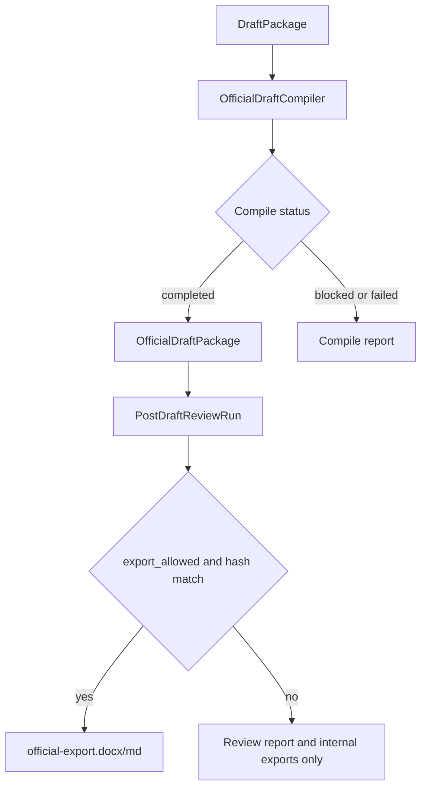

# 正式稿编译器与清污隔离设计

## 目的

当前系统已经具备初稿生成、质量检查、初稿完善、核心公式、成稿后多 Agent 会审和正式导出门禁。最近的成稿审查暴露出一个更底层的问题：系统能发现污染并阻止导出，但正式文本、内部策略、support gaps、generation logs、绘图提示和会审意见仍然可能共处于同一个 `DraftPackage` 中。

本设计的目标是新增 **正式稿编译器**，在成稿会审和正式导出之前生成专用的 `OfficialDraftPackage`。正式申请文件只允许从该编译产物导出，原始 `DraftPackage` 继续作为内部工作稿和策略上下文存在。

## 已确认范围

本版聚焦“正式稿编译器 / 清污隔离”，采用结构化编译路线。

本版要做：

- 新增正式稿专用数据模型和编译运行记录。
- 从 `DraftPackage` 编译出只包含正式申请文本的 `OfficialDraftPackage`。
- 删除或隔离 AI 对话残留、support gaps、Markdown、Mermaid、prompt、generation logs、内部策略说明和疑似他案串稿。
- 成稿后多 Agent 会审改为审查 `OfficialDraftPackage`，而不是直接审查原始 `DraftPackage`。
- `official-export.docx` 和 `official-export.md` 只从通过编译和会审的正式稿包导出。

本版不做：

- 不自动把 support gaps 补写成说明书正文。
- 不实现完整专利 AST。
- 不自动重写整份专利。
- 不提供人工 override 放行。
- 不改变内部策略稿、会审报告、补强报告的导出能力。

## 核心问题

### 1. 正式文本与内部文本混杂

`DraftPackage` 同时承担生成结果、策略回溯、公式摘要、RAG 引用、绘图提示和日志记录。该结构适合内部调试，但不适合作为正式申请文件的直接导出源。

### 2. 清污规则只在导出或报告中被动执行

当前 filing readiness 能发现污染，official export 也有清理逻辑，但清理结果没有形成可追踪、可会审、可复用的正式稿快照。用户无法清楚看到“哪些内容被删除、哪些内容被阻断、哪些内容只进入内部备忘”。

### 3. 成稿会审对象不够稳定

上一版成稿会审已经能阻止正式导出，但如果会审对象仍是原始 `DraftPackage`，agent 会同时看到正式正文和内部上下文，容易把内部说明当成申请文本问题，或者反过来遗漏真正进入正式稿的清理结果。

## 推荐架构

### 新增模型

#### `OfficialDraftPackage`

正式稿专用包，仅包含允许进入申请文件的字段：

- `title`
- `abstract`
- `claims`
- `description`
- `drawing_description`
- `figure_plan`
- `compile_warnings`
- `source_draft_hash`
- `official_package_hash`

其中 `figure_plan` 只记录正式附图计划，例如图号、图名、正文引用位置和系统模块对应关系，不包含 Mermaid 源码或绘图 prompt。

#### `OfficialCompileRun`

记录一次正式稿编译：

- `id`
- `project_id`
- `status`: `completed | blocked | failed`
- `source_draft_hash`
- `official_package_hash`
- `official_package`
- `contamination_removed`
- `blocked_items`
- `sidecar_notes`
- `logs`
- `created_at`
- `updated_at`

`contamination_removed` 记录可安全移除的污染项。`blocked_items` 记录不能自动删除或删除后会损害正式稿完整性的项目。`sidecar_notes` 记录只能进入内部报告或代理人备忘的内容。

### 新增服务

#### `OfficialDraftCompiler`

输入：

- 当前项目的 `DraftPackage`
- 最近一次核心公式包摘要
- 最近一次成稿会审结果，可选

输出：

- `OfficialCompileRun`

职责：

1. 抽取正式章节。
2. 删除或隔离污染内容。
3. 识别疑似他案串稿。
4. 检查清理后章节是否为空、断裂或结构异常。
5. 生成 `OfficialDraftPackage` 和编译日志。

### 存储

新增表 `official_compile_runs`：

- `id`
- `project_id`
- `status`
- `source_draft_hash`
- `official_package_hash`
- `official_package_json`
- `contamination_removed_json`
- `blocked_items_json`
- `sidecar_notes_json`
- `logs_json`
- `created_at`
- `updated_at`

项目删除时级联删除该项目的 compile runs。

## 编译规则

### 可安全删除的污染

以下内容命中后默认进入 `contamination_removed`，不进入正式稿：

- AI 对话开场白，例如“好的，下面将……”
- Markdown 代码块、标题标记和 Mermaid 语法。
- `image_prompt`、`prompt`、`diagram`、`generation_logs` 等内部字段名。
- `support_gap`、`support_gaps`、`支撑不足提示`、`撰写说明`。
- “根据会审策略”“多 Agent 会审”“主席汇总”等过程痕迹。
- 明确的不利自认，例如“可能不具备创造性”“禁止直接提交”。

### 必须阻断的污染

以下内容命中后进入 `blocked_items`，编译状态为 `blocked`：

- 疑似其他专利标题或其他项目标题串入正式文本。
- 清污后权利要求书、说明书、摘要或附图说明为空。
- 清污后出现未闭合编号、断裂段落或只剩章节标题。
- 正式文本中仍残留 support gap 或内部提示。

### 只进入内部侧车的内容

以下内容进入 `sidecar_notes`：

- support gaps 的原文。
- attorney memo。
- 会审建议。
- 自动清污原因。
- 需要后续补强但不能在本版自动入稿的材料需求。

## 数据流

实际实现中 Mermaid 仅存在于设计文档和内部报告，不进入 `OfficialDraftPackage`。

## API 设计

新增接口：

- `POST /api/projects/{project_id}/official-compile-runs`
- `GET /api/projects/{project_id}/official-compile-runs`
- `GET /api/projects/{project_id}/official-compile-runs/{run_id}`
- `GET /api/projects/{project_id}/official-compile-runs/{run_id}/report.md`

修改接口：

- `POST /api/projects/{project_id}/post-draft-reviews`
  - 改为要求存在 `status=completed` 的最新 `OfficialCompileRun`。
  - 会审输入使用 `OfficialDraftPackage`。
  - 保存 `official_package_hash`。

- `GET /api/projects/{project_id}/official-export.docx`
- `GET /api/projects/{project_id}/official-export.md`
  - 要求存在匹配当前 `source_draft_hash` 和 `official_package_hash` 的通过会审。
  - 导出源改为 `OfficialDraftPackage`。

## 前端流程

主流程调整为：

`生成初稿 -> 质量检查 -> 正式稿编译 -> 成稿会审 -> 导出`

正式稿编译页显示：

- 当前源 draft hash。
- 编译状态。
- 删除的污染项数量和摘要。
- 阻断项列表。
- 内部侧车备注入口。
- “重新编译正式稿”按钮。

导出页显示：

- 最近正式稿编译 run。
- 当前 official package hash。
- 成稿会审是否匹配该 hash。
- 正式稿按钮是否解锁。
- 内部稿和报告入口始终保留。

## 错误处理

### 编译 blocked

返回 200，并保存 `OfficialCompileRun.status="blocked"`。前端展示阻断项，不允许成稿会审和正式导出。

### 编译 failed

用于解析异常、存储异常或非预期错误。保存 error log，前端提示重试或查看报告。

### 成稿会审缺少编译包

返回 409：`Official draft compile is required before post-draft review.`

### 导出 hash 不匹配

返回 409：当前 `DraftPackage` 或 `OfficialDraftPackage` 已变化，需要重新编译和重新成稿会审。

## 测试计划

### 后端

- `DraftPackage` 含 AI 开场白、support_gap、Markdown、Mermaid、prompt、generation_logs 时，编译成功但污染项进入 `contamination_removed`，正式稿不含这些文本。
- 疑似他案标题进入正式文本时，编译状态为 `blocked`，不生成可导出的正式稿。
- 清污后说明书为空时，编译状态为 `blocked`。
- 成稿会审在没有 completed compile run 时返回 409。
- 成稿会审输入使用 `OfficialDraftPackage`，并记录 `official_package_hash`。
- 正式导出在 compile hash 或 review hash 不匹配时返回 409。
- 正式导出从 `OfficialDraftPackage` 生成，不再直接读取 `DraftPackage`。

### 前端

- guided flow 包含“正式稿编译”步骤。
- 编译 blocked 时不能进入“成稿会审”。
- 编译 completed 但未会审时不能导出正式稿。
- 会审通过且 hash 匹配时正式稿按钮可用。
- 导出页显示 compile run、official hash、review hash 和阻断项入口。

### 回归

- `python3 -m pytest -q`
- `npm test`
- `npm run build`
- `git diff --check`

## 迁移策略

旧项目已有 `DraftPackage` 时，不自动创建 `OfficialCompileRun`。用户进入新流程后点击“编译正式稿”，系统基于当前草稿生成第一条 compile run。

现有内部导出不受影响：

- `export.docx`
- `export.md`
- 会审报告
- 成熟度报告
- 初稿完善报告
- 核心公式 Markdown

正式导出受新门禁控制：

- `official-export.docx`
- `official-export.md`

## 验收标准

- support gap 不能进入正式稿。
- AI 对话痕迹不能进入正式稿。
- generation logs、prompt、Mermaid 不能进入正式稿。
- 疑似他案串稿必须阻断编译。
- 成稿会审只审 `OfficialDraftPackage`。
- 正式导出只从 `OfficialDraftPackage` 生成。
- 编译和会审都使用 hash 绑定当前草稿，草稿变化后自动失效。

## 自检记录

- 无空白项、未决问题或开放项。
- 本设计聚焦正式稿编译和清污隔离，没有包含 support gaps 自动补强入稿。
- API、存储、前端流程、错误处理和测试计划相互一致。
- 设计范围适合拆成一个后续实现计划。
