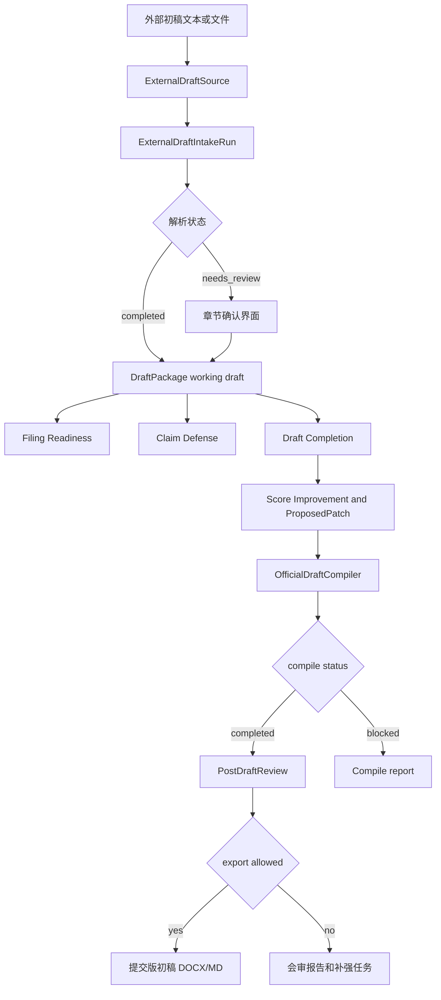

# 外部专利初稿导入、评分打磨与会审设计

## 目的

当前 `patentAgent` 已经能从一段想法或前置材料生成专利初稿，并对系统自产稿运行提交成熟度、权利要求防线、初稿完善、正式稿编译和成稿后会审。下一步需要支持另一类真实工作流：用户已经有一份外部提交的专利初稿，该稿不是本系统生成的，但希望系统接管后完成评分、打磨、会审，并输出质量更高的提交版初稿。

本设计新增 **外部初稿导入与提质工作流**。它不替代现有生成链路，而是在现有 `DraftPackage`、`Draft Completion Harness`、`Score Improvement`、`PostDraftReview` 和 `OfficialDraftCompiler` 之上增加一个导入层和外部稿专用审计记录。

目标是让用户可以把任意已有初稿放进系统，得到：

1. 原始外部稿的可追踪存档。
2. 章节解析结果和解析置信度。
3. 多维专利质量评分和缺口清单。
4. 可接受或拒绝的局部打磨建议。
5. 多 Agent 会审报告。
6. 经正式稿编译器清污后的提交版初稿。

## 产品原则

- 原始外部稿只读保存，不被系统覆盖。
- 系统所有打磨都发生在内部工作稿上，不能直接改写原始稿。
- 提交版初稿只能从 `OfficialDraftPackage` 导出，继续使用正式稿编译和会审门禁。
- 会审意见、评分细节、系统日志、prompt、agent memo 和补强报告不得进入正式申请正文。
- 外部初稿可以包含可行但未验证的方案；系统必须保留 `feasible_unverified` 或 `needs_experiment` 状态，不能把它们表述成已验证工程效果。
- 高风险仍然采用“警告但允许内部导出”的原则；正式提交版导出必须满足现有 official compile 和 post-draft review 约束。
- 本版优先支持文本、Markdown 和 DOCX 导入；PDF 导入作为后续扩展，不阻塞 MVP。

## 用户场景

### 外部代理师初稿复核

用户已有代理师或外包团队给出的初稿，希望系统判断权利要求是否过窄、说明书是否支撑不足、是否存在不利表述，以及是否需要补充实施例、公式、数据结构或替代方案。

### 旧案重写

用户有一份历史草稿，希望在不丢失原文的前提下用当前系统的护城河、现有技术区分和正式稿清洁能力重做一版更稳健的提交稿。

### 助手快速质检

助手拿到用户发来的 Word 初稿，需要快速导入、生成评分报告、列出必须补强的问题，并产出一版可给用户或代理师继续审的提交版。

## 已确认范围

本版要做：

- 新增外部初稿导入模型、存储和 API。
- 支持粘贴纯文本、上传 Markdown、上传 DOCX 三种输入。
- 将外部初稿解析成 `DraftPackage` 兼容结构。
- 记录解析置信度、缺失章节、重复章节、污染文本和不可自动归类片段。
- 将解析后的工作稿接入现有 filing readiness、claim defense、draft completion、score improvement、official compile 和 post-draft review。
- 前端新增“导入外部初稿”入口，和现有“从想法生成专利”并列。
- 导出外部初稿提质报告，包含评分变化、采纳补丁、会审结论和正式稿 hash。

本版不做：

- 不自动替代专利代理师法律判断。
- 不自动联网确认 CNIPA 法律状态。
- 不自动提交申请。
- 不做 PDF OCR 质量保证。
- 不做复杂三方合并 UI。
- 不把会审报告自动混入正式稿正文。
- 不改变现有从想法生成专利的默认路径。

## 核心概念

### `ExternalDraftSource`

外部初稿原始输入记录：

- `id`
- `project_id`
- `source_type`: `pasted_text | markdown_file | docx_file`
- `file_name`
- `content_hash`
- `raw_text`
- `raw_path`
- `metadata`
- `created_at`

`raw_text` 是抽取后的可审计文本。上传文件原件可存储在项目材料目录，`content_hash` 用于后续判断工作稿是否仍绑定该原始稿。

### `ExternalDraftIntakeRun`

一次外部初稿解析运行：

- `id`
- `project_id`
- `source_id`
- `status`: `completed | needs_review | failed`
- `parser_version`
- `source_hash`
- `parsed_package`
- `section_confidence`
- `intake_issues`
- `unassigned_fragments`
- `working_draft_hash`
- `logs`
- `created_at`

`parsed_package` 使用现有 `DraftPackage` 结构，作为内部工作稿进入后续质量流程。`needs_review` 表示系统能生成工作稿，但存在章节置信度不足或关键章节缺失，需要用户确认。

### `SectionConfidence`

章节解析置信度：

- `title`
- `abstract`
- `claims`
- `description`
- `drawing_description`

每项包含：

- `score`: `0-1`
- `source_markers`
- `warnings`

如果权利要求书或说明书置信度低于阈值，系统仍保存 intake run，但前端必须提示用户先确认章节切分。

### `IntakeIssue`

导入阶段发现的问题：

- `id`
- `category`: `missing_section | duplicate_section | low_confidence_section | format_noise | unsupported_attachment | suspected_internal_text | malformed_claim_numbering`
- `severity`: `low | medium | high`
- `section`
- `message`
- `suggested_action`
- `blocks_quality_run`

`blocks_quality_run` 只用于导入后的质量流程，不等同于正式导出硬阻断。正式导出仍由 `OfficialDraftCompiler` 和 post-draft review 决定。

### `ExternalDraftReviewBundle`

外部初稿提质后的汇总包：

- `project_id`
- `source_id`
- `intake_run_id`
- `initial_score`
- `latest_score`
- `accepted_patch_ids`
- `completion_run_ids`
- `official_compile_run_id`
- `post_draft_review_run_id`
- `export_allowed`
- `report_hash`

它是内部报告索引，不是正式申请文件。

## 推荐架构

采用“薄导入层 + 复用现有质量链”的路线。

外部稿导入只负责三件事：

1. 保留原始稿。
2. 解析成系统可处理的 `DraftPackage`。
3. 把解析风险记录为 intake report。

评分、补强、会审和导出继续复用现有模块：

- `filing_readiness.py`：发现不利表述、内部痕迹、未验证效果和提交成熟度问题。
- `claim_defense.py`：抽取权利要求特征并生成权利要求防线工作表。
- `draft_completion.py`：生成支撑矩阵、缺口、任务、patch 和 scorecard。
- `score-improvement` API：按用户确认的范围应用可进入正式稿的补丁。
- `official_compile.py`：从内部工作稿编译清洁正式稿。
- `post_draft_review.py`：对正式稿包做多 Agent 成稿会审。

这样可以避免为外部初稿另起一套评分和导出系统。

## 数据流



正式稿导出只从 `OfficialDraftPackage` 生成。`ExternalDraftSource`、`ExternalDraftIntakeRun`、`DraftCompletionRun`、会审日志和提质报告均为内部侧车材料。

## 解析策略

### 文本和 Markdown

解析器按以下优先级识别章节：

1. 标准中文章节标题：`发明名称`、`摘要`、`权利要求书`、`说明书`、`附图说明`、`具体实施方式`。
2. 标准编号结构：`1.`、`1、`、`权利要求1`、`一种...其特征在于`。
3. Markdown 标题：`#`、`##`、加粗章节名。
4. 兜底启发式：按权利要求编号、摘要长度和说明书段落密度切分。

Markdown 代码块、表格和图片链接默认保留在内部工作稿，但进入 official compile 时必须按正式稿规则清理或阻断。

### DOCX

DOCX 解析使用结构化文档库读取段落、标题和表格文本。首版不要求保留样式，不要求保留批注和修订痕迹。

DOCX 中的图片、公式和批注按以下规则处理：

- 图片只记录为 `unsupported_attachment` 或材料引用，不进入 `DraftPackage` 正文。
- 公式如果能抽取为文本，进入说明书；否则进入 intake issue。
- 批注和修订痕迹进入内部侧车，不进入正式稿。

### 章节确认

当出现以下情况时，intake run 状态为 `needs_review`：

- 缺少权利要求书。
- 缺少说明书。
- 权利要求和说明书边界置信度低。
- 同一章节出现多个候选。
- 大段文本无法分配到任何章节。

前端应允许用户在一个简洁界面中调整章节内容后保存工作稿。首版可以使用大文本框分区编辑，不做复杂 diff。

## API 设计

新增接口：

- `POST /api/projects/{project_id}/external-drafts`
  - 创建 `ExternalDraftSource`。
  - 支持 `source_type`、`text`、`file_name`、`file_content`。

- `GET /api/projects/{project_id}/external-drafts`
  - 列出项目的外部初稿来源。

- `POST /api/projects/{project_id}/external-drafts/{source_id}/intake-runs`
  - 运行解析，生成 `ExternalDraftIntakeRun`。
  - 如果解析得到可用 `DraftPackage`，更新项目内部工作稿或创建候选工作稿。

- `GET /api/projects/{project_id}/external-drafts/{source_id}/intake-runs`
  - 列出导入解析记录。

- `GET /api/projects/{project_id}/external-draft-intake-runs/{run_id}`
  - 查看单次解析结果。

- `POST /api/projects/{project_id}/external-draft-intake-runs/{run_id}/confirm`
  - 用户确认或修正章节切分，并生成正式的内部工作稿。

- `GET /api/projects/{project_id}/external-draft-review-bundle/report.md`
  - 导出外部初稿提质报告。

现有接口保持可复用：

- `POST /api/projects/{project_id}/filing-readiness`
- `POST /api/projects/{project_id}/claim-defense-worksheets`
- `POST /api/projects/{project_id}/completion-runs`
- `POST /api/projects/{project_id}/score-improvement`
- `POST /api/projects/{project_id}/official-compile-runs`
- `POST /api/projects/{project_id}/post-draft-reviews`
- `GET /api/projects/{project_id}/official-export.docx`
- `GET /api/projects/{project_id}/official-export.md`

## 后端模块

新增：

- `backend/app/external_drafts.py`

职责：

- 抽取文本。
- 解析章节。
- 计算 source hash 和 working draft hash。
- 生成 intake issues。
- 将确认后的外部稿转换为 `DraftPackage`。
- 生成外部初稿提质报告。

修改：

- `backend/app/schemas.py`：增加外部初稿模型。
- `backend/app/storage.py`：持久化 `external_draft_sources` 和 `external_draft_intake_runs`。
- `backend/app/main.py`：增加 external draft API。
- `backend/app/exporter.py`：不直接导出外部原稿，只继续导出内部稿、报告和正式稿。

不修改：

- `OfficialDraftCompiler` 的正式导出边界。
- `PostDraftReview` 对 `OfficialDraftPackage` 的审查对象。
- `DraftCompletionRun` 的基本评分模型。

## 存储设计

新增表 `external_draft_sources`：

- `id`
- `project_id`
- `source_type`
- `file_name`
- `content_hash`
- `raw_text`
- `raw_path`
- `metadata_json`
- `created_at`

新增表 `external_draft_intake_runs`：

- `id`
- `project_id`
- `source_id`
- `status`
- `parser_version`
- `source_hash`
- `parsed_package_json`
- `section_confidence_json`
- `intake_issues_json`
- `unassigned_fragments_json`
- `working_draft_hash`
- `logs_json`
- `created_at`

现有 `ProjectRecord.package` 可以保存确认后的工作稿。若后续需要保留多个候选工作稿，再增加 `working_drafts` 表；首版不需要。

## 前端流程

主流程新增两个入口：

1. `从想法生成`
2. `导入外部初稿`

`导入外部初稿` 页面包含：

- 粘贴文本区域。
- 上传 Markdown / DOCX 按钮。
- 导入结果摘要。
- 章节置信度。
- 缺失章节和解析问题。
- 章节确认编辑区。
- `开始评分与补强` 按钮。

评分与补强页面复用现有质量检查视图，但文案面向外部稿：

- `外部稿初始评分`
- `当前工作稿评分`
- `主要扣分项`
- `建议打磨`
- `已采纳修改`
- `成稿会审`
- `生成提交版初稿`

导出页展示：

- 原始外部稿 hash。
- 当前工作稿 hash。
- 正式稿 hash。
- 成稿会审状态。
- 可导出文件列表。
- 内部提质报告入口。

## 错误处理

### 导入失败

保存 `ExternalDraftIntakeRun.status="failed"`，日志记录失败原因。前端提示用户改用纯文本粘贴或 Markdown 文件。

### 章节解析不确定

返回 200，保存 `needs_review`。前端进入章节确认界面，不自动运行评分。

### 工作稿变化导致 hash 失效

如果用户确认章节后又编辑工作稿，后续 official compile 和 post-draft review 必须基于新的工作稿 hash 重新运行。

### DOCX 附件无法解析

图片、批注、复杂公式不阻断导入，但进入 intake issue 和内部报告。它们不能直接进入正式稿正文。

### 质量评分失败

外部初稿导入 run 保留成功状态，评分失败作为后续流程错误处理。用户可以重新运行质量检查，不需要重新导入原稿。

## 测试策略

### 后端

- 纯文本外部初稿能创建 `ExternalDraftSource`。
- Markdown 外部初稿能解析标题、摘要、权利要求、说明书和附图说明。
- 缺少权利要求书时 intake run 为 `needs_review`。
- 章节重复时生成 `duplicate_section` issue。
- 权利要求编号异常时生成 `malformed_claim_numbering` issue。
- DOCX 文本能抽取为 `raw_text` 并生成 `DraftPackage`。
- 确认章节后项目 `package` 更新为解析后的工作稿。
- 外部稿工作稿能运行 completion run 并生成 scorecard。
- 外部稿工作稿能进入 official compile；原始外部稿和 intake report 不进入 `OfficialDraftPackage`。
- 外部初稿提质报告包含 source hash、working draft hash、scorecard、patch 和 review 状态。

### 前端

- 主流程显示 `导入外部初稿` 入口。
- 粘贴文本后能显示章节置信度。
- `needs_review` 状态下不能直接开始评分，必须确认章节。
- 解析完成后能进入质量检查与补强。
- 评分、patch、会审和正式导出状态显示一致。
- 切换项目后不保留上一项目的外部稿解析状态。

### 回归

```bash
python3 -m pytest -q
npm --prefix frontend test -- --run
npm --prefix frontend run build
git diff --check
```

## 分阶段实现

### Phase 1: Intake foundation

- 增加模型、存储和纯文本 / Markdown 解析。
- 增加 API 和后端测试。
- 不做 DOCX 上传 UI。

### Phase 2: Quality chain integration

- 将确认后的工作稿接入 completion、score improvement、official compile 和 post-draft review。
- 增加外部初稿提质报告。

### Phase 3: Frontend guided flow

- 新增外部稿入口和章节确认界面。
- 在质量检查视图中展示外部稿初始评分、当前评分和打磨记录。

### Phase 4: DOCX support

- 增加 DOCX 文本抽取。
- 处理图片、批注、复杂公式和表格的 intake issues。

## 验收标准

功能完成后，用户应能：

1. 粘贴一份外部专利初稿并保存原始稿。
2. 看到系统解析出的题名、摘要、权利要求、说明书和附图说明。
3. 在解析不确定时手动确认章节。
4. 对外部稿运行多维评分。
5. 看到主要缺口、支撑矩阵、补强任务和局部修改建议。
6. 采纳部分建议后重新评分。
7. 对正式稿包运行成稿后多 Agent 会审。
8. 导出清污后的提交版初稿。
9. 同时保留原始外部稿、内部提质报告和正式稿 hash 绑定记录。

## 自检记录

- 本设计聚焦外部初稿导入和提质闭环，没有重写现有生成链路。
- 原始稿、内部工作稿、正式提交稿三者边界明确。
- 评分、补强、会审和正式导出复用现有模块。
- DOCX 支持被拆到 Phase 4，避免阻塞文本/Markdown MVP。
- 没有开放决策、空白项或需要实现时再决定的核心边界。
