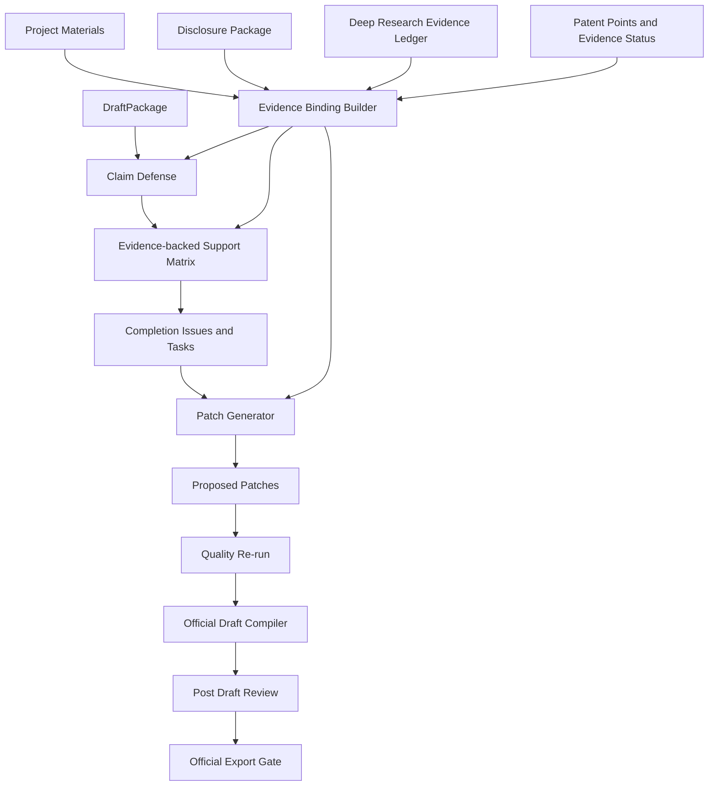

# 证据贯通、局部精修与成稿质量评测设计

## 目的

当前 `patentAgent` 已经具备从技术想法或外部初稿进入交底、发明点确认、多智能体会审、核心公式、初稿生成、提交成熟度检查、权利要求防线、初稿完善、正式稿编译、成稿会审和导出的完整链路。现有能力的强项是“防止脏内容错放行正式稿”，但下一阶段要解决的是更上层的问题：如何系统性提高最终成稿质量，并降低重复运行成本。

本设计新增一组贯穿式质量能力：

1. **证据贯通**：把 deep research 和 disclosure 阶段的现有技术证据、项目材料、用户发明点和证据状态贯穿到权利要求特征、支撑矩阵、补强任务、候选补丁和成稿会审。
2. **局部精修补丁**：把模板化补强建议升级为基于原文、证据和目标章节的结构化局部修订。
3. **阶段级缓存**：对可复用的 LLM 阶段结果建立 hash 绑定缓存，减少同一快照反复运行时的耗时和成本。
4. **成稿质量评测**：在 deterministic golden gate 中衡量稿件质量提升，而不仅是正式稿清洁度和导出门禁。

核心目标不是无人值守直接提交，而是让用户和代理人看到“为什么这份稿更可信、哪里仍缺证据、哪些修订可以安全进入正式稿”。

## 产品原则

- 正式申请文本仍只能从 `OfficialDraftPackage` 导出；证据账本、补强报告、会审意见和缓存元数据不得进入正式稿正文。
- 所有 prior-art 事实主张必须绑定检索证据或被标记为未取证假设。
- 可行未验证方案可以用于布局和内部策略，但正式稿不得把它表述为已验证工程效果。
- 局部补丁默认是建议，不自动覆盖原稿；自动应用必须满足 hash、新鲜度、证据、目标章节和清污门禁。
- 评分只用于趋势和排序，不构成授权结论或法律意见。
- 任何缓存命中都不能绕过最新 draft hash、official package hash 和 post-draft review hash 门禁。
- UI 重点展示可执行审稿清单，而不是单纯分数仪表盘。

## 已确认范围

本版要做：

- 新增统一证据绑定模型和工具函数。
- 将 disclosure/deep research 的 evidence ledger 映射到 claim defense、draft completion、proposed patch 和 post-draft review。
- 扩展支撑矩阵，显示每个权利要求特征的证据来源、说明书支撑、现有技术差异和证据状态。
- 新增局部补丁生成器，输出可审阅的结构化 `ProposedPatch`。
- 为 LLM 阶段调用增加缓存、超时和重试基础设施。
- 扩展 v1.1 deterministic quality gate，加入 drafting quality 指标。
- 在前端质量步骤展示证据支撑链、补丁依据和质量趋势。

本版不做：

- 不自动联网确认 CNIPA 法律状态。
- 不自动提交专利申请。
- 不把 evidence ledger 写入正式申请正文。
- 不实现复杂三方合并编辑器。
- 不把所有质量判断改成模型审查；规则检查和 hash gate 继续保留。
- 不引入新的 `.planning/` 工作流目录；继续使用 `docs/superpowers` 文档体系。

## 核心概念

### `EvidenceBinding`

统一证据引用结构，用于把不同阶段的产物绑到可追踪证据：

- `evidence_id`
- `source_type`: `project_material | prior_art | disclosure | patent_point | formula | generated_draft | manual`
- `source_id`
- `source_label`
- `quote`
- `confidence`
- `verification_status`: `verified | retrieved | user_provided | feasible_unverified | needs_experiment | model_generated`
- `internal_only`

`internal_only=true` 的证据只能进入内部报告、支撑矩阵和会审上下文，不能进入正式稿正文。

### `EvidenceBackedFeature`

权利要求特征的证据增强视图，不必替代 `FeatureRecord`，可以作为工具层输出或字段扩展：

- `feature_id`
- `claim_refs`
- `feature_text`
- `classification`
- `description_refs`
- `figure_refs`
- `prior_art_refs`
- `evidence_refs`
- `support_status`
- `risk_tags`

### `PatchGenerationContext`

局部补丁生成输入：

- `project_id`
- `draft_package_hash`
- `issue`
- `task`
- `target_section_text`
- `nearby_context`
- `support_matrix_rows`
- `evidence_bindings`
- `patent_type`
- `official_hygiene_constraints`

### `PatchGenerationRun`

一次补丁生成运行：

- `id`
- `project_id`
- `draft_package_hash`
- `status`
- `source_completion_run_id`
- `generated_patches`
- `blocked_patches`
- `logs`
- `created_at`

首版可以不单独建表，而是把生成结果写回 `DraftCompletionRun.patches`；但 schema 应预留扩展空间。

### `LLMStageCacheEntry`

阶段级缓存记录：

- `cache_key`
- `project_id`
- `stage`
- `model`
- `prompt_hash`
- `input_hash`
- `prompt_pack_version`
- `response_text`
- `response_json`
- `status`
- `created_at`
- `expires_at`

缓存只复用阶段响应，不复用导出放行状态。

### `DraftQualityEvalReport`

deterministic quality gate 的报告扩展：

- `evidence_binding_rate`
- `core_feature_support_rate`
- `unsupported_core_feature_count`
- `unverified_effect_leak_count`
- `dependent_fallback_depth`
- `embodiment_density`
- `patch_delta`
- `official_hygiene`
- `export_gate_status`

## 推荐架构

采用“贯通层 + 局部生成器 + 缓存适配器 + 评测扩展”的路线。

### 后端分层

1. `research/evidence.py` 继续负责 deep research 证据账本和 prior-art grounding。
2. 新增 `backend/app/evidence_binding.py`，负责从 disclosure runs、deep research packets、project materials、patent points、formula runs 和 draft package 中抽取统一 evidence bindings。
3. `claim_defense.py` 继续负责特征抽取，但输出记录应携带 `evidence_refs` 和更明确的 `prior_art_refs`。
4. `draft_completion.py` 继续负责支撑矩阵和 scorecard，但矩阵行必须消费 evidence bindings。
5. 新增 `backend/app/patch_generator.py`，负责生成证据支撑的局部补丁。
6. 新增 `backend/app/llm_cache.py`，包装 LLM stage 调用的缓存、超时和重试。
7. `scripts/v1_api_smoke.py` 扩展 quality report。

### 数据流

`Evidence Binding Builder` 是内部上下文构造器，不是正式稿生成器。

## 详细设计

### 1. 证据绑定构造

输入来源：

- `DisclosurePackage.prior_art_hits`
- `DisclosurePackage.research_ledger`
- `DisclosureRun.stage_results` 中的 `deep_research_evidence` 和 `deep_research_final`
- `ProjectMaterial`
- `PatentPointCandidate`
- `CoreFormulaPackage`
- `DraftPackage.citations`

输出：

- `list[EvidenceBinding]`
- `dict[str, list[str]]`，按 feature marker、publication number、material id 和 patent point id 建索引

匹配策略：

1. publication number / URL 精确匹配。
2. patent point id / source_candidate_id 精确匹配。
3. material id / file name 精确匹配。
4. 技术短语 marker 匹配，用于说明书支撑和特征归因。
5. 不确定匹配只标记为 `confidence < 0.6`，不得提升强证据评分。

### 2. 权利要求支撑矩阵增强

`ClaimSupportMatrixRow` 增加：

- `evidence_refs`
- `source_refs`
- `support_explanation`
- `missing_evidence_reason`

评分调整：

- `support_strength` 不能只依赖说明书字符串命中；核心特征必须同时具备说明书支撑或实施例支撑。
- `prior_art_distinction` 只有在 `differentiator/core_combo` 行绑定 prior-art evidence 时才能明显加分。
- `model_generated` 证据状态不得提高 `authorization_stability`。

### 3. 局部补丁生成

补丁生成器必须只做局部修订：

- `insert`：插入补充实施例、变量定义、数据结构、伪代码、附图说明。
- `replace`：替换不利表述、未验证效果、客体风险表述。
- `rewrite`：仅限小段重写，必须有 `before_text`。
- `sidecar_only`：只进入内部报告，不能进入正式稿。

安全规则：

- 没有证据绑定的量化效果只能生成 sidecar 或待实验任务。
- prior-art 事实不能由 patch generator 新编造。
- patch 中不得出现 prompt、generation logs、attorney memo、support_gap 标记。
- patch 应用后必须重新运行 quality checks、official compile 和 post-draft review。

### 4. LLM 阶段缓存

缓存接入点：

- `DisclosureGenerator` 的 LLM scan/points/terms/relevance/body/self-check。
- `PatentDraftGenerator` 的 claims/description/abstract/drawings/diagram/image_prompt。
- `run_post_draft_review` 的 role stages 和 chair synthesis。
- `PatchGenerator` 的局部补丁生成。

缓存不接入点：

- official export gate。
- project delete。
- desktop config health probe。
- 任何读取 live provider 状态的 doctor/probe。

失效条件：

- `source_draft_hash` 改变。
- `prompt_pack_version` 改变。
- `model` 或 provider 配置改变。
- 用户明确要求 refresh。

### 5. 成稿质量评测

在 `scripts/v1_api_smoke.py` 中扩展 report：

- 读取 completion run 的 support matrix。
- 计算 core feature 支撑率。
- 检查 prior-art differentiator 是否有 evidence refs。
- 检查正式稿污染 marker。
- 记录 score-improvement 前后 delta。
- 输出每个 golden case 的 quality floor。

示例 gate：

- `evidence_binding_rate >= 0.6`
- `core_feature_support_rate >= 0.7`
- `unverified_effect_leak_count == 0`
- `official_hygiene == clean`
- `post_draft_review == export_allowed`

## API 与存储

首版尽量复用现有 API：

- `POST /api/projects/{project_id}/completion-runs`
- `POST /api/projects/{project_id}/score-improvement`
- `POST /api/projects/{project_id}/official-compile-runs`
- `POST /api/projects/{project_id}/post-draft-reviews`

新增可选接口：

- `GET /api/projects/{project_id}/evidence-bindings`
  - 返回当前项目的证据绑定视图。
- `POST /api/projects/{project_id}/completion-runs/{run_id}/patches/generate`
  - 为指定 completion run 生成证据支撑补丁。
- `POST /api/projects/{project_id}/llm-cache/clear`
  - 清理当前项目缓存。

新增表可选：

- `llm_stage_cache`
- `patch_generation_runs`

若首版不建 `patch_generation_runs` 表，必须保证 `DraftCompletionRun` 中保存 patch 生成日志和 evidence refs。

## 前端设计

质量步骤增强为三个区域：

1. **证据支撑链**
   - 权利要求号。
   - 核心特征。
   - 说明书支撑。
   - 证据编号。
   - 证据状态。
   - 缺口原因。

2. **补强任务与候选补丁**
   - issue 严重程度。
   - patch 类型。
   - 是否可进入正式稿。
   - 证据引用。
   - before/after 摘要。
   - 接受/拒绝。

3. **质量趋势**
   - 六项 scorecard。
   - 本轮相对上一轮 delta。
   - official compile / post review hash 绑定状态。
   - export gate 是否仍需重跑。

交互约束：

- 用户浏览旧质量结果时，明确显示是否匹配当前 draft hash。
- 接受 patch 后回到质量检查步骤，不直接跳到导出。
- 对 `feasible_unverified` 和 `needs_experiment` 使用警示状态，文案强调不能写成已验证效果。

## 错误处理

- 证据构造失败：质量流程可继续，但 evidence binding rate 为 0，并产生 warning。
- 缓存读取失败：降级为真实 LLM 调用，不阻断流程。
- patch generator 失败：保留 completion issue 和 task，patch 状态为 blocked 或不生成 patch。
- patch 应用后 official compile blocked：保留 patch，但 export 不放行，提示重新修订。
- old completion run 缺少 evidence refs：视为旧版本结果，提示重新运行质量检查。

## 测试计划

### 后端

- evidence binding builder 能从 disclosure prior-art hits 和 deep research ledger 生成稳定 evidence ids。
- claim defense feature records 能携带 evidence refs。
- draft completion support matrix 能显示 evidence refs 和 missing evidence reason。
- prior_art_distinction 不因无证据 differentiator 获得高分。
- patch generator 不为无证据量化效果生成 official-safe patch。
- patch 应用后旧 official compile/post review hash 失效。
- LLM stage cache 对相同 prompt hash 命中，对不同 source hash 失效。

### 前端

- 质量面板显示证据支撑链。
- 旧 completion run 与当前 draft hash 不匹配时显示 stale 状态。
- 接受 patch 后引导重新运行质量检查。
- `feasible_unverified` 和 `needs_experiment` 有明确警示展示。

### Golden gate

- `scripts/v1_smoke.sh`
- `python3 scripts/v1_api_smoke.py --report-dir /tmp/patentagent-quality`
- `python3 -m pytest tests/test_draft_completion.py tests/test_post_draft_review.py tests/test_v1_quality_gate.py -q`
- `npm --prefix frontend test`
- `npm --prefix frontend run build`

## 迁移策略

- 旧 `DraftCompletionRun` 不含 evidence refs 时仍可读取，但 UI 标记为“旧质量结果，建议重跑”。
- 新字段使用默认空列表，避免破坏现有 SQLite JSON 反序列化。
- LLM cache 首版默认启用项目级清理，不做全局自动 GC。
- 若缓存 schema 需要迁移，使用 `create table if not exists` 和 `_ensure_column` 模式延续现有存储风格。

## 成功标准

本设计完成后，用户应能：

1. 看到每个核心权利要求特征的证据支撑链。
2. 区分已验证、用户提供、检索得到、可行未验证和模型生成内容。
3. 获取基于原文和证据的局部补强补丁。
4. 在重复运行同一快照时明显减少等待时间。
5. 从 golden quality report 看到成稿质量趋势，而不只是导出门禁状态。
