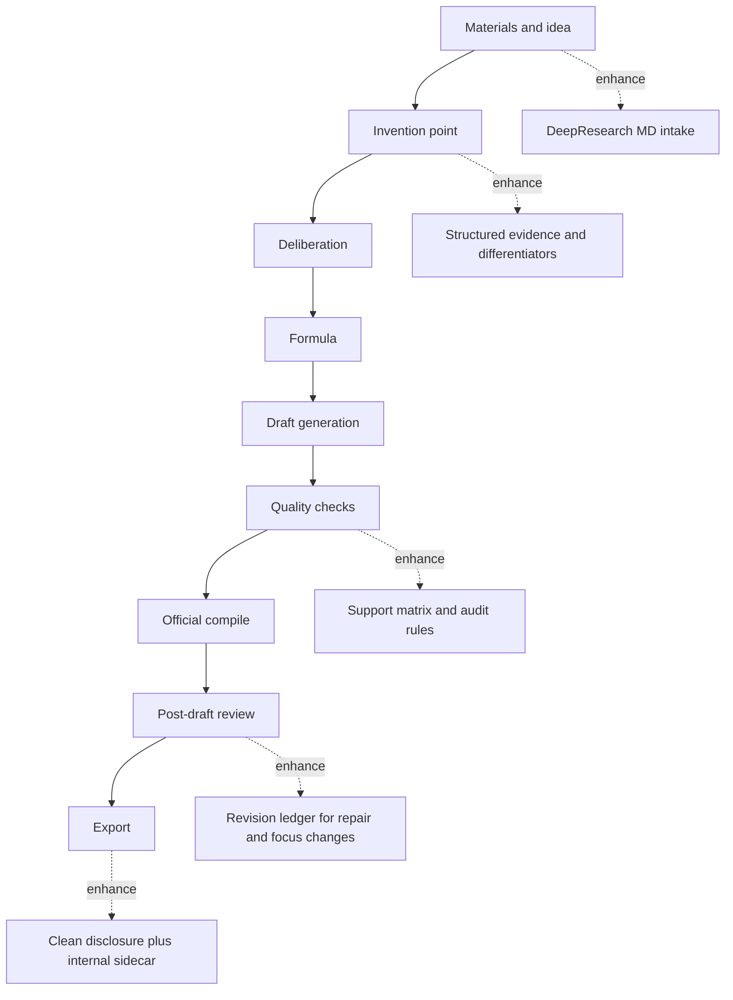

# Patent Skill Borrowing Design

## Source Identity

| Item | Value |
| --- | --- |
| Worktree | `/Users/leo/Projects/patents_agent` |
| Branch | `codex/automation-test-plan` |
| Short SHA | `4c0de247` |
| Worktree status before writing | Dirty with pre-existing unrelated changes in `backend/app/official_compile.py`, `docs/qa/automation-test-plan-execution-2026-06-27.md`, `tests/adversarial_flow_harness.py`, `tests/test_adversarial_flow_explorer.py`, and `tests/test_official_compile.py` |

## Context

PatentAgent previously referenced [`handsomestWei/patent-disclosure-skill`](https://github.com/handsomestWei/patent-disclosure-skill). That repository is useful as a source of process discipline for disclosure drafting, prior-art search, clean artifact generation, self-checks, and iterative revision. It is not a replacement for PatentAgent's current workflow.

PatentAgent already has the authorization-oriented back half that the external skill does not fully cover: evidence status, claim defense, support matrix, grantability analysis, official draft cleanroom, post-draft review, and export gates. This design therefore embeds selected ideas into the existing workflow rather than introducing a new skill runtime or rebuilding the flow around technical disclosure generation.

## Goals

1. Strengthen the existing PatentAgent workflow with reusable discipline from the external disclosure skill.
2. Keep the current guided flow unchanged: materials and idea, invention point, deliberation, formula, draft generation, quality checks, official compile, post-draft review, export.
3. Use Markdown DeepResearch documents as the only enhanced material intake target for this scope.
4. Improve prior-art search reliability, evidence traceability, disclosure artifact boundaries, iterative revision records, and draft audit rules.
5. Preserve formal separation between official filing text and internal strategy/evidence reports.

## Non-Goals

1. No `.docx` or `.pptx` to Markdown conversion work in this phase. The user's current prerequisite materials are Markdown DeepResearch documents.
2. No external skill runtime, prompt-pack loader, or repository fork inside the production application.
3. No change to the number or order of guided-flow steps.
4. No weakening of existing official compile and post-draft review gates.
5. No automatic claim filing without professional human review.

## Chosen Approach

Use a layered absorption approach. The external repository contributes workflow rules and helper ideas, while PatentAgent keeps ownership of data models, persistence, quality gates, and export boundaries.

The implementation is split into five bounded modules:

1. `deep_research_intake`: parse Markdown DeepResearch documents into structured evidence and prior-art packets.
2. `prior_art` discipline: strengthen search-term planning, provider calls, dedupe, abstract use, URL traceability, and low-evidence handling.
3. `disclosure_artifacts`: split clean attorney-facing disclosure output from internal sidecar reports.
4. `revision_ledger`: record material merges, corrections, and protection-focus revisions without overwriting prior history.
5. `draft_audit_rules`: add formula, symbol, Mermaid, URL, and internal-metadata audit checks to the existing quality pipeline.

## Embedded Workflow

The existing PatentAgent workflow remains the source of truth.

DeepResearch Markdown is not pasted directly into generated text. It is parsed into structured prior-art items, differentiators, claim constraints, evidence gaps, warnings, and completion tasks. Those structures then feed the existing `DisclosureRun`, `PatentPointCandidate`, `EvidenceBinding`, `GrantabilityReport`, and `DraftCompletionRun` paths.

## Module Design

### DeepResearch Markdown Intake

Create a focused parser for Markdown DeepResearch reports. It should identify:

- prior-art references with title, publication number or URL when present, source label, summary, and quoted evidence snippets;
- differentiators and novelty opportunities;
- claim constraints and scope warnings;
- evidence gaps and completion tasks;
- free-form warnings that should remain internal.

Parsed items should become structured evidence, not official-text content. If parsing fails, the project should continue using the original material summary with a warning. Empty or unrecognized Markdown should not block project creation.

### Prior-Art Discipline

Strengthen the existing prior-art stage using rules adapted from `prior_art_search.md` in the external repository:

- generate 2 to 8 semantic search chunks instead of one long sentence;
- call CNIPA-style search one chunk at a time when the provider supports it;
- dedupe by `publication_number`, then URL, then normalized title;
- require non-empty abstracts to be considered during relevance and difference analysis;
- keep public URLs traceable and never synthesize unverifiable patent links;
- if CNIPA is unavailable, continue through Google Patents fallback but retain low-evidence warnings;
- low-evidence or no-prior-art states remain fail-closed in grantability analysis.

The external repository's CNIPA helper may be used as implementation reference, but production behavior should stay behind PatentAgent's existing prior-art provider interface.

### Disclosure Artifact Split

Current disclosure exports include attorney-facing content together with internal details such as Claim Chart, source ledger, self-check findings, generation logs, and confidence warnings. This phase separates them:

- Clean disclosure: title, background, technical problem, technical solution, effects, protection points, embodiments, drawing guidance, and public prior-art URLs.
- Internal sidecar report: Claim Chart, evidence ledger, low-confidence warnings, self-check findings, generation logs, provider diagnostics, and revision records.

The official draft cleanroom remains separate and stricter. This split improves the technical disclosure handoff without changing official export rules.

### Revision Ledger

Add a persistent ledger for iterative changes:

- material merge;
- factual correction;
- fifth-chapter protection-focus strengthening;
- application of a saved post-draft repair session.

Each record should contain the project id, baseline artifact hash, new artifact hash, revision kind, user intent summary, affected sections, whether prior-art conclusions changed, whether protection scope changed, created time, and artifact names or ids.

The ledger does not replace existing versioned runs. It gives the user and reviewer a readable chain of why a draft changed.

### Draft Audit Rules

Extend the quality pipeline with deterministic and prompt-assisted audit rules inspired by the external skill's self-checks:

- formula symbol table exists when formulas appear;
- symbol usage is consistent across formulas, parameter tables, embodiments, and claims;
- dimensions use subscript form in LaTeX-style expressions rather than ambiguous superscripts;
- Mermaid diagrams are present and renderable when the package expects diagrams;
- public prior-art entries include usable URLs;
- clean disclosure and official text do not contain internal process metadata, script names, evidence ids, source ledgers, generation logs, or self-check tables.

These rules should surface through existing quality reports and post-draft review surfaces rather than creating another standalone review workflow.

## Data and Interface Impact

Expected backend additions:

- a DeepResearch Markdown parser module at `backend/app/research/deep_research_intake.py`;
- structured parser output models or reuse of existing `DeepResearchPacket`, `DeepResearchFinding`, and `EvidenceBinding`;
- prior-art provider tests that verify semantic chunk handling and dedupe behavior;
- disclosure artifact functions that produce clean Markdown/DOCX content and internal sidecar Markdown content;
- a revision ledger model and SQLite persistence path;
- audit helper functions called by draft completion, official compile, or post-draft review.

Expected frontend impact is intentionally light:

- show new warnings and evidence details only where existing panels already display quality, claim defense, completion, or export reports;
- do not add a new guided-flow step;
- do not require users to learn a new skill or prompt system.

## Error Handling

DeepResearch parsing failures should create warnings and fall back to current material summary behavior.

Prior-art provider failures should be recorded in the source ledger and keep existing fallback behavior. The resulting confidence state should be explicit and should not be upgraded by model inference alone.

Disclosure artifact generation should still produce at least the internal report if the clean handoff export fails. Official export gates are unchanged.

Revision ledger write failures should be visible to the user for revision operations, because revision history is part of the acceptance criteria for merge and correction flows. They should not corrupt existing draft packages.

Audit rule failures should be reported as quality issues or post-draft blockers according to severity. Deterministic metadata leakage in official text remains a blocker.

## Testing Strategy

1. DeepResearch parser fixtures:
   - complete Markdown with prior art, differentiators, evidence gaps, and warnings;
   - Markdown with missing publication numbers but valid URLs;
   - empty or unrecognized Markdown that returns warnings and no fatal error.

2. Prior-art discipline tests:
   - generated or supplied terms are normalized to 2 to 8 chunks;
   - provider is called once per chunk;
   - duplicate CNIPA and Google Patents hits collapse to one hit;
   - abstracts participate in relevance prompts or enrichment input;
   - no-prior-art and low-evidence cases keep fail-closed grantability behavior.

3. Artifact split tests:
   - clean disclosure excludes Claim Chart, source ledger, self-check findings, generation logs, provider diagnostics, evidence ids, and internal warnings;
   - sidecar report includes those internal details;
   - official compile behavior is unchanged.

4. Revision ledger tests:
   - material merge, correction, and protection-focus revision records are persisted;
   - baseline hash and new hash are captured;
   - records append without overwriting previous records.

5. Audit rule tests:
   - formula symbol mismatch is reported;
   - Mermaid render failure or missing diagram is reported;
   - missing public prior-art URL is reported;
   - internal metadata in clean disclosure or official text is caught.

## Acceptance Criteria

1. A Markdown DeepResearch document can enrich evidence and prior-art structures without changing the guided-flow step count.
2. Prior-art search behavior is traceable, deduped, and explicit about low evidence.
3. Attorney-facing disclosure output no longer contains internal strategy, logs, self-checks, or evidence ledgers.
4. Internal sidecar reports retain the removed evidence and diagnostic material.
5. Revision operations append readable records with hashes and change summaries.
6. New audit rules appear in existing quality or post-draft review outputs.
7. Existing official compile and post-draft export gates continue to pass their current tests.

## Rollout Plan

1. Implement DeepResearch Markdown parsing and evidence binding tests.
2. Strengthen prior-art search discipline behind the existing provider interface.
3. Split disclosure artifacts into clean disclosure and internal sidecar outputs.
4. Add revision ledger persistence and append behavior.
5. Add draft audit rules and connect them to existing quality reports.
6. Add light frontend display only for fields that are already part of quality, export, or repair surfaces.

## References

- External repository: https://github.com/handsomestWei/patent-disclosure-skill
- External prompt reference: `prompts/prior_art_search.md`
- External prompt reference: `prompts/disclosure_builder.md`
- External prompt reference: `prompts/disclosure_self_check.md`
- Current PatentAgent design reference: `docs/project-design-overview.md`
